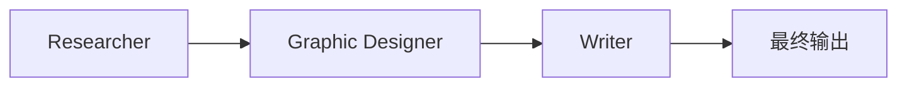

# L5 多智能体通信模式（Communication Patterns）

## 为什么这是个难题

人类组织里画"组织架构图"本身就是难事——谁向谁汇报、谁和谁协作，没有标准答案。多智能体系统设计也一样：**agent 之间怎么通信** 是核心设计决策之一。

讲者整理了目前业界常见的几种模式，从最常用到最实验性。

## 模式一：Linear（线性，最常用之一）



每个 agent 把产物传给下一个。来自 L4 的营销案例就是这种。

特点：**简单、可控、容易调试**。任务本身就是顺序的时候首选这种。

## 模式二：Hierarchical / Manager（一层经理，最常用之二）

```
        Marketing Manager
          /     |     \
   Researcher  Designer  Writer
```

经理协调，下属各做各的。实现要点：

- **下属把结果交回给经理**，而不是横向直接传给下一个下属。
- 经理收到后决定下一步给谁、传什么。

这样比"下属之间互传"更简单可控——所有协调逻辑都收敛在经理这一层。

## 模式三：多层级 Hierarchy（更深的层级，进阶）

经理下面的 agent 自己又有子 agent：

```
              Marketing Manager
              /      |       \
       Researcher  Designer   Writer
        /     \                /     \
   WebSearch  FactChecker  StyleWriter CitationChecker
```

- Researcher 自己叫 web 检索员 + 事实核查员。
- Writer 自己叫风格作家 + 引用校对员。
- 平面设计师独立工作。

**优点**：贴近真实复杂组织的分工。
**缺点**：比单层级复杂得多，调试更难。**目前用得相对少**。

## 模式四：All-to-All（全连接，实验性）

任何 agent 可以在任何时候和任何其它 agent 对话。

实现：给每个 agent 的 prompt 中告诉它"另外还有 N 个 agent，你可以选择给它们发消息"。每发一条消息进入接收者的上下文 → 接收者再思考并决定何时回复。所有 agent 在一个"广场"里互相聊天，直到大家（或者某个关键角色，比如 Writer）宣布任务完成。

**特点**：

- 不可预测——同一个输入跑两次可能结果差很多。
- 适合"对结果不需要严控、可以跑多次抽好的"的场景。
- 一些实验性项目在用，但很难管理控制。

## 决策心法

| 模式 | 何时考虑 |
|---|---|
| Linear | 任务天然是序列的、要可控可调试 |
| Manager | 任务需要动态决定"先做什么再做什么"，但仍想集中协调 |
| 多层 Hierarchy | 子任务本身复杂到值得再分 agent；做好"复杂度成本"的准备 |
| All-to-All | 创造性任务、可以容忍"乱序与不确定" |

## 框架支持

现在已经有不少软件框架直接支持搭多智能体系统，并把这些通信模式内置成开箱即用的能力。自己搭多 agent 系统时，可以借力这些框架探索不同模式。

## 下一讲

整门课的收尾。
