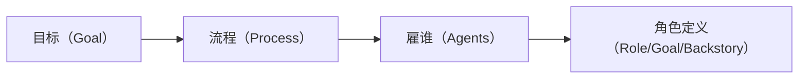
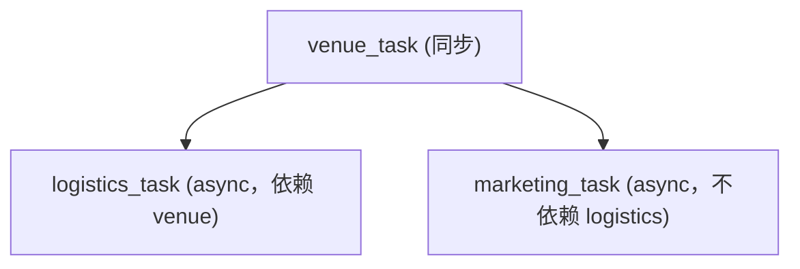
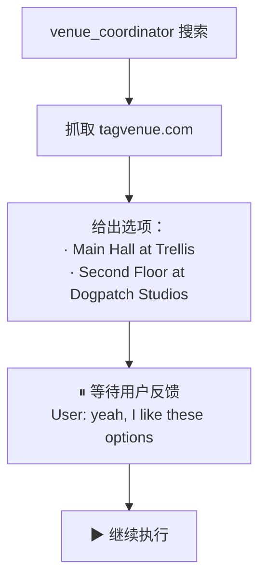
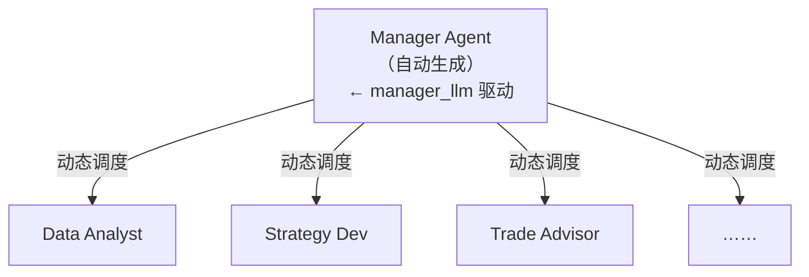

# 第 6 课：Tasks 设计哲学 & 金融分析 Crew 实战（层级协作）

> 课程：Multi AI Agent Systems with crewAI
> 讲师：João Moura
> 原文件：
> - `subtitles/crewai_c1_06-1.vtt`（理论：Task 的设计哲学）
> - `subtitles/crewai_c1_06-2.vtt`（L5 活动策划视频实操讲解）
> - `subtitles/crewai_c1_06-3.vtt`（小结）
> - `code/L6_collaboration_financial_analysis.md`（L6 代码：金融分析 —— 层级协作）

> 📌 本课文档分三部分：
> - **Part A · 理论** — Task 的设计哲学：把自己当成"管理者"
> - **Part B · 视频实操** — L5 活动策划 Crew 的代码走读 + Pydantic 深入
> - **Part C · 代码实战** — L6 金融分析：**层级式协作（Hierarchical Process）**

---

# Part A：Task 的设计哲学

## 1. 回顾："像管理者一样思考"框架

之前第 4 课我们学过**管理者心智模型**：



## 2. 本节的扩展：**新人入职视角**

> 🧠 **把你自己想象成正在带一位刚入职的初级工程师（Junior Engineer）。**

如何让新人做好一件事？两件事必须讲清楚：

| # | 要求 | 对应 Task 属性 |
|---|------|----------------|
| 1 | **这件事具体是什么？** | `description` |
| 2 | **我期望的结果长什么样？** | `expected_output` |

> ⚠️ **crewAI 强制要求每个 Task 必须填这两个属性**——这不是限制，而是**逼你思考清楚**。

### 🎯 核心论断

> **无论使用哪个框架，你越用心解释"任务是什么"和"期望什么"，结果就越好。**

---

## 3. Task 的完整能力图谱

crewAI 的 Task 类暴露了很多超参数（hyperparameters），按用途可分为 4 类：

| 类别 | 属性 | 作用 |
|------|------|------|
| **必填** | `description` / `expected_output` / `agent` | 基础三件套 |
| **上下文** | `context` | 把别的 Task 的输出作为本 Task 的上下文 |
| **工具** | `tools=[...]` | Task 级工具（覆盖 Agent 级） |
| **回调** | `callback` | 任务完成后执行回调函数 |
| **人工介入** | `human_input=True` | 完成前暂停等人工反馈 |
| **执行模式** | `async_execution=True` | 与后续任务并行执行 |
| **输出格式** | `output_json=<Pydantic>` / `output_pydantic` | 结构化输出 |
| **输出持久化** | `output_file="path"` | 写入文件 |

> 💡 **大多数选项在其他框架也有**，只是形式不同。**本质上都是为了让 Agent 高效完成任务**。

---

---

# Part B：L5 活动策划 Crew 视频实操

> 代码见第 5 课笔记。本节聚焦视频中讲解的**设计动机**与**运行时现象**。

## 1. 工具配合：Serper + ScrapeWebsite

```python
from crewai_tools import ScrapeWebsiteTool, SerperDevTool
search_tool = SerperDevTool()       # 搜
scrape_tool = ScrapeWebsiteTool()   # 爬
```

**配合思路**：
- `SerperDevTool` 搜索 → 找到候选网址
- `ScrapeWebsiteTool` 抓取 → 读取网址内容

> 🔑 **工具规划** 对 Agent 行为有重大影响。

---

## 2. 深入聊聊 Pydantic：给 Fuzzy Output 装上"强类型外壳"

### 2.1 为什么需要 Pydantic？

AI 应用是 **Fuzzy Output**——输出是自然语言。但真实业务需要**强类型数据**（存数据库、传给函数、序列化为 JSON）。

> 🌉 **Pydantic 就是 AI 应用与传统代码之间的桥梁。**

### 2.2 传统 Python vs Pydantic

**传统写法**（繁琐）：

```python
class VenueDetails:
    def __init__(self, name, address, capacity, booking_status):
        self.name = name
        self.address = address
        self.capacity = capacity
        self.booking_status = booking_status
```

**Pydantic 写法**（语法糖）：

```python
from pydantic import BaseModel

class VenueDetails(BaseModel):
    name: str
    address: str
    capacity: int
    booking_status: str
```

### 2.3 与 Task 的联动

```python
venue_task = Task(
    ...
    output_json=VenueDetails,          # 输出符合 Pydantic 模型
    output_file="venue_details.json",  # 并写入 JSON 文件
)
```

**运行时内部流程**：

```
Agent 产出 Fuzzy Text
   ↓
crewAI 解析并填充到 VenueDetails 实例
   ↓
序列化为 JSON
   ↓
写入 venue_details.json
```

### 2.4 什么场景特别有用？

> 📌 **不通过 API 把 Agent 集成到现有代码中**——直接拿到结构化数据传给函数。

---

## 3. 异步执行：任务依赖图的构建

三个 Task 的依赖关系：



关键点：
- `logistics_task` 和 `marketing_task` **互不依赖** → 可以并行
- 设置 `async_execution=True` 后，它们在 **tasks 列表中的相对顺序不再重要**

---

## 4. 🔥 运行现场：人工介入 + 双 Agent 并行

### 4.1 Venue Task 暂停等反馈



### 4.2 异步并行：日志里同时出现两个 Agent Executor

> **两个 `CrewAgentExecutor` 同时在跑**——logistics 查餐饮设备，marketing 想营销策略。

### 4.3 产出文件

| 文件 | 内容 |
|------|------|
| `venue_details.json` | 场地详情（name / address / capacity / booking_status） |
| `marketing_report.md` | 完整营销计划（数字营销 / 内容营销 / 合作伙伴 / 网络 / 预算分配） |

### 4.4 核心价值体现

> 🎯 一个多 Agent 系统同时完成了：**选场地 + 算物流 + 做营销策划**——用传统程序几乎不可能实现。

---

## 5. Part A/B 小结

1. ✅ 管理者心智框架 + 新人入职视角
2. ✅ Task 必须有清晰的 **description + expected_output**
3. ✅ Task 的多种进阶属性（async / output_json / output_file / human_input）
4. ✅ Pydantic 是 **AI ↔ 传统代码** 的关键桥梁
5. ✅ **这是进入"生产级 Agent 系统"的转折点**

---

---

# Part C：L6 代码实战 —— 金融分析 Crew（层级协作）

> 🎯 **本课聚焦：让 Agent 之间真正"协作"——层级式（Hierarchical）流程**

## 1. 环境准备

```python
import warnings
warnings.filterwarnings('ignore')

from crewai import Agent, Task, Crew

import os
from utils import get_openai_api_key, get_serper_api_key

openai_api_key = get_openai_api_key()
os.environ["OPENAI_MODEL_NAME"] = 'gpt-3.5-turbo'
os.environ["SERPER_API_KEY"] = get_serper_api_key()
```

## 2. 工具

```python
from crewai_tools import ScrapeWebsiteTool, SerperDevTool

search_tool = SerperDevTool()
scrape_tool = ScrapeWebsiteTool()
```

---

## 3. 定义四个金融 Agent

> 🔑 **关键**：所有 4 个 Agent 都设置了 `allow_delegation=True` —— 这是层级协作的基础。

### 3.1 Data Analyst（数据分析师）

```python
data_analyst_agent = Agent(
    role="Data Analyst",
    goal="Monitor and analyze market data in real-time "
         "to identify trends and predict market movements.",
    backstory="Specializing in financial markets, this agent "
              "uses statistical modeling and machine learning "
              "to provide crucial insights. With a knack for data, "
              "the Data Analyst Agent is the cornerstone for "
              "informing trading decisions.",
    verbose=True,
    allow_delegation=True,
    tools=[scrape_tool, search_tool]
)
```

### 3.2 Trading Strategy Developer（交易策略开发者）

```python
trading_strategy_agent = Agent(
    role="Trading Strategy Developer",
    goal="Develop and test various trading strategies based "
         "on insights from the Data Analyst Agent.",
    backstory="Equipped with a deep understanding of financial "
              "markets and quantitative analysis, this agent "
              "devises and refines trading strategies. It evaluates "
              "the performance of different approaches to determine "
              "the most profitable and risk-averse options.",
    verbose=True,
    allow_delegation=True,
    tools=[scrape_tool, search_tool]
)
```

### 3.3 Trade Advisor（执行顾问）

```python
execution_agent = Agent(
    role="Trade Advisor",
    goal="Suggest optimal trade execution strategies "
         "based on approved trading strategies.",
    backstory="This agent specializes in analyzing the timing, price, "
              "and logistical details of potential trades. By evaluating "
              "these factors, it provides well-founded suggestions for "
              "when and how trades should be executed to maximize "
              "efficiency and adherence to strategy.",
    verbose=True,
    allow_delegation=True,
    tools=[scrape_tool, search_tool]
)
```

### 3.4 Risk Advisor（风险顾问）

```python
risk_management_agent = Agent(
    role="Risk Advisor",
    goal="Evaluate and provide insights on the risks "
         "associated with potential trading activities.",
    backstory="Armed with a deep understanding of risk assessment models "
              "and market dynamics, this agent scrutinizes the potential "
              "risks of proposed trades. It offers a detailed analysis of "
              "risk exposure and suggests safeguards to ensure that "
              "trading activities align with the firm's risk tolerance.",
    verbose=True,
    allow_delegation=True,
    tools=[scrape_tool, search_tool]
)
```

---

## 4. 定义四个 Task

### 4.1 Data Analysis Task

```python
data_analysis_task = Task(
    description=(
        "Continuously monitor and analyze market data for "
        "the selected stock ({stock_selection}). "
        "Use statistical modeling and machine learning to "
        "identify trends and predict market movements."
    ),
    expected_output=(
        "Insights and alerts about significant market "
        "opportunities or threats for {stock_selection}."
    ),
    agent=data_analyst_agent,
)
```

### 4.2 Strategy Development Task

```python
strategy_development_task = Task(
    description=(
        "Develop and refine trading strategies based on "
        "the insights from the Data Analyst and "
        "user-defined risk tolerance ({risk_tolerance}). "
        "Consider trading preferences ({trading_strategy_preference})."
    ),
    expected_output=(
        "A set of potential trading strategies for {stock_selection} "
        "that align with the user's risk tolerance."
    ),
    agent=trading_strategy_agent,
)
```

### 4.3 Execution Planning Task

```python
execution_planning_task = Task(
    description=(
        "Analyze approved trading strategies to determine the "
        "best execution methods for {stock_selection}, "
        "considering current market conditions and optimal pricing."
    ),
    expected_output=(
        "Detailed execution plans suggesting how and when to "
        "execute trades for {stock_selection}."
    ),
    agent=execution_agent,
)
```

### 4.4 Risk Assessment Task

```python
risk_assessment_task = Task(
    description=(
        "Evaluate the risks associated with the proposed trading "
        "strategies and execution plans for {stock_selection}. "
        "Provide a detailed analysis of potential risks "
        "and suggest mitigation strategies."
    ),
    expected_output=(
        "A comprehensive risk analysis report detailing potential "
        "risks and mitigation recommendations for {stock_selection}."
    ),
    agent=risk_management_agent,
)
```

---

## 5. 🌟 核心新概念：Hierarchical Process（层级流程）

### 5.1 对比：Sequential vs Hierarchical

| 模式 | 特点 | 适合场景 |
|------|------|----------|
| **Sequential**（之前用的） | 一个接一个执行，前一个的输出作为下一个的输入 | 线性流水线 |
| **Hierarchical**（本课） | **一个 Manager Agent 统筹调度多个 Worker Agent** | 复杂动态协作 |

### 5.2 Process 类的使用

```python
from crewai import Crew, Process
from langchain_openai import ChatOpenAI

financial_trading_crew = Crew(
    agents=[data_analyst_agent,
            trading_strategy_agent,
            execution_agent,
            risk_management_agent],

    tasks=[data_analysis_task,
           strategy_development_task,
           execution_planning_task,
           risk_assessment_task],

    manager_llm=ChatOpenAI(model="gpt-3.5-turbo",  # 🧠 管理者用的 LLM
                           temperature=0.7),
    process=Process.hierarchical,                   # 🏗 层级模式
    verbose=True
)
```

### 5.3 关键参数

| 参数 | 作用 |
|------|------|
| `process=Process.hierarchical` | 指定为层级模式 |
| `manager_llm` | **Manager Agent 用的 LLM**（可独立配置温度/模型） |

### 5.4 层级模式下的运行机制



- Manager 自动**决定哪个 Task 交给哪个 Agent**
- Manager 可以**反复询问某个 Agent**以澄清或优化
- 所有 Agent 都必须 `allow_delegation=True`，允许被 Manager 调度

---

## 6. 运行 Crew

### 6.1 输入参数

```python
financial_trading_inputs = {
    'stock_selection': 'AAPL',
    'initial_capital': '100000',
    'risk_tolerance': 'Medium',
    'trading_strategy_preference': 'Day Trading',
    'news_impact_consideration': True
}
```

### 6.2 启动

```python
# ⚠️ 此执行耗时较长
result = financial_trading_crew.kickoff(inputs=financial_trading_inputs)
```

### 6.3 渲染结果

```python
from IPython.display import Markdown
Markdown(result)
```

---

## 📝 本课综合要点

### 理论层（Task 设计哲学）

| 要点 | 一句话 |
|------|--------|
| 管理者思维 | 目标 → 流程 → 雇谁 → 怎么带 |
| 新人入职视角 | **description + expected_output** 必须写清楚 |
| Task 超参数 | 异步 / 人工介入 / 结构化输出 / 文件输出 / 回调 |

### 代码层（新 API）

| API | 用途 |
|-----|------|
| `Process.hierarchical` | 启用层级协作模式 |
| `manager_llm=<LLM>` | 指定 Manager Agent 的 LLM |
| `allow_delegation=True` | 让 Agent 可被 Manager 调度 / 可委派其他 Agent |

### 两种 Process 模式对比

| 维度 | Sequential | Hierarchical |
|------|-----------|--------------|
| 执行顺序 | 按 tasks 列表顺序 | 由 Manager Agent 动态决定 |
| 是否需要 manager_llm | ❌ | ✅ |
| Agent 委派要求 | 可选 | 必须 `allow_delegation=True` |
| 适用场景 | 线性流水线（写博客、客服） | 复杂分析（金融、研究） |

### 🎯 下一课预告

> 到这里已经具备**构建生产级 Agent 系统**的能力。下一课继续深入，解锁更多可能。

---

## 面试速答总结

**一句话**：Task 设计的核心心法是"**把 Agent 当刚入职的初级工程师**"——必须讲清两件事:**这件事是什么(`description`)+ 我期望的结果长什么样(`expected_output`)**,crewAI 强制这两个必填就是逼你想清楚;而多 Agent 的协作有两种 Process——**Sequential(按列表顺序、前输出喂后输入)** 和 **Hierarchical(一个 Manager Agent 用 `manager_llm` 动态调度、审核 Worker,要求所有 Worker `allow_delegation=True`)**,切换只需改一行 `process=`。

### 面试回答骨架（问"怎么写好 agent 的 task / sequential 和 hierarchical 怎么选"）

> 1. **Task 设计哲学**：两个心智模型——"像**管理者**"(目标→流程→雇谁→怎么写角色) + "像带**新人**"(必须把"做什么"和"期望产出什么"讲到位)。核心论断:**无论哪个框架,你越用心解释任务是什么、期望什么,结果越好**;crewAI 把 `description`/`expected_output` 设为必填正是这个道理。
> 2. **Task 能力图谱**:必填三件套(`description`/`expected_output`/`agent`) + 进阶超参(`context` 引入别的 task 输出、`tools` Task 级工具、`callback` 完成回调、`human_input` 人工介入、`async_execution` 并行、`output_json` 结构化、`output_file` 落盘)。大多数选项别的框架也有,本质都是帮 Agent 高效完成任务。
> 3. **两种 Process 对比(高频)**:**Sequential**——一个接一个、前一个输出作后一个输入,适合线性流水线(写博客/客服),无需 manager_llm;**Hierarchical**——crewAI **自动生成一个 Manager Agent**,由它决定哪个 Task 派给哪个 Agent、可反复追问澄清、可审核要求改进,适合复杂动态协作(金融/研究),需配 `manager_llm` 且所有 Worker `allow_delegation=True`。
> 4. **落地一行切换**:`process=Process.hierarchical` + `manager_llm=ChatOpenAI(...)`,Manager 的 LLM 可独立配温度/模型(通常给它更强的模型,因为调度和规划最吃推理)。

### 关键判断（加分点）

- **`expected_output` 常被低估**:很多人只写 description 就跑,结果飘忽。明确期望产出等于给 Agent 一个"验收标准",是稳定性的关键来源——这是"新人入职视角"的精髓。
- **Hierarchical 的价值是"单一权威点 + 自动编排"**:Manager 始终记得最初目标(不像 Sequential 那样上下文逐级淡化),且不用你手动排 Task 顺序、还能自动审核——用推理换掉人工编排。
- **代价对称**:Hierarchical 更灵活但更贵更慢(多一层 Manager 的反复调度),且结果更难预测;线性确定的流程用 Sequential 反而更稳更省。别默认上层级。
- **Pydantic 是 AI↔传统代码的桥**:`output_json` 把 Fuzzy 文本解析成强类型实例,让 Agent 不经 API 直接集成进现有代码。

### 为什么这是高分答法

- 把 Task 设计上升成"管理者 + 带新人"两个可复述的心智模型,而非罗列属性;
- Sequential vs Hierarchical 给出**机制差异 + 适用场景 + 代价对称**三面,体现取舍判断而非"层级更高级"的误区。

**一句话收尾**：写好 Task 的本质是像给新人交代工作一样把"做什么"和"要什么结果"讲清楚;而协作模式的选择是线性确定性(Sequential)与动态编排(Hierarchical,Manager 换掉人工排程但更贵更不可预测)之间的取舍——一行 `process=` 切换的背后,是"要不要为灵活性付推理成本"的架构决定。

> 关联：`04-Agent六大要素与客户触达Crew.md`(管理者思维起源)、`05-优秀Tools三大特性与活动策划Crew.md`(Task 进阶属性)、`07-协作模式进阶与金融分析及简历定制Crew.md`(协作模式全景 + Task Context)、`../../11-AI Agents in LangGraph/notes/L09-高级Agent架构.md`(Supervisor 模式 = Hierarchical 的另一种表达)。
