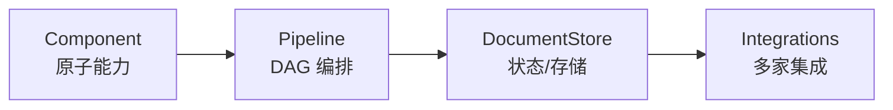

# Building AI Applications with Haystack —— 总结回顾

> 课程：**Building AI Applications with Haystack**（DeepLearning.AI × deepset，讲师 Tuana Çelik、Andrew Ng）
> 版本：`haystack-ai==2.2.4`
> 用途：一页式快速回顾。逐课详记见各 `L0*` 笔记。

---

## 一句话主线

> **Haystack 只有两个根抽象——Component（原子能力）+ Pipeline（把组件连成数据流图 DAG，必要时含环）。它不提供"一切"，而是给统一接口 + 简洁抽象，让你用自定义 Component 扩展框架。沿着「线性 RAG → 分支 → 循环 → 工具调用」这条演化线,同一套 DAG 抽象就能覆盖从普通检索到 Agent 的全部形态——Agent 不是新东西,只是带条件、带循环、带工具的 Pipeline。**

---

## 核心心智模型

- **Component**：单一职责单元。契约只有两条——`run()` 方法 + `@component.output_types(...)` 声明输出端口。`run()` 形参 = 输入端口,返回 dict 的键 = 输出端口。
- **Pipeline**：`add_component(name, instance)` 注册 + `connect("a.out", "b.in")` 字段级接线。是数据流(不是控制流)图——同一份数据可一对多扇出。
- **DocumentStore**：状态层,本课用零依赖 `InMemoryDocumentStore`,生产换 Weaviate / Qdrant / Elasticsearch / pgvector,只换实例不改拓扑。
- **可观测**：`pipeline.show()` 可视化拓扑,是必用的调试/沟通工具。

---

## 逐课速查

### L1 — 基础构件（Building Blocks）

- 一个 RAG MVP = **两条独立的图**:
  - **Indexing Pipeline**(离线/批量):`Converter → Splitter → Embedder → Writer`
  - **Search Pipeline**(在线/低延迟):`TextEmbedder → Retriever`
- 关键区分:写入端用 `OpenAIDocumentEmbedder`(吃 `List[Document]`),查询端用 `OpenAITextEmbedder`(吃单条 `text`)——两个不同组件。
- **为何拆两条 Pipeline?** 生命周期不同(离线 vs 在线),混在一起参数膨胀、无法独立部署。

### L2 — 定制化 RAG（Customized RAG）

- RAG 三段式:`Retriever → PromptBuilder(Jinja) → Generator`。
- **PromptBuilder 用 Jinja2 模板**,模板变量名 = 组件的输入端口("模板驱动接线")。Jinja 支持 ``/``,天然适配"文档列表"这种 RAG 数据形态——f-string 做不到(立即求值、无法延迟/循环)。
- 换 Embedder(Cohere)/Generator(OpenAI 兼容接口接 Together、Llama-3)只改初始化一行,拓扑不变——这是"统一接口"的红利。
- `Secret.from_env_var` 是密钥抽象,避免把 key 硬编码进可序列化的 Pipeline。
- 用 `meta`(如 url)把元数据带过整条管道,最终在答案里引用来源。

### L3 — 自定义组件（Custom Components）

- 把任意 Python 类变组件的全部门槛:`@component` 装饰器 + `@component.output_types(...)`。无需继承基类、无需注册中心。
- **Pipeline 可嵌套**:一个 Component 内部可持有并运行一个 sub-pipeline(实战 `HackernewsNewestFetcher` 内含 `LinkContentFetcher + HTMLToDocument`),对外只暴露 `articles=...` 一个端口。
- **何时写自定义组件?** 业务专属 I/O(特定 API、内部库、私有协议);通用能力(fetch/split/embed/retrieve)优先用现成组件。

### L4 — 分支 Pipeline 与 Web 搜索 Fallback

- 痛点:答案不在知识库 → LLM 瞎编或硬拒。期望:检索不到 → 回退 Web 搜索 → 再生成。
- **`ConditionalRouter`**:每条 route = Jinja 条件 + 输出值 + 命名输出端口 + 类型。激活哪条,哪条分支才跑。
- **fallback 触发器:让 LLM 自己说 `no_answer`**(写进 prompt),而不是相似度阈值——阈值依赖语料分布、难跨域复用。
- 同一 Router 输出可 `connect` 多次扇出(一份给 web search 当 query、一份给下游 prompt)。
- Retriever 选型:`InMemoryBM25Retriever`(关键词、零成本) vs Embedding Retriever(语义、需 API),可并存做混合检索。

### L5 — 自反思 Agent 与 Pipeline 循环

- 模式:LLM 抽取 → Validator 检查 → 不合规把"上版结果+校验提示"回流给 LLM → 直到 LLM 自报 `DONE`。
- **循环的核心机制:Component 根据条件返回不同的输出 key**。哪个 key 被填,连到它的下游才激活,另一支自然停——无需特殊原语,不引入 State 概念。
- **`Pipeline(max_loops_allowed=N)`** 是带环 Pipeline 的硬上限护栏,防死循环。
- 同一个 Jinja 模板靠 `` 复用为"首次抽取"+"反思修订"两种角色。
- **何时上自反思?** 任务有可机检的硬约束(schema/格式/覆盖度)且一次生成达成率不够;约束模糊则会震荡。

### L6 — Chat Agent 与 Function Calling

- **Pipeline = Tool**:把 L02 的整条 RAG 管道包成一个 `def fn(query) -> dict`,作为工具暴露给 Chat LLM。模型不该看到 retriever/prompt_builder,只看到语义清晰的 `rag_pipeline_func(query)`。
- ReAct 风格 Agent 最小三件套:
  - `OpenAIChatGenerator`:`generation_kwargs={'tools': tools}` 注入标准 OpenAI tools schema(无独家 DSL)。
  - `OpenAIFunctionCaller`(来自 `haystack_experimental`):把 tool_calls 真正执行。两路输出——`function_replies`(工具结果,回喂模型) / `assistant_replies`(直接答用户,终点)。
  - `BranchJoiner`:多输入合一输出的汇流节点。DAG 边只允许"一上游→一端口",多源(用户输入+回环工具结果)进同一端口必须显式合并。
- 回环 `function_replies → message_collector` 构成 ReAct 循环骨架;`assistant_replies` 是出口。
- **会话状态由外层 `messages` 列表维护,Pipeline 本身无状态**——与 LangGraph 把 state 放进 graph 形成对照,Haystack 更"轻"。

---

## 演化总览(一条线索)

| 节 | 拓扑形态 | 关键抽象 |
|---|---|---|
| L1 | 线性 | Component / Pipeline / DocumentStore |
| L2 | 线性 + 模板参数化 | PromptBuilder + Jinja |
| L3 | 嵌套 Pipeline | `@component` 自定义组件 |
| L4 | **分支**(含 fallback) | ConditionalRouter |
| L5 | **带环**(自反思) | 选择性输出 + `max_loops_allowed` |
| L6 | **环 + 工具**(Agent) | ChatGenerator + FunctionCaller + BranchJoiner |

> **线性 RAG → 分支 → 循环 → 工具调用 Agent**,全程同一套 DAG 抽象,不引入新概念——这是 Haystack 作为"AI 应用框架"的核心设计哲学。

---

## 架构师视角:三条带走的判断

1. **何时选框架?** 当应用要集成多家 LLM/向量库/检索器、且预期会换组件时,"统一接口"抽象价值最高;只用一两个固定 API 时,框架反而是负担。
2. **Haystack 的差异化定位**:RAG-first 的编排框架,管线即显式 DAG,强类型组件,工程化与可部署性是相对 LangChain 的卖点。循环用"组件选择性返回端口"实现,比 LangGraph 的状态机更低耦合,但也意味着状态留在你自己代码里。
3. **不稳定的部分隔离在 `haystack_experimental`**(如工具调用协议),主包接口更稳——对生产用户友好的取舍。
