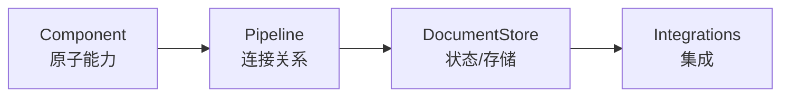

# L01 Haystack 基础构件（Building Blocks）

> 原始字幕：`subtitles/haystack_c1_L1.vtt`
> 配套代码：`code/Lesson_1.md`

---

## 一、三个核心抽象



- **Component**：单一职责的可运行单元。每个 Component 暴露一个 `run()` 方法 + 用 `@component.output_types(...)` 声明输出 schema。
- **Pipeline**：用 `add_component(name, instance)` 注册，`connect("a.out", "b.in")` 连接。本质是 DAG 编排器。
- **DocumentStore**：向量 / 文本的持久化层。本课用零依赖的 `InMemoryDocumentStore`，生产可换 Weaviate / Qdrant / Elasticsearch / pgvector 等。
- **Integrations**: 接各家模型与工具:OpenAI、Anthropic、HuggingFace、Cohere 等            

> **架构要点**：Component 与 DocumentStore 是解耦的——DocumentStore 通过 Writer/Retriever 这两类 Component 注入 Pipeline，换底层存储只换组件初始化，Pipeline 拓扑不变。

---

## 二、最小 Component 示例

```python
from haystack.components.embedders import OpenAIDocumentEmbedder
from haystack.dataclasses import Document

embedder = OpenAIDocumentEmbedder(model="text-embedding-3-small")
documents = [Document(content="Haystack is an open source AI framework ...")]
embedder.run(documents=documents)
```

- `Document` 是 Haystack 的标准数据类：`content` + `meta`（如 url、title）+ 自动生成的 `id` + 后续填入的 `embedding`。
- Component 可以**独立调用**（`embedder.run(...)`），也可以放进 Pipeline——便于单元测试。

---

## 三、Indexing Pipeline（写入端）

四件套：**Converter → Splitter → Embedder → Writer**。

```python
indexing_pipeline = Pipeline()
indexing_pipeline.add_component("converter", TextFileToDocument())
indexing_pipeline.add_component("splitter",  DocumentSplitter())
indexing_pipeline.add_component("embedder",  OpenAIDocumentEmbedder())
indexing_pipeline.add_component("writer",    DocumentWriter(document_store=document_store))

indexing_pipeline.connect("converter", "splitter")
indexing_pipeline.connect("splitter",  "embedder")
indexing_pipeline.connect("embedder",  "writer")

indexing_pipeline.run({"converter": {"sources": ['data/davinci.txt']}})
```

- 输入是字典：键为入口组件名，值为该组件 `run()` 参数。
- `indexing_pipeline.show()` 可视化拓扑——调试 / 沟通设计时的利器。

---

## 四、Search Pipeline（查询端）

```python
query_embedder = OpenAITextEmbedder()      # 注意：Text 而不是 Document Embedder
retriever      = InMemoryEmbeddingRetriever(document_store=document_store)

document_search = Pipeline()
document_search.add_component("query_embedder", query_embedder)
document_search.add_component("retriever",      retriever)
document_search.connect("query_embedder.embedding", "retriever.query_embedding")

results = document_search.run({
    "query_embedder": {"text": question},
    "retriever":      {"top_k": 3},
})
```

**两个细节**：
1. 写入端用 `OpenAIDocumentEmbedder`（输入 `List[Document]`），查询端用 `OpenAITextEmbedder`（输入单条 `text`）——是两个不同 Component。
2. `connect("a.field_x", "b.field_y")` 可精确到字段；当组件只有一个输入/输出时可省略字段名。

---

## 五、设计取舍（架构师视角）

- **写入与查询为何拆成两个 Pipeline？** —— 生命周期完全不同：indexing 是离线/批量，search 是在线/低延迟。混在一起会让运行时参数膨胀且无法独立部署。
- **为什么 InMemoryDocumentStore 也值得用？** —— 教学和原型期"零依赖"很关键；接口与生产存储一致，迁移只换实例不改拓扑。
- **Pipeline 的 DAG 抽象意味着什么？** —— 任意一处可观测、可替换、可并发。这是 Haystack 与朴素 Python 脚本最大的区别。

---

## 六、本节要点

- Haystack = Component（原子）+ Pipeline（DAG）+ DocumentStore（状态）。
- 一个完整 RAG MVP = Indexing Pipeline + Search Pipeline，两条独立的图。
- `connect` 的字段级 wiring 让组件可组合性极高。
- `show()` 是必用的调试工具。
