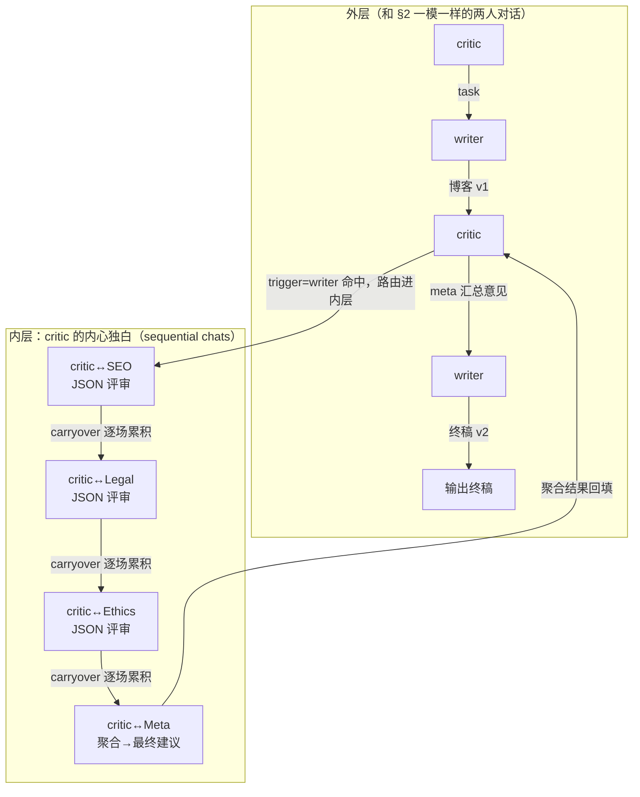

# L3 · 用 Nested Chat 实现 Reflection 设计模式（多 reviewer 审稿写博客）

> 课程：AI Agentic Design Patterns with AutoGen（DeepLearning.AI × Microsoft × Penn State，讲师 Chi Wang & Qingyun Wu，AutoGen 创始人）
> 本课任务：写一篇 100 词以内、关于 DeepLearning.AI 的博客——从单发生成，到 critic↔writer 两 agent 反思，再到把 **SEO/法务/伦理/meta 四个 reviewer 的审稿流水线**作为 nested chat 嵌进 critic 的"内心独白"，三级递进。

## 0. 本课目标与路线

Reflection 是最著名、最有效的 agentic 设计模式之一：让（另）一个 agent 回看产出、给反馈、驱动修订。本课路线三级递进：**① 单 writer 直出（无反思）→ ② critic↔writer 对话（朴素反思）→ ③ nested chat 多 reviewer 面板（结构化反思）**。核心新概念：**nested chat——注册为某个 agent 内心独白（inner monologue）的一场或一串对话**。

## 1. 基线：writer 单发直出

先按 L1 的套路建一个 writer（这次用 `AssistantAgent`——ConversableAgent 的预置子类，默认不执行代码、面向 LLM 助手场景）：

```python
writer = autogen.AssistantAgent(
    name="Writer",
    system_message="你是写手，就给定话题写简洁有吸引力的博客（带标题）。"
        "必须根据收到的反馈打磨稿件并给出修订版。"       # 预埋"接受反馈"的行为
        "只返回最终作品，不加额外评论。",
    llm_config=llm_config,   # {"model": "gpt-3.5-turbo"}
)

reply = writer.generate_reply(         # 单发调用：没有对话、没有反思
    messages=[{"content": task, "role": "user"}])
```

产出能看，但"good, we want to make it even better"——这就是 reflection 的用武之地。

## 2. 朴素 Reflection：critic ↔ writer 两 agent 对话

实现 reflection 的一种方式：再造一个 agent 专职挑毛病。

```python
critic = autogen.AssistantAgent(
    name="Critic",
    system_message="你是评论家，审查 writer 的作品并给出建设性反馈，帮助提升内容质量。",
    is_termination_msg=lambda x: x.get("content", "").find("TERMINATE") >= 0,
    llm_config=llm_config,
)

res = critic.initiate_chat(
    recipient=writer, message=task,
    max_turns=2,                  # 恰好一轮"初稿 → 反馈 → 修订稿"
    summary_method="last_msg",    # 摘要=最后一条消息，即 writer 的终稿
)
```

运行效果：writer 出 v1 → critic 给反馈 → writer 出 v2。有效，**但反馈偏泛**（"kind of general"）——critic 一张嘴，想到哪评到哪。

## 3. 需求升级：把反思变成"有清单的评审流程"

真实评审不是一个人随口点评，而是分维度过检查单：SEO 排名、自然流量、法律风险、伦理问题……我们想在 **critic 的内心独白里**跑完这样一套流程，对外仍只输出一份汇总意见。这正是 nested chat 的定义：**注册为某个 agent 内心独白的一场（或一串）对话**。

先造评审团——三个专项 reviewer + 一个 meta reviewer，全是 `AssistantAgent`，差异只在 system message：

| reviewer | 职责 | system message 的两个共性约束 |
|---|---|---|
| SEO Reviewer | 内容能否在搜索引擎排名好、吸引自然流量 | ①建议精简（≤3 条 bullet）、具体、切中要害 |
| Legal Reviewer | 内容是否合法合规、无法律风险 | ②**开头先自报角色**（"Begin the review by stating your role"） |
| Ethics Reviewer | 内容是否合乎伦理、无潜在伦理问题 | ——为的是后面 meta 汇总时能分清谁说的 |
| Meta Reviewer | 聚合以上所有评审，给最终建议 | （无以上约束，只做聚合） |

## 4. review_chats：套用 L2 的 sequential chats + 一个关键函数

评审流水线本身就是 L2 学过的 chats 列表——四场对话，每场 recipient 是一个 reviewer。**不写 sender**：这串 chat 稍后注册给 critic，critic 默认就是每场的 sender。

```python
def reflection_message(recipient, messages, sender, config):
    # 被触发时动态调用：recipient=critic（注册方），sender=writer（触发方）
    # 从外层 critic↔writer 对话里取最新一条 —— 正是 writer 刚交的稿
    return f'''Review the following content.
            \n\n {recipient.chat_messages_for_summary(sender)[-1]['content']}'''

review_chats = [
    {"recipient": SEO_reviewer,
     "message": reflection_message,              # 开场消息是函数，不是字符串！
     "summary_method": "reflection_with_llm",
     "summary_args": {"summary_prompt":          # 每场审稿压成结构化 JSON
        "Return review into as JSON object only:"
        "{'Reviewer': '', 'Review': ''}. Here Reviewer should be your role"},
     "max_turns": 1},
    {"recipient": legal_reviewer,  "message": reflection_message, ...},   # 同上
    {"recipient": ethics_reviewer, "message": reflection_message, ...},   # 同上
    {"recipient": meta_reviewer,                 # 最后一场：聚合
     "message": "Aggregrate feedback from all reviewers and give final suggestions on the writing.",
     "max_turns": 1},                            # 不需要 summary_prompt
]
```

两个机制值得盯住：

1. **`reflection_message` 函数**：nested chat 的开场消息没法写死——要审的稿子每轮都不同。把 `message` 设为函数，触发时才执行，通过 `recipient.chat_messages_for_summary(sender)[-1]['content']` 把**外层对话的最新内容（writer 的稿）注入内层对话**。这是外层→内层的数据通道；
2. **JSON summary + 自报角色 + L2 的 carryover**：前三场的审稿意见被 summary_prompt 压成 `{'Reviewer','Review'}`，随 carryover 流到第四场——meta reviewer 拿到的是三份署名的结构化意见，聚合才有据可依。

## 5. register_nested_chats：挂载内心独白

```python
critic.register_nested_chats(
    review_chats,
    trigger=writer,   # 触发器：每当 critic 收到来自 writer 的消息
)
```

注册之后，critic 的行为被改写：**收到 writer 的消息 → 不直接回复，先把消息路由进 nested chat 走完四场评审 → 把评审结果（最后一场的产出）作为自己的回复发回给 writer**。



而外层的启动代码**与 §2 逐字相同**：

```python
res = critic.initiate_chat(recipient=writer, message=task,
                           max_turns=2, summary_method="last_msg")
print(res.summary)   # writer 吸收汇总意见后的最终修订版博客
```

运行 walkthrough（视频 demo）：writer 出 v1 → critic 触发 nested → SEO reviewer 建议嵌入 "AI courses / DeepLearning.AI / Andrew Ng" 等关键词 → legal reviewer 提示复核标题的法律风险 → ethics reviewer 结论"无伦理问题" → meta reviewer 聚合成最终建议 → critic 把它发给 writer → writer 按建议修订 → `res.summary` 即终稿。

> **架构师视角**：nested chat 的精髓是**接口不变、实现升级**——外层协议始终是"critic↔writer 两人对话"，评审复杂度全部封装在 critic 内部；从 §2 的朴素 critic 换成 §5 的评审团，调用方零改动。这就是给 agent 做"函数抽取"：对话即接口，nested chat 即函数体。反过来的警惕也在这：内层烧掉 4 场 LLM 对话的 token 与延迟，外层完全不可见——封装了复杂度，也封装了成本，观测埋点必须打进内层（对应 5-observability-eval 的嵌套 span）。

> **对比 11-design-patterns.md 的模式层**：Reflection 是 Ng 四大模式（Reflection / Tool Use / Planning / Multi-Agent）之一，落在 workflow 谱的 **evaluator-optimizer** 档；课程 08 的成熟度立场是 Reflection + Tool Use 最成熟、应优先。但选型包同时警告：**外部确定性反馈（跑代码、查引用）＞ 纯 LLM 自评**——本课的多 reviewer 面板虽把自评拆成了多视角、降低了"自我表扬"，本质仍是 LLM 评 LLM；生产升级方向是把某几个 reviewer 换成确定性检查（字数校验、敏感词扫描、SEO 工具实测）。

> **对比课程 11 LangGraph 的图编排**：LangGraph 里 reflection 是**显式的图结构**——generate 与 reflect 两个节点加一条回环边，控制流写在图上，看得见、可断点。AutoGen 则把同样的控制流**藏进对话语义**：trigger 命中→路由→内心独白，图不存在于代码里而存在于运行时。声明式的图利于审计与人工介入，会话式的 nested chat 利于快速堆叠（本课三级递进每级只加几行）；这也呼应 03-framework-profiles 的定位——AutoGen 适合 PoC 快速验证，生产编排新项目优先 LangGraph/crewAI/MAF。

## 6. 本课总结

| 要点 | 一句话 |
|---|---|
| Reflection 模式 | 另设 agent 回看产出给反馈，驱动修订（Ng 四大模式之一） |
| 朴素版 | critic↔writer `initiate_chat`，max_turns=2 = 初稿→反馈→修订 |
| nested chat | 注册为 agent 内心独白的一串对话，`register_nested_chats(chats, trigger=...)` |
| reflection_message | message 设为函数，运行时从外层对话抓最新稿件注入内层 |
| 多 reviewer 面板 | SEO/法务/伦理各审一场（JSON 摘要+自报角色），meta 聚合 |
| 复用 L2 | 内层评审流水线就是 sequential chats + carryover，模式可组合 |
| 接口不变 | 外层 initiate_chat 代码与朴素版逐字相同，复杂度全封装在 critic 内 |

> **记忆点（引出 L4）**：本课的 agent 再怎么反思，也只是**动嘴**——评审、建议、改稿全在语言空间里。L4 引入 Ng 四大模式里另一个最成熟的模式 **Tool Use**：给 agent 装上可调用的工具函数，让两个 agent 边对话边**动手**下一盘真正的国际象棋。

## 与我的资产映射

- 模式层：`agent/skills/agent-selection/11-design-patterns.md`——evaluator-optimizer（≈Reflection）档的完整选型判据：有明确评价标准才上循环、外部反馈优先于自评
- 框架层：`agent/skills/agent-selection/2-framework/03-framework-profiles.md` §8（AutoGen/AG2/MAF 现状与"仅 PoC"定位）
- 对照课程：`courses/08-Agentic AI（Andrew Ng）/2-Reflection Design Pattern`（模式原理版）、`courses/11-AI Agents in LangGraph`（同一模式的显式图编排版）
- 面试包：`agent/interview/jd-senior-agent-engineer/01-agent-run-loop-and-orchestration`（nested chat = 运行循环内的子循环，嵌套编排的活例子）
- [[project_selection_matrix]]
