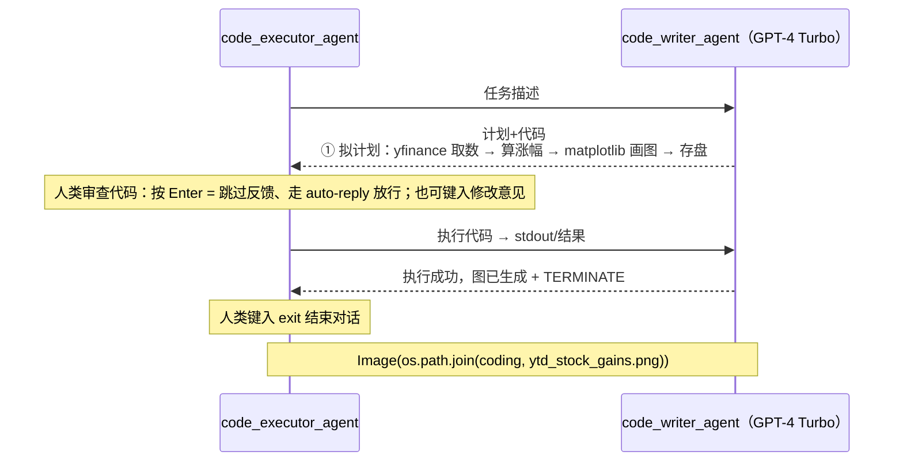

# L5 · 代码执行与金融分析（Code Executor + 用户自定义函数）

> 课程：AI Agentic Design Patterns with AutoGen（DeepLearning.AI × Microsoft × Penn State，讲师 Chi Wang & Qingyun Wu）
> 本课任务：给 agent 加上**写代码 + 执行代码**的能力（freeform coding），构建两套双 agent 系统完成股票分析任务——第一套 LLM 从零生成代码，第二套复用**用户自定义函数**；人类在代码执行前有反馈机会。

## 0. 本课目标与路线

L4 的工具调用依赖 OpenAI 式 function-call 特性，有两个局限：**很多模型没有这个特性**；有时你希望 agent **创造性地写自由代码**，而不是只能在预定义函数里挑。本课的解法是 freeform coding：LLM 直接产出 Python/shell 代码块，由另一个 agent 真实执行。

路线：**① 创建 code executor → ② 创建写码 agent（AssistantAgent）+ 执行 agent → ③ 跑金融分析任务（LLM 从零写码）→ ④ 引入用户自定义函数重跑 → ⑤ 两种工具化方式的取舍**。模型仍是 `gpt-4-turbo`。

## 1. Code Executor：本地命令行执行器

```python
from autogen.coding import LocalCommandLineCodeExecutor

executor = LocalCommandLineCodeExecutor(
    timeout=60,          # 单次执行 60 秒超时
    work_dir="coding",   # 工作目录：生成的代码和中间产物都落在这里
)
```

`work_dir="coding"` 会创建同名文件夹，agent 生成的所有代码文件和结果（如图片）都能在里面找到。AutoGen 提供多种 executor：本课用的**本地命令行执行**，另有 **Docker 容器执行**和 **Jupyter notebook 执行**，还可以自定义 executor 支持其他语言或执行环境。

> **架构师视角**：从 L4 到 L5，动作范式从 **function-calling 切到了 CodeAct**（模型写代码当动作）。按我的 `7-safety-guardrails.md`：**只要用了 CodeAct 就必须沙箱**——本课的 `LocalCommandLineCodeExecutor` 是直接在宿主机 shell 上跑 LLM 生成的代码，仅有 timeout 一道闸，教学可以、生产是红线。隔离强度谱从轻到重：进程级/seccomp → 容器（Docker，AutoGen 自带这档）→ gVisor → microVM（Firecracker）→ 托管沙箱（E2B 类），并配网络出站白名单、文件系统限制、密钥不进沙箱。课程里 `human_input_mode="ALWAYS"` 的人工审批，本质是拿人当最后一道安全闸。

## 2. 双 agent 分工：写码的不执行，执行的不用 LLM

延续 L4 的"提议/执行分离"，只是提议物从函数调用换成了代码块。

**执行侧**：ConversableAgent 挂上 executor，不用 LLM，执行前**总是**先要人类确认：

```python
code_executor_agent = ConversableAgent(
    name="code_executor_agent",
    llm_config=False,                            # 不用 LLM
    code_execution_config={"executor": executor},# 挂上代码执行器
    human_input_mode="ALWAYS",                   # 执行前必询问人类（HITL 闸门）
    default_auto_reply=
    "Please continue. If everything is done, reply 'TERMINATE'.",  # 消息里没代码时的回复
)
```

**写码侧**：`AssistantAgent` 是 ConversableAgent 的派生类，**自带一份精心调过的默认 system message**，专教 LLM 如何用代码解题：

```python
code_writer_agent = AssistantAgent(
    name="code_writer_agent",
    llm_config=llm_config,
    code_execution_config=False,   # 只提议代码，不执行
    human_input_mode="NEVER",
)
print(code_writer_agent.system_message)   # 可打印查看这份默认提示词
```

这份默认 system message 很长，要点值得拆解（讲师说它在很多编码任务乃至数学题上都表现很好，也可自行定制强化）：

| 指令 | 目的 |
|---|---|
| 需要收集信息时用代码（浏览/搜索/下载/读文件） | 把"感知"也代码化 |
| 需要执行任务时用代码输出结果 | 把"行动"代码化 |
| 先给计划，标明哪步用 code、哪步用 language skill | 强制显式规划 |
| 代码必须按指定格式放代码块 | executor 靠格式提取代码 |
| 用户只会执行代码，不要给需要用户修改的半成品 | 保证代码自包含可直接跑 |
| 代码块内加特定文件名标记可存盘 | 控制产物落盘 |
| 检查执行结果，有错就修复后重新输出 | 自带"执行→纠错"循环 |
| 全部完成后回复 TERMINATE | 终止信号 |

## 3. 任务一：LLM 从零写码做股票分析

```python
import datetime
today = datetime.datetime.now().date()
message = f"Today is {today}. "\
"Create a plot showing stock gain YTD for NVDA and TLSA. "\   # （notebook 原文如此，TSLA 笔误）
"Make sure the code is in markdown code block and save the figure"\
" to a file ytd_stock_gains.png."""

chat_result = code_executor_agent.initiate_chat(   # 由执行方发起对话
    code_writer_agent,
    message=message,
)
```

运行时序（人类在关键点介入）：



两个落盘细节（讲师特意补充）：代码块首行带**文件名注释行**时，代码会以该文件名存进 `coding/` 目录；**没有这行，代码执行完会被自动删除**。产物（.py 与 .png）都在 `work_dir` 下。

## 4. 任务二：让 agent 复用用户自定义函数

想要更强的控制：不让 LLM 每次从零写取数/画图逻辑，而是提供**你写好的函数**让它调用。函数就按普通 Python 写，**docstring 是关键**——agent 靠它理解怎么用：

```python
def get_stock_prices(stock_symbols, start_date, end_date):
    """Get the stock prices for the given stock symbols between
    the start and end dates.
    Args: ...                      # 参数、格式、返回值写清楚
    Returns: pandas.DataFrame ...  # docstring 会被注入 LLM 提示词
    """
    import yfinance
    stock_data = yfinance.download(stock_symbols, start=start_date, end=end_date)
    return stock_data.get("Close")

def plot_stock_prices(stock_prices, filename):
    """Plot the stock prices for the given stock symbols. ..."""
    import matplotlib.pyplot as plt
    ...
    plt.savefig(filename)
```

接线两步，两端各一动作：

```python
# ① 执行端：把函数交给 executor —— 它才能执行这些函数
executor = LocalCommandLineCodeExecutor(
    timeout=60,
    work_dir="coding",
    functions=[get_stock_prices, plot_stock_prices],   # 新增
)

# ② 写码端：把函数的存在告诉 LLM —— 拼接进 system message
code_writer_agent_system_message += executor.format_functions_for_prompt()
```

`format_functions_for_prompt()` 会**根据函数定义自动生成**一段提示词：告知"你可以访问以下用户定义函数，通过 `from functions import get_stock_prices` 导入"，并附上完整**函数签名和 docstring**——用户零额外工作，只管把 Python 函数写规范。这个 `functions` 模块也是 AutoGen 在 work_dir 里自动创建的。

用新 system message 重建 `code_writer_agent`、用新 executor 重建 `code_executor_agent`，同一任务重跑。效果：计划里明确写出要用这两个函数；生成代码以 `from functions import ...` 开头，**明显更短、更干净**——取数和画图两步直接调用现成函数。

> **对比 L4 / 课程 09-10 的 function-calling 路线**：同样是"复用用户定义的函数"，L4 走模型原生 tool-call（函数以 JSON schema 注入、模型发调用意图），本课走**代码内 import 调用**（函数以签名+docstring 注入提示词、模型在生成的代码里调用）。后者的杀手锏是**完全不依赖底层模型的 function-call 特性**——换任何一个不支持 tool-call 的开源模型也照用。MCP（课程 10）则是把前一条路线标准化成跨进程协议；两条路线在"函数如何被模型看见"上分道：schema 走协议层 vs docstring 走提示词层。

## 5. 取舍：Tool Call vs Code Execution

讲师收尾给出的对比（这是本课最值得带走的一张表）：

| 维度 | Tool / Function Call（L4） | Code Execution（L5） |
|---|---|---|
| 灵活性 | 受限——只能调预定义函数 | 高——agent 能写的任何代码，也可混用用户函数 |
| 确定性 | 高——**只有**提供的函数会被执行，别无其他 | 低——不保证只跑预期逻辑 |
| 模型要求 | 需要模型原生 tool-call 特性 | 无要求，任何能写代码的模型都行 |
| 适用 | 动作空间可枚举、需可审计 | 任务多样、需要超出预定义函数的能力 |

想让 agent 能力**超出预定义函数**就用 code execution；要**确定性和可审计**就用 tool call。人类反馈同理有档位：`human_input_mode` 全自动（NEVER）或 human-in-the-loop（ALWAYS），按风险选。

> **架构师视角**：这张表就是 `0-action-paradigm.md` 的"function-calling（离散可审计）vs CodeAct（灵活但必须沙箱）"取舍在 AutoGen 里的具象化。我的默认立场：**能用 function-calling 表达的动作就别为了灵活引入代码执行**——CodeAct 换来的能力上限，是拿沙箱建设、网络/FS 限制、红队门控这些真金白银的护栏成本买的（`7-safety-guardrails.md` 把 Coding/数据分析 Agent 直接列为 🔴 重护栏档）。复杂度证明值得了再上。

## 6. 本课总结

| 要点 | 一句话 |
|---|---|
| Code Executor | `LocalCommandLineCodeExecutor(timeout, work_dir)`，另有 Docker/Jupyter 档可选 |
| 双 agent 分工 | AssistantAgent 写码（默认 system message 自带规划+纠错回路），ConversableAgent 挂 executor 执行 |
| HITL 闸门 | `human_input_mode="ALWAYS"`：执行前人类可放行（Enter）、改码（键入意见）、退出（exit） |
| 用户自定义函数 | `functions=[...]` 给执行端 + `format_functions_for_prompt()` 给写码端，docstring 自动进提示词 |
| 落盘规则 | 代码块带文件名注释行才存盘，否则执行后自动删除；产物都在 work_dir |
| 两种范式取舍 | tool call 确定但受限且要模型特性；code execution 灵活、模型无关，但必须管住执行环境 |

> **记忆点（引出 L6）**：本课的双 agent 还是"一写一执行"的直线流水。L6 上强度：**coding agent + planning agent + execution agent 多角色协作**，用新的对话模式 **Group Chat** 完成一份完整的股票报告生成任务——Planning 模式登场。

## 与我的资产映射

- 动作范式与护栏：`agent/skills/agent-selection/7-safety-guardrails.md`（CodeAct 必须沙箱；本课 local executor 无隔离是教学简化，生产对应 🔴 档 + Docker/microVM/托管沙箱）
- 模式层：`agent/skills/agent-selection/11-design-patterns.md`（Tool Use 属动作原语层；本课把原语从 function-calling 换成 CodeAct，形态不变）
- 工具层：`agent/skills/agent-selection/4-tools.md`（"函数如何被模型看见"两条路线：schema 注入 vs docstring 注入提示词）
- 面试包：`01-agent-run-loop-and-orchestration`（写码→人审→执行→回传→纠错的 run loop；HITL 插在哪一步）
- [[project_selection_matrix]]
