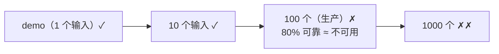
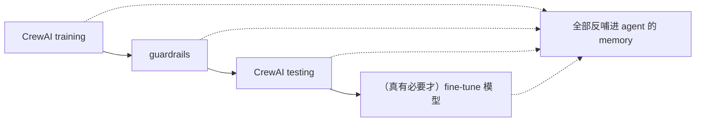
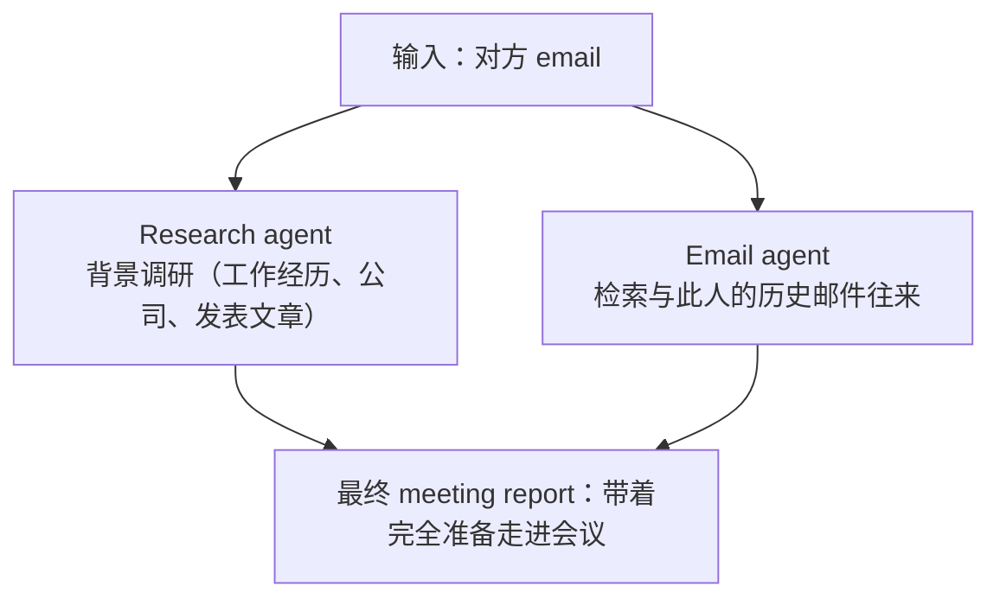
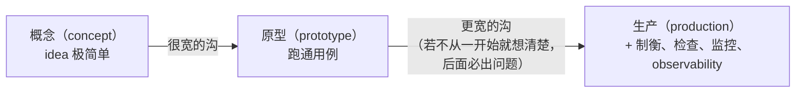

# L01-02 · 课程定位与总览（Design, Develop, and Deploy Multi-Agent Systems with CrewAI）

> 课程：Design, Develop, and Deploy Multi-Agent Systems with CrewAI（DeepLearning.AI × CrewAI）
> 本两节任务：定调整门课——这是一门**从原型到生产（prototype → production）**的多智能体系统课；给出全课路线图、Module 1 十二节地图，以及一个"会议准备 crew"的完整成品演示。

## 一句话定位

把复杂任务拆成子任务、交给多个专职 agent 执行的多智能体系统课——但重心不在"能跑 demo"，而在**可靠（reliable）、可重复（repeatable）、可管理（manageable）地跑到生产规模**。Andrew Ng 称之为"a definitive course"：学完你应掌握核心构建块、思维框架，以及从原型一路推到 scale 的完整路径。

**讲师**：CrewAI 的 João (Joe) Moura——Andrew Ng 介绍他"在多智能体系统流行之前很久就开始构建 CrewAI"，见过大量真实、有商业价值、有规模的落地实现（Andrew 本人是 CrewAI 的小额投资人）。若你上过此前 DeepLearning.AI × CrewAI 的合作课程，Joe 把本课定位为 **"phase three"**——不只是把东西搭出来，而是为了 scale、quality、reliability 而构建。

## 1. 为什么现在学这个：三个前提条件

Joe 的判断："The genie is not getting back in the bottle"——agent 的使用只会越来越多。但要成规模发生，系统必须同时满足三点：

| 支柱 | 含义 | 课程对应内容 |
|---|---|---|
| **Easy to build** | 极易构建，快速拿到价值（get to value fast） | agents / tasks / crews / flows 构建块，低层控制特性 |
| **Trustworthy** | 可靠且可重复的产出（reliable & repeatable outcomes） | guardrails、testing、training、观测 |
| **Manageable** | 能管理到规模化 | 版本控制、trace 监控、构建块复用 |

值得注意的是对 **scale 的重新定义**：scale 不（只）是"一小时跑一百万个 agent"，而是**构建块可复用**——自定义 tools 跨用例复用、甚至 agent 本身复用。

> **架构师视角**：这三条支柱其实是一张验收清单。"easy to build" 是开发体验问题，多数框架都能给；真正分层的是后两条——trustworthy 对应 eval/guardrail 层、manageable 对应 observability/复用层，恰好是我的选型矩阵里 5-observability-eval 和 2-framework 的评估维度。评估任何 agent 框架时，先问它对后两条给了什么原生答案。

## 2. 可靠性问题：从 demo 到 1000 个输入

Andrew 点出了 agent 开发最常见的死亡曲线：

结论不是"agent 不可靠"，而是：**懂得驱动 agent 开发流程（agent development process）的团队，有一整套工具突破 80%**。Joe 给出的可靠性改进谱系（成本从低到高）：

配套的纪律流程（Andrew 的总结）：构建多智能体系统 → 设计 observability 机制（知道什么时候 work、什么时候不 work）→ 快速定位错误 → 用 prompting / fine-tuning 等工具修复 → 循环。**这套方法比大多数人以为的更可行**——不容易，但比普遍认知的容易。

> **对比课程 13《Multi AI Agent Systems with crewAI》（2024 同厂商基础课）**：13 课教的是 role-playing、agents/tasks/crews 三件套、"让 demo 跑起来"；本课（2025-11）是同一作者的**生产化续作**——新增 flows（低层控制）、testing/training、trace 监控、版本控制、生产案例模块，且开宗明义把"80% 可靠 ≈ 不可用"当作头号敌人。可以理解为：13 课回答"怎么搭"，本课回答"怎么搭到敢上线"。

## 3. Agent 的非确定性：卖点与代价一体两面

Joe 对用例本质的刻画：这些系统有趣，恰恰因为它们**非确定性（non-deterministic）**——agent 能接入多种数据源，不只做认知（cognition），还能 **self-heal**、对运行时抛来的任何东西即时反应。但这不能以"产出不可靠、不可重复"为代价。**本课的核心张力就是：保留非确定性的灵活，换取确定性的质量。**

## 4. 成品演示：Meeting Prep Crew

L2 展示了一个课程结束时你能亲手构建的生产级 crew——会议准备助手：

这是刻意选的"简单用例"，课程后面会构建复杂得多的系统（code review、deep researcher 等）。

## 5. 课程路线

### 5.1 全课弧线（L2 给出）

| 阶段 | 内容 |
|---|---|
| 构建 | 搭出你的第一个多智能体系统并持续改进 |
| 管理 | 在不同规模下管理 AI agent：从小启动 → 扩张 → 生产 |
| 评估 | 如何度量 agentic 系统的性能（evaluation） |
| 技术栈 | 围绕 agent 正在成形的**新技术栈（new technology stack）** |
| 用例 | 更大、更有影响力的用例——公司在真实世界里跑通了什么 |
| 收尾 | 把这些原则用回你的职业：你自己能构建的用例 |
| 最终模块 | 多家把 CrewAI 用在生产环境的公司现身说法 |

课程反复强调的鸿沟（这是全课的组织逻辑）：

### 5.2 Module 1 十二节地图

| # | 主题 | 类型 |
|---|---|---|
| L1 | Welcome（Andrew Ng × Joe Moura 对谈定调） | 概念 |
| L2 | Course overview（路线图 + meeting prep 演示） | 概念 |
| L3 | What are AI agents?（定义、与传统自动化对比） | 概念 |
| L4 | Use cases for AI agents（复杂度×精度矩阵、agency 谱系、crews vs flows） | 概念 |
| L5 | What makes an AI agent intelligent?（LLM 原理、context engineering） | 概念 |
| L6 | 构建第一个 agent（context engineering 实操；任务重于 agent 的 80/20 法则） | lab |
| L7 | 从单 agent 到多 agent 专职化（各带自己的 tools/knowledge/prompt） | 概念+规划 |
| L8 | 构建第一个多智能体系统：deep research crew（4 agents，贯穿后续课程迭代） | lab |
| L9 | 原型 → 生产的鸿沟（one-off 自动化 → 生产系统） | 概念 |
| L10 | 观测与优化（human time vs machine time、调试、持续改进策略） | 概念 |
| L11 | 规模化生产用例（真实企业 80–97% 效率提升案例） | 概念 |
| L12 | 总结与未来（agent 采用模式的变迁、对技术决策的影响） | 概念 |

### 5.3 本课要学的构建块清单（L1 预告）

- 核心构建块：**agents、tasks、crews**
- 定制与优化：**memory、tools（含 MCP）、execution hooks、guardrails**
- 低层控制：**CrewAI flows + states**
- 质量闭环：metrics 测试、**human feedback 训练 agent**、随时间持续改进
- 生产化：性能追踪、版本控制、trace 监控、agent loop 全程改进

> **架构师视角**：L1 的构建块清单几乎就是 11-design-patterns.md 里"编排层之下的横切关注点"全集（memory / tools / hooks / guardrails / eval）。CrewAI 的差异化押注在 **crews（高 agency）+ flows（高 control）双抽象**——大多数框架只给其中一头（对比 LangGraph 以图控制为主、AutoGen 以对话协作为主），这个"两头都给、按需切换"的设计是后续选型对比时要重点验证的主张。

## 6. 本课总结

| 要点 | 一句话 |
|---|---|
| 课程定位 | 同厂商 2024 基础课的 "phase three"：从能跑 demo 到敢上生产 |
| 三支柱 | easy to build / trustworthy / manageable，缺一不可 |
| 可靠性谱系 | training → guardrails → testing → fine-tuning，全部沉淀进 memory |
| 鸿沟模型 | 概念 → 原型 → 生产两道沟，observability 要从 day one 设计 |
| scale 新定义 | 不是并发量，是 tools/agents 构建块的跨用例复用 |
| 双抽象 | crews（agency 优先）+ flows（control 优先） |

> **记忆点（引出 L3）**：这两节把"为什么"讲完了——agent 必须可靠、可重复、可管理。但地基还没打：到底什么是 AI agent？它和写死分支的传统自动化差在哪？L3 给出全课的工作定义："**一个能决定接下来发生什么、以达成目标的系统**"。

## 与我的资产映射

- 设计模式层：`agent/skills/agent-selection/11-design-patterns.md`（crews vs flows 对应"自主编排 vs 工作流编排"两大模式家族）
- 框架层：`agent/skills/agent-selection/2-framework/03-framework-profiles.md`（CrewAI 条目——本课是官方一手信源，可校准 profile 里对 flows/testing/training 的描述）
- 面试包：`agent/interview/jd-senior-agent-engineer/01-agent-run-loop-and-orchestration`（"80% 可靠如何突破"是高频追问，本课的可靠性谱系是标准答案素材）
- [[project_selection_matrix]]
