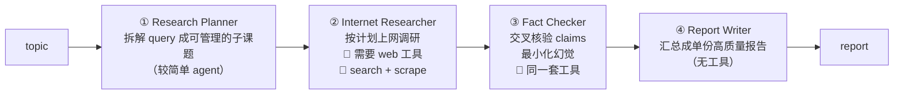

# L07–08 · Lab：规划并构建四 Agent 深度研究系统（sequential crew + 工具）

> 课程：Design, Develop, and Deploy Multi-Agent Systems with CrewAI（DeepLearning.AI × CrewAI，Module 1）
> 本课任务：先想清楚**什么时候值得从单 agent 升级到多 agent**（L7 规划），再动手搭一个 **deep research crew**（L8 实做，`C1M1_Lab_L8_automatic_deep_research.ipynb`）：四个专职 agent 按 sequential 顺序接力，把一个 topic 变成一份事实核查过的完整报告。这个 crew 会贯穿后续多课，持续被加固升级。

## 1. L7 规划：为什么要多 agent

单 agent 已经很强，但榨取价值的最佳方式是**让 agent 各自专精**：与其一个全能 agent，不如多个专职 agent，**每个带自己的 tools、自己的 knowledge、自己的 prompt**。

什么时候加 agent、加几个，有一个平衡。对照前面课程的 use case 矩阵：**高复杂度**（无论低精度还是高精度要求）的场景通常需要不止一个 agent——核心动作是 **divide and conquer**：拆分问题、按分工设 agent，甚至**不同 agent 用不同 LLM**，一切为最终输出质量服务。

> **架构师视角**："要不要多 agent"的判据不是任务大小，而是**分工是否能带来专精收益**：每个 agent 有了更窄的 role，它的 prompt、工具集、甚至模型选型都可以按角色调优（规划用小模型、研究用带工具的模型）。如果拆出来的几个"角色"共享同一套 prompt 和工具，那只是把一个 agent 复制了 N 份，徒增编排成本——这正是 `11-design-patterns.md` 里"multi-agent 的成本要用专精收益来偿还"的判断。

## 2. Deep research crew 的设计：topic in → report out

一端进 topic，一端出 report，中间四个 agent **sequential（顺序）**接力：



- **Planner**：把任意 topic 拆成更小、更具体的研究子课题——一个较简单的 agent；
- **Researcher**：接住 plan 去执行调研，**需要工具**（搜索网页、抓取内容）；
- **Fact Checker**：独立一个 agent 只做事实核查——交叉核对 claims、确保有效性、最小化幻觉；
- **Report Writer**：把规划、调研、核查的所有知识收敛成**一份连贯报告**。

课程刻意选了最简单的 **sequential** 通信方式（按固定顺序，后一个吃前一个的输出）。但 João 提醒：sequential 并非总是最优，随着 use case 演化应探索其他通信风格——**hierarchical、hybrid、parallel、asynchronous**（多 agent 并行、最后汇聚到一个 agent）等。

## 3. L8 实做①：环境与工具实例

三大类的 import 与上一个 lab 完全相同，多了模型与工具的配置：

```python
from crewai import Agent, Task, Crew
import os
from utils import get_openai_api_key

os.environ["MODEL"] = "gpt-4o-mini"                 # 用环境变量统一设默认模型
os.environ["OPENAI_API_KEY"] = get_openai_api_key()  # （课程邀请你换模型对比效果）
```

Researcher 需要"上网"的能力，本课用两个 **预构建工具**（自定义工具后续课程再讲）：

```python
from crewai_tools import EXASearchTool, ScrapeWebsiteTool
from utils import get_exa_api_key
os.environ["EXA_API_KEY"] = get_exa_api_key()

exa_search_tool = EXASearchTool(base_url=os.getenv("EXA_BASE_URL"))  # exa.ai 语义搜索
scrape_website_tool = ScrapeWebsiteTool()                            # 抓取指定网页正文
```

- **EXASearchTool**（EXA Search Web Loader）：基于 exa.ai API 的**语义搜索**——比常规 embedding 检索更能捕捉概念间的上下文关系；
- **ScrapeWebsiteTool**：提取并读取指定网站内容，开箱即用。

## 4. L8 实做②：四个 Agent（工具挂在 agent 上）

Planner 延续 role/goal/backstory 老三样，lab 额外引入两个**限流/限步参数**：

```python
research_planner = Agent(
    role="Research Planner",
    goal="Analyze queries and break them down into smaller, specific research topics.",
    backstory="You are a research strategist who excels at breaking down complex "
              "questions into manageable research components. ...",
    verbose=True,
    max_rpm=150,     # 每分钟最大请求数，防止触发限流
    max_iter=15,     # 最大迭代步数，超过则必须给出当前最佳答案
)
```

其余三个 agent 同一模式，关键差异在 **`tools` 参数**——工具是挂在 agent 上的能力：

```python
researcher = Agent(
    role="Internet Researcher",
    goal="Research thoroughly all assigned topics",
    backstory="...",                                  # lab 留白：自己发挥
    tools=[exa_search_tool, scrape_website_tool],     # 🔧 搜索 + 抓取
    verbose=True, max_rpm=150, max_iter=15,
)

fact_checker = Agent(
    role="Fact Checker",
    goal="Verify data for accuracy, identify inconsistencies, "
         "and flag potential misinformation",
    tools=[exa_search_tool, scrape_website_tool],     # 🔧 与 researcher 同一套工具
    ...,
)

report_writer = Agent(
    role="Report Writer",
    goal="Write clear, concise, and well-structured reports based on gathered information",
    ...,                                              # 无工具：纯写作
)
```

注意 **researcher 和 fact_checker 共用同一套工具**：核查者需要能独立上网复核，而不是只审阅 researcher 递过来的材料。

> **架构师视角**：Fact Checker 拿到与 Researcher 相同的工具，是"**验证者必须有独立取证通道**"的设计——若它只能看上游输出，就退化成对着同一份材料复述的橡皮图章，无法真正压幻觉。同理 Report Writer **刻意不给工具**：写作阶段再开检索口子，等于允许未经核查的新信息绕过 Fact Checker 混进报告。工具分配 = 信息流的权限设计。

## 5. L8 实做③：四个 Task 与 `{user_query}` 插值

第一个 task 首次出现**变量插值**——用户输入以 `{变量名}` 写进 description：

```python
create_research_plan_task = Task(
    description=(
        "Based on the user's query, break it down into specific topics and key "
        "questions, and create a focused research plan. "
        "The user's query is: {user_query}"          # ← 运行时由 inputs 注入
    ),
    expected_output="A research plan with main research topics to investigate, "
                    "key questions for each topic, and success criteria for the research.",
    agent=research_planner,                          # task ↔ agent 显式绑定
)
```

跑 crew 时总有一个"用户输入"的成分要注进来；`kickoff(inputs=...)` 会把它**自动插值到 tasks 和 agents 中所有提到该变量的地方**，从第一个 task 开始决定整个 plan 的走向。

其余三个 task 同一标准（description 里大量使用 comprehensive 这类形容词、明确说要包含什么、要什么来源），按 lab 的任务卡各自定义 expected_output 并绑定 agent：

| Task | 绑定 agent | expected_output 要点 |
|---|---|---|
| create_research_plan | research_planner | 研究计划：子课题 + 每题关键问题 + 成功标准 |
| gather_research_data | researcher | 全部子课题的信息 + 引用来源 + 来源可信度注记 |
| verify_information_quality | fact_checker | 数据+审查报告：一致性检查结果、来源可靠性评级 |
| write_final_report | report_writer | 最终报告：完整回答 + executive summary + 完整引用 |

## 6. L8 实做④：组装 Crew、注入输入、观察执行

```python
crew = Crew(
    agents=[research_planner, researcher, fact_checker, report_writer],
    tasks=[create_research_plan_task, gather_research_data_task,
           verify_information_quality_task, write_final_report_task],
    # tasks 列表的顺序 = 执行顺序：sequential 下后一个 task 拿前一个的输出
)

user_query = ("Evaluate the top 5 emerging AI tools for automating "
              "competitive market analysis")          # 课程示例 query，鼓励换着玩

result = crew.kickoff(inputs={"user_query": user_query})  # 触发插值 + 顺序执行

from IPython.display import Markdown
Markdown(result.raw)                                   # 最终报告是 markdown，直接渲染
```

verbose 日志值得逐段"跟读"（这是理解 crew 运行机制的最好素材）：

1. **Planner** 先产出完整的信息搜集计划；
2. **Researcher** 开始**用工具**：调用 EXA search 搜"emerging AI tools for market analysis 2025"，工具输出里能看到 URL、标题、ID、发布时间；随后决定 scrape 具体网站深挖某个工具，对多个站点重复，最后汇总成 Final Answer；
3. **Fact Checker** 也在搜索，但查询**更有针对性**（features、pricing），逐一验证上游发现的每个软件（如 Quantilope）；
4. **Report Writer** 产出 markdown 报告：覆盖 Delve AI、Quantilope、Crayon 等工具，附引用来源网站、功能对比表、局限性与成本分析。

如果某个 task 的输出不符合预期，**回去改它的 `expected_output`** 再跑——这正是 L6 "expected_output 即验收契约"的实操闭环。

> **对比课程 13《Multi AI Agent Systems with crewAI》（2024 同厂基础课）**：结构上几乎是同一道题（研究→写作的角色接力 + 挂搜索/抓取工具），可直接对照出演进点：① 工具从 SerperDevTool（Google SERP 关键词检索）换成 **EXASearchTool 语义搜索**，检索层跟着行业从关键词走向语义；② 新课把 `max_rpm` / `max_iter` 这类**运行时护栏参数**放进第一个 lab，2024 版基本不谈——框架成熟的标志是把限流、步数上限这类生产关切前置；③ sequential 仍是默认心智（tasks 列表顺序即执行顺序），hierarchical 从 2024 版的"压轴亮点"变成一句"你还会见到 hierarchical/hybrid/parallel/async"的预告。API 面没有破坏性变化，`{变量}` 插值 + `kickoff(inputs=...)` 也一脉相承。

> **对比 AutoGen 的 conversation-first 范式**：同样做"调研→核查→写报告"，AutoGen 的做法是把几个 ConversableAgent 拉进 group chat，靠对话轮转（或 manager 选择发言者）推进，**执行顺序是涌现的**；CrewAI 这里的顺序写死在 `tasks=[...]` 列表里，**拓扑是声明的**。声明式拓扑换来可预期、可调试（每个 task 的输出可单独验收），代价是灵活性——需要动态分派时得升级到 hierarchical 或换 LangGraph 自定义图（见 `2-framework/03-framework-profiles.md` §7 反模式、`11-design-patterns.md` 拓扑三型：需要"现场决定谁干活"才上 orchestrator-workers）。

## 7. 本课总结

| 要点 | 一句话 |
|---|---|
| 多 agent 的动机 | 专精化：每个 agent 自带 tools/knowledge/prompt；高复杂度 use case 靠 divide and conquer |
| 四角色流水线 | Planner → Researcher(🔧) → Fact Checker(🔧) → Writer，sequential 接力 |
| 工具挂载 | `tools=[...]` 挂在 Agent 上；EXASearchTool（语义搜索）+ ScrapeWebsiteTool |
| 核查者独立取证 | fact_checker 与 researcher 同工具集；writer 无工具防绕过核查 |
| 输入插值 | description 写 `{user_query}`，`kickoff(inputs={...})` 全局注入 |
| 运行护栏 | `max_rpm` 防限流、`max_iter` 限步数强制收敛 |
| 顺序即拓扑 | `Crew(tasks=[...])` 列表顺序 = 执行顺序；更复杂拓扑（hierarchical/parallel/async）后续再上 |

> **记忆点（引出 L9–L11）**：这个 crew 已经能跑通"topic → 核查过的报告"，但它还只是**能跑**：输出结构靠 prompt 约束、失败无兜底、执行过程只能靠 verbose 日志裸看。L9–L11 进入生产化与调试——继续拿这同一个 deep research crew 开刀，让它"不只更复杂，而且更可靠（way more reliable）"。

## 与我的资产映射

- 设计模式层：`agent/skills/agent-selection/11-design-patterns.md`——本课是 §"chaining + Multi-Agent（研究→写→编）"场景行的教科书实例；"何时升级 orchestrator-workers/hierarchical" 的判据可直接复用
- 框架层：`agent/skills/agent-selection/2-framework/03-framework-profiles.md` §7 crewAI（多角色协作甜区/需精细状态控制换 LangGraph）、§8 AutoGen/MAF（conversation-first 的现状）
- 面试包：`agent/interview/jd-senior-agent-engineer/01-agent-run-loop-and-orchestration`（sequential vs hierarchical vs group chat 的编排对比；`max_iter` 作为 run loop 终止条件的实例）
- [[project_selection_matrix]]
