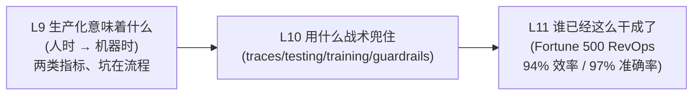
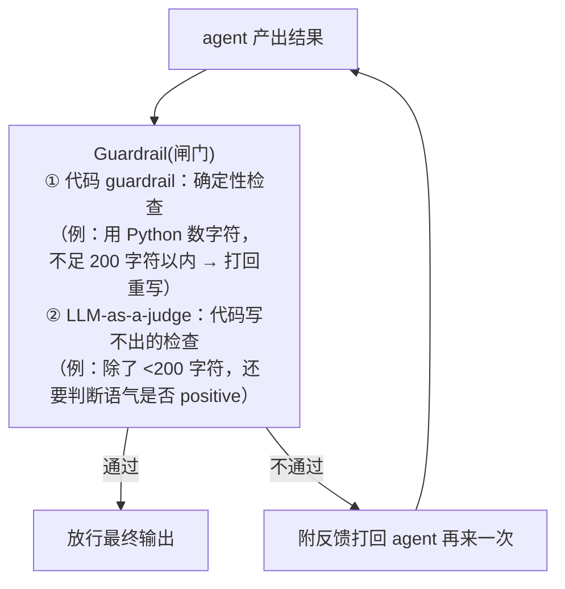
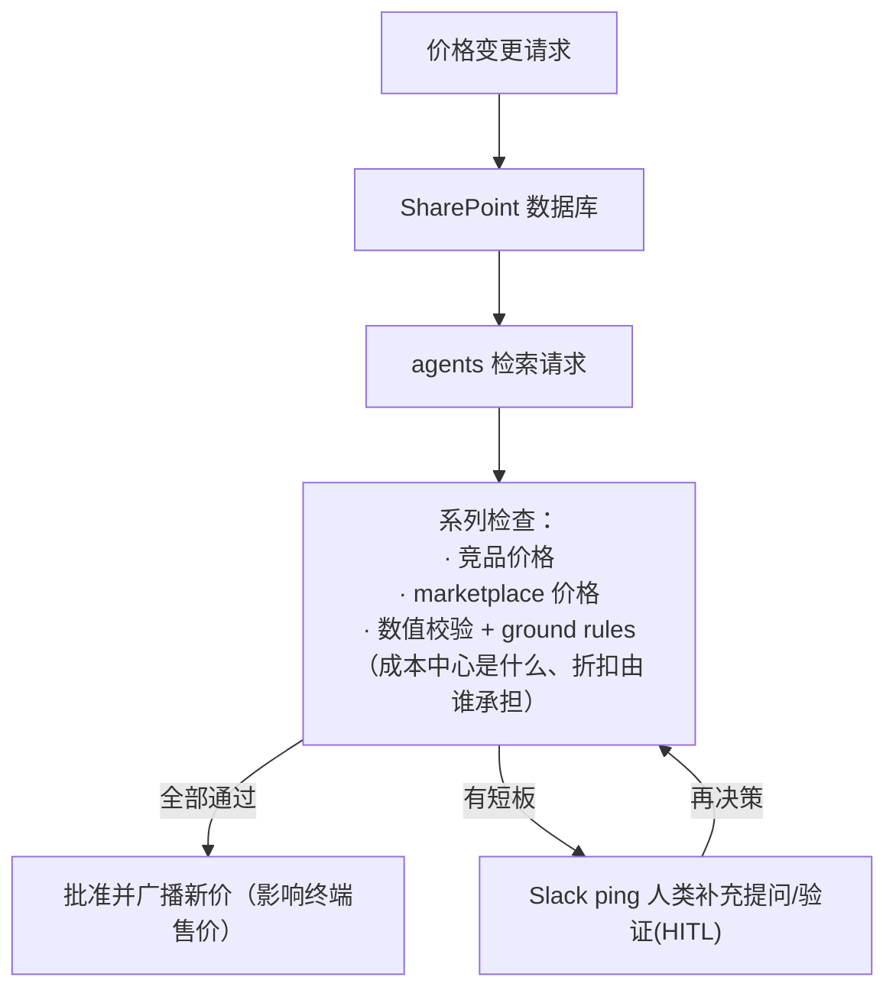

# L9-11 · 从原型到生产：机器时间、四大调优战术与规模化案例

> 课程：Design, Develop, and Deploy Multi-Agent Systems with CrewAI（DeepLearning.AI × CrewAI）· Module 1
> 本篇合并三课：L9 Multi-agent systems in production（生产化的挑战）、L10 Tactics for debugging, observing, optimizing（四大调优战术）、L11 Use cases at scale（规模化真实案例）。无代码，纯方法论。

## 0. 三课路线

到 L8 为止已经会搭 crew 了，但 Joe 开宗明义：**原型和生产之间的鸿沟是巨大的（the gap is huge）**。三课递进：

## 1. L9 · 生产化的本质：从人时（human time）到机器时（machine time）

原型阶段的 crew 往往是**一次性自动化（one-off automation）**：比如会议准备 crew、转写纪要+行动项+起草邮件 crew——开会前你手动触发一次、拿结果，或者小范围部署给自己的工程团队。一旦开放给整个公司，运行节奏就换挡了：

| | 人时（human time） | 机器时（machine time） |
|---|---|---|
| 用户量 | 少数用户，甚至只有你自己 | 数千用户 |
| 执行量 | 一天几次到几十次 | 数十万次执行 |
| 监控方式 | ad hoc 看 trace 就能定位修复 | 无法再逐条人工盯，**漏洞会堆积（vulnerabilities pile up）** |
| 用户画像 | 一小撮熟练用户 | 全公司各水平用户 |

### 两类必须同时具备的指标

| 指标类型 | 视角 | 内容 | 用途 |
|---|---|---|---|
| **Zoom-in metrics** | 单次执行 | debug、复现错误、查 traces / prompts / tokens | ad hoc 排障：钻进一次执行看清每一步 |
| **Zoom-out metrics** | 整个系统 | LLM-as-a-judge、质量、幻觉、ROI / 成功指标 | 规模化后对系统整体做质量把关 |

> **架构师视角**：zoom-in / zoom-out 正是我在 `5-observability-eval.md` 里"trace 埋点层"与"eval 层"的两分——zoom-in 对应一次提问一棵 span 树的可观测性，zoom-out 对应离线/在线 eval 与 LLM-as-Judge。课程的增量表述是**换挡时机**：人时阶段 zoom-in 就够，切到机器时的那一刻，没有 zoom-out 你就是盲飞。

### 坑在流程，不在技术

Joe 给出的一线观察：模型已经足够强，**卡在生产门口的团队，问题几乎都出在 process 而非 tech**。典型流程之坑：

1. 没花足够时间**规划用例**；
2. 没有**清晰的成功定义**（definition of success）；
3. 没把流程**拆成小块**（smaller chunks）让多个 agent 分担；
4. 即便定义了成功，也**不度量、不评估**——部署了却说不清有没有创造价值，直接阻碍后续投入；改进系统时也无法判断趋势是否向好。

> **对比 9-serving-deployment.md**：课程说的"人时→机器时"正是我 serving 选型文档里"同步单次调用 → 异步后台/批量执行"的升级触发信号——执行量上到十万级，部署形态、重试与队列、trace 采样策略都要跟着换挡，而不是只把原型代码放上服务器。课程点破的是同一条阶梯的"为什么"，我的文档给的是"怎么爬"。

## 2. L10 · 四大调优战术：traces、testing、training、guardrails

前情提要：执行量越堆越高，**不仅要 speed to value，还要足够信任输出**才敢"开到 11 档"。context engineering（system prompt、清晰指令、role playing、memory、tools）大多已内嵌在 CrewAI 里，但部署后你必然会问三个 debug 问题：

- **Why did my agent do X?**（为什么这么做）
- **Where did this data come from?**（数据从哪来）
- **What tools did my agent use?**（用了什么工具）

四个战术依次回答"看清行为 → 选对模型 → 塑造行为 → 兜住底线"：

| 战术 | 解决什么 | 机制 | 备注 |
|---|---|---|---|
| **Traces** | 看清每一步 | 本地跑 crew 时终端出 trace，结束给链接跳转 CrewAI AMP 的浏览器 UI：从初始 task、每次 LLM 调用、工具调用到中间一切，可看耗时、展开工具输入、逐条 message | zoom-in 的落地 |
| **Testing** | 数据驱动选模型 | 拿同一份 agent + task 定义，对多个 LLM 各跑一遍，每个请求配 LLM-as-a-judge 打分，横向比较哪个模型完成任务最可靠 | "based on actual data instead of vibing your way" |
| **Training** | 让 agent 记住你的偏好 | **不是微调**：agent 反复执行任务→每轮结束向人要反馈→反馈转成 learnings 写入 agent memory→未来执行时注入回 prompting | 改 context 的第三条路（前两条：改 task 描述、改 agent 定义） |
| **Guardrails** | 强制格式/行为底线 | agent 完成任务前的"闸门"：通过则放行最终答案；不通过则**带反馈打回 agent 重做** | 生产系统的兜底 |

### Guardrail 的两种形态

prompting 只是冰山一角（tip of the iceberg）：agent 有 role / goal / backstory，task 有 description / expected output，改这些确实控制了送进模型的内容，但 testing、training、guardrails 才是把"非确定性系统"驯成"可信任系统"的成套手段。后续模块还会有更多性能优化手段。

> **对比课程 21 Evaluating AI Agents**：CrewAI Testing 相当于课程 21 里 "experiments + LLM-as-Judge" 的框架内置简化版——好处是零搭建成本就能做模型对比，代价是评审维度、数据集管理、回归基线都不如 Phoenix/独立 eval 框架可定制。我的裁决：用 Testing 做**模型初选**，正经回归 eval 仍按 `5-observability-eval.md` 的 4 层评估落独立平台。另注意 CrewAI 的 "Training" 是把人工反馈注入 memory/prompt 的**上下文级学习**，与权重级 fine-tuning 完全两回事，命名容易误导。

## 3. L11 · 规模化案例：数字与蓝图

生产用例的整体水位：**80–97% 的效率提升**（不同公司口径不同，常见口径是"实施 agent 前后同一任务的耗时对比"）。

### 旗舰案例：Fortune 500 消费品公司（CPG）的 RevOps

背景：卖薯片/维生素/方便面/啤酒这类超市商品的真实 Fortune 500 公司，首个用例是 **RevOps（收入侧运营）——加速价格变更审批**。历史流程靠大量人工审批：查竞品价、查各 marketplace 价。

结果与口径：

| 指标 | 数字 | 口径 |
|---|---|---|
| 上线速度 | **数周内 live** | 客户带用例找上门到投产 |
| 效率提升 | **94%**（优化后） | 单用例；全球化运营下每周可省数百小时 |
| 准确率 | **97%** | 同一时段人类决策 vs agent 决策**一对一对照** |

Joe 点明讲这个案例的目的：给你一份**可复制到自己公司/团队的 blueprint**。

### 版图：垂直行业 × 职能场景

| 维度 | 清单 |
|---|---|
| 头部垂直行业 | high-tech、咨询、电信、金融、客服、保险 |
| 高频职能场景 | 销售与营销自动化、开发者自动化、网络安全、供应链、定价、人员管理 |

### 收束：设计先行

L11 结尾把 L9-L10 串成一张**上线前设计清单**——事先想清楚这些，结果质量天差地别：

1. 想要的**输出质量**是什么；
2. agents 之间**如何协作**最合适；
3. **如何度量**性能；
4. 如何对不同**模型做测试**（Testing）；
5. 如何**扩容**（scaling）；
6. 放什么**guardrails**；
7. 端到端的 **observability 与 tracing** 怎么加。

> **架构师视角**：97% 准确率的评估口径值得单独记——**拿人类同期决策当 ground truth 做一对一影子对照（shadow comparison）**，这是审批类（决策型）用例最干净的 eval 设计，比事后人工抽检便宜且无偏；配合"不确定就 Slack 升级人类"的 HITL 出口，正是 `11-design-patterns.md` 里 evaluator + escalation 组合的教科书落地。另外注意案例选型逻辑：RevOps 审批是**高频、规则可枚举、错误可回滚**的流程，首个生产用例选它而不是开放式创作，本身就是取舍判断。

## 4. 本课总结

| 要点 | 一句话 |
|---|---|
| 人时→机器时 | 数十万执行后无法 ad hoc 监控，漏洞会堆积，观测要前置设计 |
| 两类指标 | zoom-in（trace 单次执行）+ zoom-out（LLM-as-judge 看系统质量/ROI） |
| 坑在流程 | 不规划、无成功定义、不拆分、不度量——败因是 process 不是 tech |
| Traces | 终端 + CrewAI AMP UI，逐步展开 LLM 调用/工具输入/messages |
| Testing | 同一 agent+task 打多个 LLM，judge 打分，数据驱动选模型 |
| Training | 人工反馈→learnings 进 memory→注入未来 prompting（非微调） |
| Guardrails | 代码检查 + LLM-as-judge 双形态闸门，不过关带反馈打回重做 |
| RevOps 案例 | Fortune 500 CPG 价格审批：数周上线、94% 效率、97% 准确率、HITL 兜底 |
| 设计先行 | 输出质量/协作方式/度量/模型测试/扩容/guardrails/观测，七项想在写码前 |

> **记忆点（引出 L12）**：L9-L11 讲的是"一个系统怎么活到生产"；L12 抬高一层视角——为什么 **AI agent 革命偏偏发生在现在**：企业采用模式已从 LLM 时代的边缘渗透翻转为中心化 enablement，一整套 agent 技术栈正在成形，而无论栈怎么选，每家公司都在问同样五个问题。

## 与我的资产映射

- 观测与评估：`agent/skills/agent-selection/5-observability-eval.md`（zoom-in/zoom-out = 埋点层/eval 层；CrewAI AMP 是垂直一体化方案，多框架并存时换框架中立平台）
- 部署形态：`agent/skills/agent-selection/9-serving-deployment.md`（人时→机器时 = 同步→异步后台的换挡信号）
- 设计模式：`agent/skills/agent-selection/11-design-patterns.md`（guardrail 闸门 = evaluator-optimizer；Slack 升级 = HITL escalation）
- 面试包：`agent/interview/jd-senior-agent-engineer/01-agent-run-loop-and-orchestration`（trace 一次执行的 run loop、guardrail 重试环）
- [[project_selection_matrix]]
