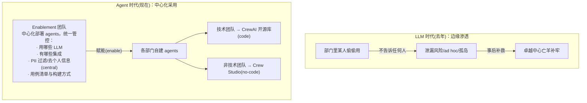
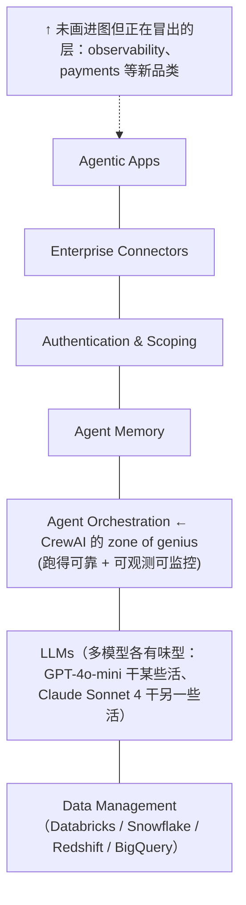

# L12 · Agent 革命为何在当下：中心化采用、Agent 技术栈与五问（Module 1 收尾）

> 课程：Design, Develop, and Deploy Multi-Agent Systems with CrewAI（DeepLearning.AI × CrewAI）· Module 1
> 本课是 Module 1 的收官课：不讲新技术，讲**趋势判断**——AI agents 回不去了（not going back），企业采用模式、技术栈、共性诉求各是什么，以及这对你的技术决策意味着什么。

## 0. 本课定位

L1-L8 讲"怎么建"，L9-L11 讲"怎么活到生产"，L12 抬到组织与产业层：**采用模式之变 → 可靠 agent 三要素 → 成形中的 agent 栈 → 每家公司都在问的五件事**。

## 1. 采用模式翻转：从边缘渗透到中心化 enablement

一年前 LLM 的企业采用是**从边缘开始（from the edges）**的：某个部门的某个人自己用 LLM 干活、很喜欢、但**谁也不告诉**。后果三连：

| LLM 边缘采用的问题 | 说明 |
|---|---|
| 信息泄漏风险高 | 不该发给 LLM 的数据被发出去了 |
| 用例 ad hoc、不可复制 | 别人无法复用同样的做法 |
| 知识孤岛 | 经验困在个人手里 |

采用因此**失序（de-organized）**，很多公司事后补救——设专门团队、建卓越中心（centers of excellence）。而 **AI agents 的采用模式一开始就不同**：

> **架构师视角**：这页 slide 是"平台工程"叙事在 agent 上的复刻——enablement 团队做的事就是内部 agent 平台：模型准入、集成白名单、PII 中间件、用例治理，然后把"造 agent 的能力"下放。对架构师的启示：**你的位置在中心那格**，价值不是替每个部门写 crew，而是定标准、铺轨道、让 code 与 no-code 两条道都通。这也是"资产复用框架"的组织学版本：不让公司把同一个 agent/工具造两遍。

## 2. 可靠 agent 的三要素

"building reliable agents" 围绕三件事：

| 要素 | 内涵 |
|---|---|
| **易建（easy to build）** | code 或 no-code 都行，要快——from zero to one in record speed |
| **可重复的结果（repeatable outcomes）** | 这是非确定性系统，**不会有两次相同的答案，但要保证所有答案都是好的** |
| **可扩展的方案（scalable solutions）** | 不只是"跑一百万个 agent"，更是**复用**：公司/团队不把同一个 agent、同一个工具造第二遍，building blocks 全司共享 |

## 3. 正在成形的 Agent 技术栈

围绕 agent 有一整个 stack 在成形，自底向上：

两个课程强调的判断：agents **必然要触达企业数据**（无论哪家数仓）；**没有一个模型通吃**，每个模型有自己的 flavor 和能力，按用例配型。

> **对比 2-framework/03-framework-profiles.md**：课程这张栈图和我的选型矩阵分层几乎一一对应——data ↔ 3-retrieval、LLMs ↔ 1-model、orchestration ↔ 2-framework、memory ↔ 6-memory、auth/connectors ↔ 4-tools、外加课程自己承认没画的 observability ↔ 5-observability-eval。差异在立场：CrewAI 把 orchestration 称作自家 zone of genius，是**厂商视角的栈**；我的矩阵是买方视角——每层独立选型、警惕任何一层的方案顺手把相邻层也"包办"了（AMP 同时吃掉 orchestration + observability 就是典型的甜蜜捆绑）。

## 4. 五问：无论栈怎么选，每家公司都在问

不管每层选了什么，**always five things**：

| # | 诉求 | 内涵 |
|---|---|---|
| 1 | **Interoperability** | 能换 provider，不被 vendor lock-in |
| 2 | **Observability** | 清楚 agent 做了什么、为什么这么做，可全程回溯 |
| 3 | **Governance** | 追踪数据访问；authn/authz 体系齐备，满足内部合规 |
| 4 | **Evaluations** | 持续确认表现达标、质量不随时间劣化（不把 agent 改坏） |
| 5 | **Guardrails** | 拿到更可靠、可重复的输出 |

CrewAI 对第 1 条的自答：平台上构建的东西**可以下载为 open source、随处运行**——用开放性对冲 lock-in 疑虑。

> **对比课程 13（crewAI 基础课）**：课程 13 的世界里只有 Role/Task/Crew 怎么写；这门课到 L12 给出的五问，恰好全是课程 13 不覆盖、而我 24 周路线图后半程逐层补的内容（观测=课程 21、guardrails=7-safety、governance/auth=4-tools 的 gateway 一节）。可以把五问当成**面试和方案评审的默认 checklist**：任何 agent 方案讲完，用这五个词各追问一句，深浅立现。

## 5. Module 1 收官

### L1-L12 一句话回顾

| 课 | 主题 | 一句话 |
|---|---|---|
| L1 | Welcome | Andrew Ng × Joe Moura 开场：把复杂任务拆给专业化 agents，是当下最重要的 AI 技能之一 |
| L2 | Course overview | 路线图：从原型到生产、评估、agent 新栈、真实用例、落回你的职业 |
| L3 | What are AI agents | 定义：**能决定下一步做什么以达成目标的系统**；LLM + 认知（在选项间做合理选择） |
| L4 | Use cases | 复杂度 × 精确度矩阵：最有价值的是高复杂度用例，最快的赢是低精确度用例（IRS 表单 70 页+手册 700 页 = 双高样板） |
| L5 | What makes it intelligent | 传统 AI 特征→预测 vs LLM 下一 token；生产可靠性来自每次 API 调用的 context engineering |
| L6 | Build your first agent | 80/20 法则：**多磨 task、少磨 agent**，task 定义差会拖垮好 agent；agent 可复用 |
| L7 | Planning multi-agent | 单 agent 强，专业化分工更强：每个 agent 有自己的工具/知识/prompt，合力攻高复杂度 |
| L8 | First multi-agent system | 动手建 deep research crew：research planner + internet researcher + fact checker + report writer 顺序执行 |
| L9 | Production | 人时→机器时；zoom-in/zoom-out 双指标；败因在 process 不在 tech |
| L10 | Debug/observe/optimize | 四战术：Traces（看清）、Testing（选模型）、Training（反馈进 memory）、Guardrails（闸门兜底） |
| L11 | Use cases at scale | 80-97% 效率提升；Fortune 500 CPG 价格审批 94%/97%；六大垂直 × 六大职能；设计先行 |
| L12 | The AI agent revolution | 中心化采用、可靠三要素、agent 栈成形、五问恒在 |

> **架构师的裁决**：这门 2025 课相对 2024 的课程 13，**原语层零增量**（还是 Role/Task/Crew，L6-L8 可快进），真增量全在生产化外围：① 人时/机器时与 zoom-in/zoom-out 的换挡框架；② Testing/Training/Guardrails 从"周边技巧"升为框架一等公民；③ RevOps 案例给了带数字、带 eval 口径（人类同期决策一对一对照）的落地样板；④ 中心化采用 + 五问是能直接搬进方案评审的组织级语言。一句话：**基础课教你把 crew 跑起来，这门课教你向 CTO 解释它凭什么上生产**——对我这种目标是架构师的人，后者才是该精读的部分。

### Module 2 预告

收官后先做 graded lab（实现一个 **multi-agent automatic code review system**）+ graded quiz；Module 2 动手实现：**tools、guardrails、execution hooks、MCP servers** for your crew。

## 6. 本课总结

| 要点 | 一句话 |
|---|---|
| 采用模式翻转 | LLM 是边缘渗透（泄漏/ad hoc/孤岛），agent 是 enablement 团队中心化部署再赋能各部门 |
| 中心管控内容 | 统一 LLM 准入、集成、PII 过滤、用例治理；code（开源库）与 no-code（Crew Studio）双通道 |
| 可靠三要素 | 易建（zero-to-one 快）、可重复结果（答案不同但都好）、可扩展（building blocks 不重复造） |
| Agent 栈 | data → LLMs → orchestration → memory → auth/scoping → connectors → agentic apps，observability/payments 在冒头 |
| 五问 | interoperability / observability / governance / evaluations / guardrails，与栈选型无关地恒在 |
| 开放对冲 | CrewAI 平台产物可下载为 open source 随处跑 |
| 下一步 | graded lab（自动代码评审系统）→ Module 2：tools、guardrails、execution hooks、MCP servers |

## 与我的资产映射

- 分层选型总图：`agent/skills/agent-selection/2-framework/03-framework-profiles.md`（课程栈图 ↔ 选型矩阵分层；crewAI 画像与反模式表）
- 观测与评估：`agent/skills/agent-selection/5-observability-eval.md`（五问里的 observability + evaluations 两问的展开）
- 部署：`agent/skills/agent-selection/9-serving-deployment.md`（"跑一百万个 agent"的 how）
- 设计模式：`agent/skills/agent-selection/11-design-patterns.md`（guardrails/HITL 模式）
- 面试包：`agent/interview/jd-senior-agent-engineer/01-agent-run-loop-and-orchestration`（五问 checklist 可直接用于方案评审类面试题）
- [[project_selection_matrix]]
