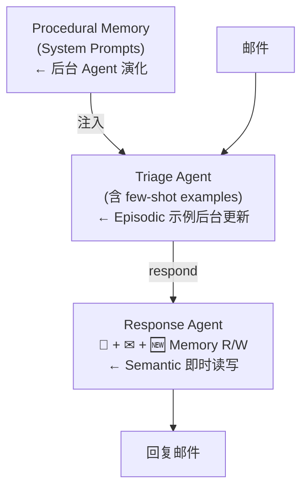

学习如何给 AI Agent 添加"长期记忆"——让它跨多次对话、跨多个会话持续学习和成长。
越来越多的 AI 应用需要"跨时间持续运行"——不再是一次性问答，而是长期陪伴用户。

场景	没有长期记忆	有长期记忆
每次对话	像第一次见面的陌生人	越用越懂你
会议安排	每次都问偏好	自动按你的习惯安排

长期记忆的两个核心难题
存什么（What to Store）
Semantic Memory（语义记忆）—— 事实
类比人类：你在课本上学到的知识、记住的别人的生日……

Agent 场景	例子
用户偏好	"用户喜欢上午开会"
人物画像	"Alice 是公司 CTO"
物品信息	"我们公司用 Slack 做内部沟通"

Episodic Memory（情景记忆）—— 经历
类比人类：去过迪士尼乐园的具体记忆，不是关于迪士尼的事实，而是那次经历本身。

Agent 场景	例子
Few-shot 示例	历史邮件 + 用户当时给出的 triage 决定
行为轨迹	"上次遇到类似邮件时 Agent 是这样处理的"
🎯 本质：Episodic 记忆 = 给 Agent 看"过往真实案例"作为参考。

Procedural Memory（程序记忆）—— 规则
类比人类：怎么骑自行车（动作技能），或者你给自己定的"处理邮件的原则"。

Agent 场景	例子
System Prompt	Agent 的行为指令
工具使用规则	"遇到 X 类邮件时调用 Y 工具"
流程规范	"回复前先检查日历是否冲突"
🎯 本质：Procedural 记忆 = Agent 自己的"规则手册"，且可被自动迭代优化。

三类记忆速查表
类型	一句话定义	在 Agent 里的形态
Semantic	事实和知识	向量数据库里的条目
Episodic	历史经历 / 案例	Prompt 里的 few-shot 示例
Procedural	规则和指令	System Prompt 本身

取什么（What to Retrieve）
检索时把记忆里的相关片段塞进上下文。

何时更新记忆

Hot path（每轮对话即时更新）
Background（后台异步更新）

场景	选哪个
关键事实，必须立刻可用（用户刚说的偏好）	Hot Path
大量历史汇总、模式提取	Background
系统 Prompt 优化（长期演进）	Background

三个自问问题（设计任何 Agent 时都该问）
问题	对应记忆类型
Agent 需要学习更好的指令吗？	Procedural
Agent 需要从过去案例中学习吗？	Episodic
Agent 需要记住人 / 地 / 物的事实吗？	Semantic