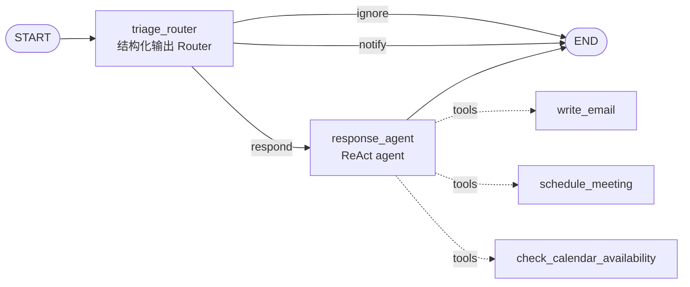

# L2 Baseline 邮件助理 — 本地演示项目

把 `lesson2.ipynb`（Long-Term Agentic Memory With LangGraph 课程 L2）改造成可直接命令行运行的演示项目。这是全课程的 baseline：**没有任何记忆**，只有 triage 分类 + ReAct 响应两级结构，L3–L5 在此之上逐层加 semantic / episodic / procedural memory。

## 架构



- **triage_router**：用 `with_structured_output(Router)` 强制 LLM 输出 `reasoning + classification`，按 ignore / notify / respond 三分类路由（`Command(goto=...)`）
- **response_agent**：`create_react_agent` 预制 ReAct agent，挂三个占位工具（真实场景接邮件/日历 API）

## 运行

```bash
cd L2
# 首次：建环境（Python 3.11，按课程 pin 的版本）
uv venv --python 3.11 .venv
uv pip install --python .venv/bin/python -r requirements.txt
cp .env.example .env   # 填入你的 API Key

# 演示：跑内置 3 封邮件（spam→ignore / CI 通知→notify / 同事提问→respond）
.venv/bin/python main.py

# 跑自定义邮件
.venv/bin/python main.py --email my_email.json
# JSON 格式: {"author": ..., "to": ..., "subject": ..., "email_thread": ...}
```

## 与课程 notebook 的差异

| 差异点 | notebook | 本项目 | 原因 |
|---|---|---|---|
| 模型 | `openai:gpt-4o(-mini)` | `.env` 中 `MODEL`（默认 deepseek-v4-flash） | 本地用 DeepSeek 的 OpenAI 兼容 API |
| 结构化输出 | 默认 method | `method="function_calling"` | DeepSeek 不支持 `json_schema` response_format |
| 入口 | 逐 cell 执行 | `main.py` CLI | 可演示 |
| 语言 | 全英文 | prompt/示例邮件/人物全中文化（张伟/李娜） | 中文演示更直观；分类枚举 `ignore/notify/respond` 保留英文——它是 function calling 的 schema 约束和代码分支依据 |

其余 prompts / schemas / 图结构与课程一致。
