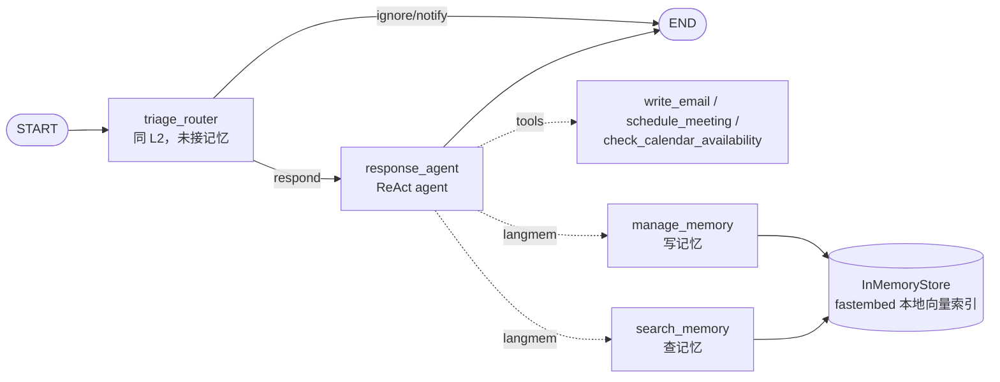

# L3 邮件助理 + Semantic Memory — 本地演示项目

在 [L2 baseline](../L2/README.md) 上新增**语义记忆**：agent 拿到 `manage_memory` / `search_memory` 两个工具，自主决定何时存、何时查。记忆存在 `InMemoryStore`（带向量索引），按 `("email_assistant", user_id, "collection")` 命名空间隔离。

## 架构



记忆是**工具型（agent 主动式）**：LLM 自己决定调不调记忆工具，prompt 里只是告诉它有这两个工具。这是 langmem "hot path" 写法；对比 12a 课程的 Memory Manager 是后台被动抽取。

## 运行

```bash
cd L3
uv venv --python 3.11 .venv
uv pip install --python .venv/bin/python -r requirements.txt fastembed
cp .env.example .env   # 填 API Key

.venv/bin/python main.py
```

演示两幕：

1. **记忆写入/读取**：`"Jim is my friend"` → agent 调 `manage_memory` 存；`"who is jim?"` → 调 `search_memory` 取
2. **跨邮件上下文**：Alice 提问邮件 → 回复后 agent 自主存了这次交互；追问邮件 `"Any update on my previous ask?"` 本身毫无信息量，agent 靠 `search_memory` 找回前情，回复里能准确说出是 `/auth/refresh`、`/auth/validate` 文档的事

## 与课程 notebook 的差异

| 差异点 | notebook | 本项目 | 原因 |
|---|---|---|---|
| Chat 模型 | gpt-4o-mini + claude-3-5-sonnet | `.env` 的 `MODEL`（deepseek-v4-flash） | 本地统一走 DeepSeek |
| Embedding | `openai:text-embedding-3-small` | fastembed `bge-small-en-v1.5`（384 维，纯 CPU） | DeepSeek 无 embedding API；本地跑不碰 MPS |
| 结构化输出 | 默认 method | `method="function_calling"` | DeepSeek 不支持 json_schema |
| HF 下载 | — | 默认 `HF_ENDPOINT=hf-mirror.com` | 国内直连 HuggingFace 卡死 |

`InMemoryStore` 的 `index={"embed": fn, "dims": 384}` 直接接受自定义 Python 函数——这是把课程代码从云 embedding 迁到本地的关键接口。
