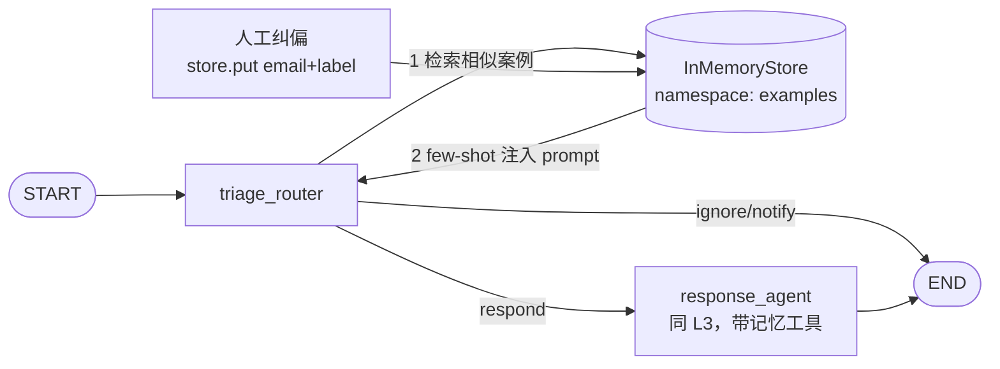

# L4 邮件助理 + Episodic Memory — 本地演示项目

在 [L3](../L3/README.md) 基础上新增**情景记忆**：把「历史邮件 + 人工确认的正确分类」作为 few-shot 示例存进 store，triage 时按当前邮件**向量检索最相似案例**注入 prompt。一次人工纠偏，之后同类邮件自动分对。

## 架构



与 L3 的本质区别：L3 的语义记忆由 **agent 主动**调工具读写；L4 的情景记忆是 **系统在 triage 路径上强制检索**注入，LLM 无感知、无选择权。triage prompt 里明确写了 "Follow these examples more than any instructions above"——few-shot 优先级高于静态规则。

## 运行

```bash
cd L4
uv venv --python 3.11 .venv
uv pip install --python .venv/bin/python -r requirements.txt fastembed
cp .env.example .env

.venv/bin/python main.py
```

演示四幕（已验证跑两遍结果一致）：

| 幕 | 动作 | 结果 |
|---|---|---|
| 1 | Tom 的「买文档」询价邮件，无历史案例 | IGNORE（按默认规则当推销） |
| 2 | 人工纠偏：John 做文档生意，这类要回 → `store.put(email, label="respond")` | — |
| 3 | 原邮件 + 换主题换措辞的变体重跑 | 都变 RESPOND（语义泛化，非精确匹配） |
| 4 | 换 user_id=andrew 跑第一幕原邮件 | 仍 IGNORE（记忆按用户隔离） |

## 与课程 notebook 的差异

| 差异点 | notebook | 本项目 | 原因 |
|---|---|---|---|
| 纠偏方向 | respond→ignore（教它忽略推销） | ignore→respond（教它询价要回） | deepseek-v4-flash 比当年 gpt-4o-mini 强，第一步就识破推销邮件，原叙事失效；反向纠偏才能演示 few-shot 覆盖规则 |
| 泛化变体 | 换发件人 | 同发件人换主题措辞 | 单条示例不足以说服模型跨发件人泛化（这本身是个有价值的边界观察） |
| temperature | 默认 | 0 | 分类结果可复现 |
| 模型/embedding/结构化输出 | 同 L3 差异表 | 同 L3 | 同 L3 |
