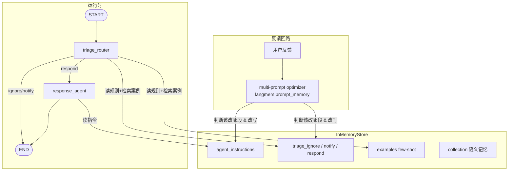

# L5 邮件助理 + Procedural Memory — 本地演示项目

在 [L4](../L4/README.md) 基础上新增**程序性记忆**：4 段指令 prompt（`agent_instructions` / `triage_ignore` / `triage_notify` / `triage_respond`）不再硬编码，而是存进 store（`namespace=(user_id,)`），每次构建 prompt 时现读。用户给出反馈后，langmem 的 multi-prompt optimizer 会判断该改哪段指令、怎么改，写回 store——**agent 的行为准则本身成了可进化的记忆**。

## 架构



三种记忆在本课汇齐：semantic（collection，agent 主动读写）、episodic（examples，triage 强制检索）、procedural（4 段指令，反馈驱动进化）。

## 运行

```bash
cd L5
uv venv --python 3.11 .venv
uv pip install --python .venv/bin/python -r requirements.txt fastembed
cp .env.example .env

.venv/bin/python main.py
```

演示四幕（已验证）：

| 幕 | 动作 | 结果 |
|---|---|---|
| 1 | Alice 提问邮件 | RESPOND，回复签 "Best, John" |
| 2 | 反馈 "Always sign your emails \`John Doe\`" | optimizer 只改了 `agent_instructions`，追加签名要求 |
| 3 | 同一封邮件重跑 | 回复签 "Best, **John Doe**" |
| 4 | Alice Jones 邮件先 RESPOND；反馈 "Ignore any emails from Alice Jones" | `triage_ignore` 被追加规则，重跑变 IGNORE |

第四幕能看到 optimizer 的「多 prompt 路由」判断力：一条反馈同时更新了 `agent_instructions` 和 `triage_ignore`，而 notify/respond 两段没被动。

## 与课程 notebook 的差异

| 差异点 | notebook | 本项目 | 原因 |
|---|---|---|---|
| optimizer 模型 | `anthropic:claude-3-5-sonnet-latest` | 复用 DeepSeek llm 实例 | 本地统一 |
| 结构化输出 | — | `FunctionCallingChat` 子类无条件覆盖 `method="function_calling"` | langmem 0.0.8 的 `PromptMemory` **硬编码** `method="json_schema"`（`langmem/prompts/stateless.py`），DeepSeek 会 400；只改调用处不够，必须在模型类层面覆盖 |
| prompt 回写 | 只回写 main_agent，其余留作练习 | 4 段全部回写（`PROMPT_STORE_KEYS` 映射） | 补全课程 TODO，第四幕才能生效 |
| 模型/embedding | 同 L3 差异表 | 同 L3 | 同 L3 |
