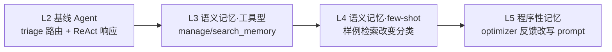

# Long-Term Agentic Memory With LangGraph — 本地化演示版

课程原版（DeepLearning.AI）依赖 OpenAI + Anthropic API。本目录已本地化：

- **Chat**：DeepSeek `deepseek-v4-flash`（OpenAI 兼容端点）
- **Embedding**：fastembed 本地跑 `BAAI/bge-small-en-v1.5`（384 维，ONNX 纯 CPU）
- **依赖**：课程原 pin（langchain 0.3.18 / langgraph 0.2.72 / langmem 0.0.8）已升级到最新版，代码结构零改动

L2–L5 每课一个 `main.py`，python 命令直接跑，均已实跑验证通过。

> 课程原始说明：项目最初用 Poetry 搭建，但已不需要；requirements.txt 可直接使用，文件引用均相对当前课目录。需 Python 3.11+。

## 环境准备（一次性）

L2–L5 共用 `code/` 根目录下的一个 venv：

```bash
cd "agent/courses/memory/12-Long-Term Agentic Memory With LangGraph/code"
uv venv --python 3.11 .venv
uv pip install -p .venv/bin/python -r requirements.txt
```

`code/.env` 里配置（已就位，换 key 时改这里）：

```
DEEPSEEK_API_KEY=sk-...
MODEL=deepseek-v4-flash
```

## 怎么跑

每课一个 `main.py`，带分节横幅逐步打印课程叙事：

```bash
cd "agent/courses/memory/12-Long-Term Agentic Memory With LangGraph/code"
.venv/bin/python L2/main.py   # 基线：triage 分类 + ReAct 起草回信（~1 分钟）
.venv/bin/python L3/main.py   # 记忆工具：存/取记忆 + 追问邮件衔接（~2 分钟）
.venv/bin/python L4/main.py   # few-shot 四步翻转（~2 分钟）
.venv/bin/python L5/main.py   # prompt 自我改写：两轮反馈 + 分类翻转（~3 分钟）
```

各课 notebook 仅作课程原文对照（执行输出已保留，可直接翻看），不作为演示入口。

## 每课演示看点



| 课 | 演示叙事（对照 notebook 输出） |
| --- | --- |
| **L2** | 基线邮件助理：垃圾推销邮件 → IGNORE，正经 API 文档提问 → RESPOND，随后 ReAct agent 起草回信 |
| **L3** | 给 agent 挂上 langmem 的 `manage_memory` / `search_memory` 工具：对话中主动存记忆，后续邮件能检索到之前的上下文 |
| **L4** | few-shot 记忆四步翻转：同一封邮件 ①初判 RESPOND → ②存入 ignore 样例后 IGNORE → ③换个措辞的变体邮件仍 IGNORE（语义检索命中）→ ④换 `langgraph_user_id` 后回到 RESPOND（记忆按用户隔离） |
| **L5** | 程序性记忆：`create_multi_prompt_optimizer` 把自然语言反馈写进 prompt——"Always sign your emails John Doe" 进了 main_agent 指令；"Ignore any emails from Alice Jones" 让同一封邮件从 RESPOND 翻成 IGNORE |

**注意（L4）**：课程原版用 "want to buy documentation?" 这封一眼假的推销邮件演示"模型被骗→few-shot 纠正"，但 deepseek 直接识破它（样例前就 IGNORE），翻转失效。本地化版把演示邮件反向设计成正经提问（初判 RESPOND），叙事才能完整走通。

## 本地化改了什么

每课只动了 4–5 个 cell，每处保留原模型名注释：

- `init_chat_model("openai:gpt-4o-mini")` / `create_react_agent("openai:gpt-4o", ...)` → `make_llm()`
- `InMemoryStore(index={"embed": "openai:text-embedding-3-small"})` → `index={"embed": make_embed(), "dims": EMBED_DIMS}`
- L5 optimizer 的 `"anthropic:claude-3-5-sonnet-latest"` → `make_llm()`

适配层在各课的 `local_stack.py`（四课同一份），import 即完成 `.env` 加载与网络补丁，内置三件事：

1. **结构化输出**：DeepSeek 不支持 `json_schema` response_format，子类无条件改走 `function_calling`（langmem 的 prompt_memory optimizer 会硬编码前者，必须在子类层拦）
2. **thinking 关闭**：`deepseek-v4-flash` 默认开 thinking、不支持强制 tool_choice，建模型时 `extra_body={"thinking": {"type": "disabled"}}`
3. **网络补丁**：HF 走镜像、`api.deepseek.com` 加入 NO_PROXY 直连、fastembed 缓存固定到 `~/.cache/fastembed` 且已缓存时强制离线

## 依赖版本

| 包 | 课程原版 | 本地化版 |
| --- | --- | --- |
| langchain | 0.3.18 | 1.3.14 |
| langchain-openai | 0.3.5 | 1.4.1 |
| langchain-anthropic | 0.3.7 | 1.5.2 |
| langgraph | 0.2.72 | 1.2.9 |
| langmem | 0.0.8 | 0.0.30 |
| fastembed | — | 0.8.0 |

新版兼容性结论：`langgraph.prebuilt.create_react_agent`（含 `prompt=`/`store=` 参数）、langmem 三个工厂函数、`InMemoryStore` 自定义 embed 函数在 1.x 下全部原样可用。
