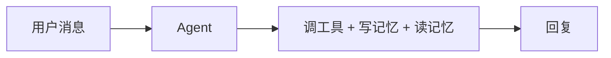
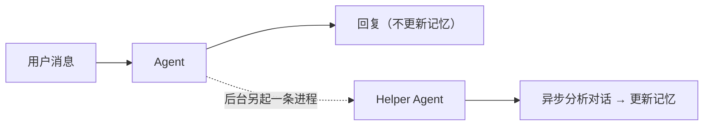
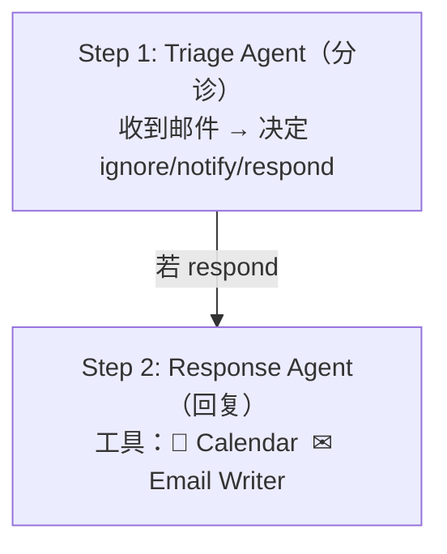
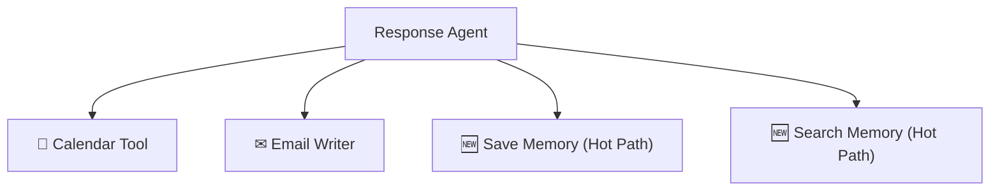
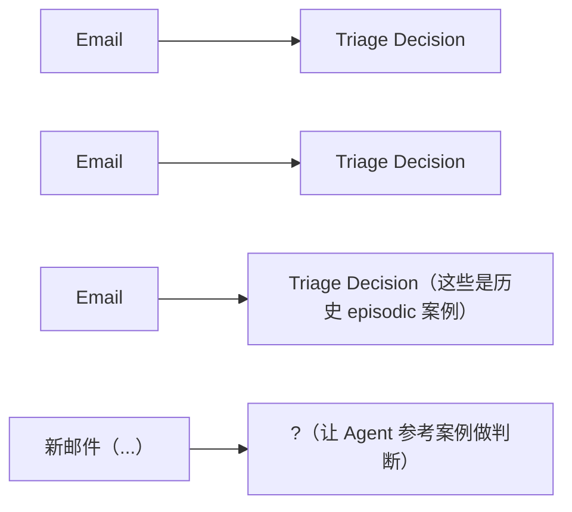
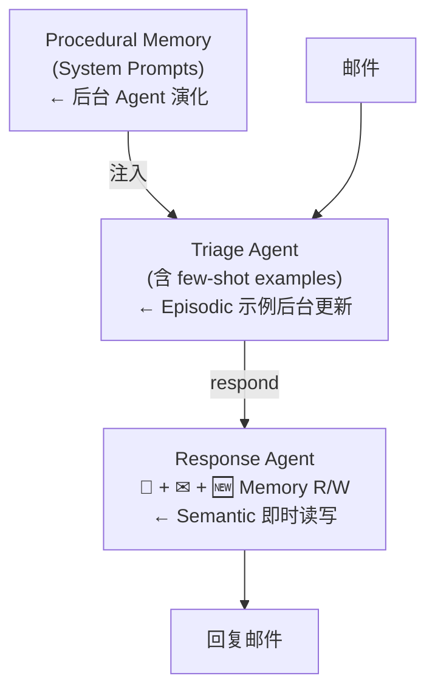

# 第 1 课：Agent 三大记忆类型 & 邮件助理蓝图

> 课程：Long-Term Agentic Memory With LangGraph · Lesson 1
> 讲师：Harrison Chase
> 原文件：`subtitles/sc-LangChain-C6-L1.vtt`

---

## 一、本课目标

> **建立"Agent 长期记忆"的完整心智模型**：
> - 三大记忆类型（Semantic / Episodic / Procedural）
> - 两种更新模式（Hot Path / Background）
> - 把它们映射到一个真实邮件助理项目

本课**没有代码**，全程概念和架构图。下一课开始动手。

---

## 二、为什么从"邮件助理"切入？

### 2.1 数据：开发者的真实需求

> LangChain 团队前几个月**对开发者做调研**："Agent 现在最适合做什么任务？"
>
> **第二高票**就是：**个人助理 + 生产力工具**。

### 2.2 没有记忆的助理 = 失忆的人

> 想象一个真实的人类助理——**如果他每次都把你说过的话忘干净，那这助理基本是废的。**
>
> 同理，Agent 没有长期记忆 = 用户体验灾难。

### 2.3 邮件助理的天然契合

| 痛点 | 邮件助理能做什么 |
|------|------------------|
| 邮件越来越多忙不过来 | 自动 triage（分诊）+ 自动回复 |
| 像高管助理那样工作 | 查日历、写邮件、判断优先级 |
| 多次互动 | **不断学习用户的偏好** |

---

## 三、邮件助理需要哪些"记忆"？

### 3.1 关键决策点

```
收到邮件
    ↓
① 该忽略 / 通知 / 回复？
    ↓ 若回复
② 用户的会议时间偏好？
③ 用户的会议地点 / 主题偏好？
    ↓
④ 用户的写作风格 / 语气？
⑤ 之前和这个人的互动历史？
```

**每一个 ❓ 都是一个记忆需求。**

---

## 四、🧠 三大记忆类型详解

### 4.1 Semantic Memory（语义记忆）—— 事实

> **类比人类**：你在课本上学到的知识、记住的别人的生日……

| Agent 场景 | 例子 |
|-----------|------|
| 用户偏好 | "用户喜欢上午开会" |
| 人物画像 | "Alice 是公司 CTO" |
| 物品信息 | "我们公司用 Slack 做内部沟通" |

### 4.2 Episodic Memory（情景记忆）—— 经历

> **类比人类**：去过迪士尼乐园的具体记忆，不是关于迪士尼的事实，而是**那次经历本身**。

| Agent 场景 | 例子 |
|-----------|------|
| **Few-shot 示例** | 历史邮件 + 用户当时给出的 triage 决定 |
| 行为轨迹 | "上次遇到类似邮件时 Agent 是这样处理的" |

> 🎯 **本质**：Episodic 记忆 = 给 Agent 看"过往真实案例"作为参考。

### 4.3 Procedural Memory（程序记忆）—— 规则

> **类比人类**：怎么骑自行车（动作技能），或者你给自己定的"处理邮件的原则"。

| Agent 场景 | 例子 |
|-----------|------|
| **System Prompt** | Agent 的行为指令 |
| 工具使用规则 | "遇到 X 类邮件时调用 Y 工具" |
| 流程规范 | "回复前先检查日历是否冲突" |

> 🎯 **本质**：Procedural 记忆 = Agent 自己的"规则手册"，且**可被自动迭代优化**。

### 4.4 三类记忆速查表

| 类型 | 一句话定义 | 在 Agent 里的形态 |
|------|------------|-------------------|
| **Semantic** | 事实和知识 | 向量数据库里的条目 |
| **Episodic** | 历史经历 / 案例 | Prompt 里的 few-shot 示例 |
| **Procedural** | 规则和指令 | System Prompt 本身 |

---

## 五、🔄 两种更新模式

### 5.1 Hot Path（热路径）—— 即时更新



**特点**：

| ✅ 优点 | ❌ 缺点 |
|---------|---------|
| 简单（只有一个 Agent） | Agent 同时干两件事，更复杂 |
| 记忆**立即生效** | 增加用户响应延迟 |

### 5.2 Background（后台）—— 异步更新



**特点**：

| ✅ 优点 | ❌ 缺点 |
|---------|---------|
| 主 Agent 简洁、专注 | 系统更复杂（两个 Agent） |
| 用户响应更快 | 记忆**不是即时**生效 |

### 5.3 选型建议

| 场景 | 选哪个 |
|------|--------|
| 关键事实，必须立刻可用（用户刚说的偏好） | Hot Path |
| 大量历史汇总、模式提取 | Background |
| 系统 Prompt 优化（长期演进） | Background |

---

## 六、🗺 课程实战路线图：把三类记忆装进邮件助理

### 6.1 起点：Baseline Email Agent



### 6.2 渐进加入三类记忆

#### ① Semantic Memory（Hot Path）

> **在 Response Agent 上增加两个工具**：
> - 🧠 **写记忆工具**（Save Memory）
> - 🔍 **读记忆工具**（Search Memory）
>
> Agent 在用 Calendar、写邮件的过程中，**即时读写记忆**。



#### ② Episodic Memory（Background）

> **在 Triage Agent 的 Prompt 里**插入 few-shot 示例：



> 这些示例**通过后台进程**从历史交互中提取并更新到 Prompt 里。

#### ③ Procedural Memory（Background + 独立优化 Agent）

> **System Prompt 本身被视为可演化的"程序记忆"**：
>
> - 用一个独立的 Agent 在后台**自动优化** Prompt
> - 比如根据用户反馈，调整 triage 的判断规则
> - 调整工具使用的指令

---

## 七、💎 三大核心理念

### 7.1 通用性

> ⭐ **本课程虽然以邮件助理为例，但所有记忆管理技术都适用于你未来要构建的任何 Agent。**

### 7.2 三个自问问题（设计任何 Agent 时都该问）

| 问题 | 对应记忆类型 |
|------|--------------|
| Agent 需要**学习更好的指令吗**？ | Procedural |
| Agent 需要从**过去案例**中学习吗？ | Episodic |
| Agent 需要记住**人 / 地 / 物的事实**吗？ | Semantic |

### 7.3 没有银弹

> 选用哪类记忆 + 哪种更新模式，**完全取决于你的应用场景**。

---

## 八、📝 整体架构图



---

## 🎯 下一课预告

> **Lesson 2**：动手构建 **Baseline Email Agent**——
>
> 不带记忆的版本，让你先看清楚"裸 Agent"的样子。后续 3 课才会逐步把三类记忆塞进去。

---

## 九、面试速答总结

**一句话**：Agent 的长期记忆按认知科学分**三类**——**Semantic（事实，落地为向量库条目）/ Episodic（历史案例，落地为 prompt 里的 few-shot）/ Procedural（规则，落地为 System Prompt 本身且可被后台 Agent 自动优化）**；每类记忆还要选**更新时机**——**Hot Path（即时读写、立刻生效但增延迟）vs Background（异步 helper agent 更新、主 agent 简洁但不即时）**；设计任何 agent 时用三个自问（要不要学更好的指令 / 从过去案例学 / 记住人地物的事实）来决定用哪几类。

### 面试回答骨架（问"agent 的记忆怎么设计 / 长期记忆有哪几种 / 偏好怎么持久化"）

> 1. **先给分类框架（要会背）**：借人类记忆做类比——**Semantic=课本知识/别人生日**（用户偏好、人物画像、公司事实）；**Episodic=去迪士尼那次经历**（历史邮件+当时的 triage 决定，即 few-shot 案例）；**Procedural=怎么骑车/自定的处理原则**（System Prompt、工具使用规则、流程规范）。
> 2. **落地形态对齐**：Semantic → **向量数据库条目**（读时检索）；Episodic → **prompt 里的 few-shot 示例**（给模型看过往真实案例）；Procedural → **System Prompt 本身**，且能被一个独立 agent 根据反馈**自动迭代优化**。
> 3. **更新模式二选一**：**Hot Path**——主 agent 在回复过程中即时读写记忆，简单、立即生效，但让 agent 一心二用、增加响应延迟；**Background**——回复后另起 helper agent 异步分析对话更新记忆，主 agent 专注、响应快，但记忆非即时生效。
> 4. **选型规则**：刚说出口、必须马上可用的关键事实 → Hot Path；大量历史汇总/模式提取、System Prompt 长期演进 → Background。

### 关键判断（加分点）

- **"三个自问"是可迁移的设计模板**：面对任何新 agent 都问——要不要**学更好的指令**(Procedural)、要不要**从过去案例学**(Episodic)、要不要**记住人/地/物的事实**(Semantic)。这比背名词更能体现架构能力。
- **记忆类型 × 更新模式是两个正交维度**：常见误区是把它们混为一谈。同一类记忆既可 Hot Path 也可 Background——例如 Semantic 偏好在本课走 Hot Path，但历史汇总类 Semantic 更适合 Background。
- **Procedural 记忆最反直觉也最有价值**：把 System Prompt 当成"可演化的程序记忆"，让后台 agent 依据用户反馈自动改写 triage 规则——这是"agent 自我改进"的朴素形态，是加分亮点。
- **没有银弹**：用哪类记忆 + 哪种更新模式完全取决于场景（延迟容忍度、即时性要求、反馈闭环有无），面试忌讲"全都要上"。

### 为什么这是高分答法

- 不背"agent 要有记忆"，而是给**三类记忆 × 两种更新模式**的正交框架，并对齐到具体落地形态（向量库/few-shot/System Prompt）；
- 用"三个自问"把设计方法论化，能从邮件助理迁移到任意 agent，体现架构师视角。

**一句话收尾**：Agent 长期记忆的本质是把"该记什么"（Semantic 事实 / Episodic 案例 / Procedural 规则）和"何时更新"（Hot Path 即时 / Background 异步）拆成两个正交决策——按场景的即时性和延迟容忍度组合，而不是无脑全上，这正是设计有记忆 agent 的取舍核心。

> 关联：`../../../11-AI Agents in LangGraph/notes/L05-持久化与流式输出.md`（记忆落到持久化底座）、`../../../../skills/agent-selection/`（记忆选型矩阵）。
