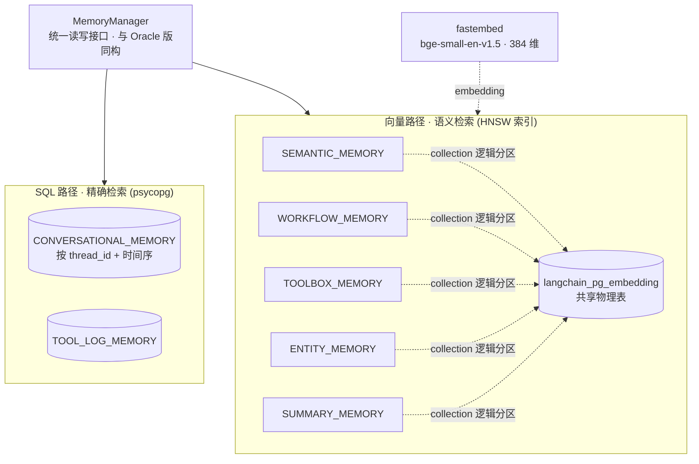

# 12a·L2 Memory Manager — pgvector 版（Oracle 替换对照实验）

回答一个选型问题：**课程用的 Oracle 26ai 能不能换成 PostgreSQL + pgvector？** 能，而且这个目录就是证明：`main.py` 的演示流程（③④⑤ 步）与 `../L2/main.py` **逐字相同**，`MemoryManager` 的向量方法也逐字相同——真正重写的只有 Infrastructure 层（连接、DDL、SQL 方言、向量存储类），全部集中在 `helper_pg.py`。这正是 L2 三层架构（Application / Memory / Infrastructure）承诺的"换底座上层不动"。

## 架构



## 运行

```bash
# 1. 起 PG（一次性，镜像 ~430MB，秒级启动；5433 避开本机已占用的 5432）
docker pull docker.m.daocloud.io/pgvector/pgvector:pg17   # Docker Hub 直连不通时走 daocloud 镜像
docker tag docker.m.daocloud.io/pgvector/pgvector:pg17 pgvector/pgvector:pg17
docker run -d --name pg-memory-lab -p 5433:5432 \
    -e POSTGRES_PASSWORD=postgres pgvector/pgvector:pg17

# 2. 环境（一次性）
cd L2-pgvector
uv venv --python 3.11 .venv
uv pip install --python .venv/bin/python -r requirements.txt

# 3. 演示
.venv/bin/python main.py
```

演示流程与 Oracle 版相同：建 2 张 SQL 表 + 5 个向量 collection + HNSW 索引 → 灌 arXiv 论文（HF 拉不到自动退内置样例）→ 语义检索两连（`"space exploration"` 命中航天论文、`"agent long-term memory"` 命中 Generative Agents/RAG，结果与 Oracle 版一致）→ 会话记忆写 3 轮按 `thread_id` 读回。


## 取舍与注意点（架构师视角）

- **"同一个库 SQL + 向量"的核心卖点两边等价**：L2 的关键权衡（精确/时序走 SQL 表、语义走向量）在 PG 里同样一个连接搞定，不需要独立向量库。
- **物理布局差异是真实的取舍**：Oracle 版"一种记忆一张表"清晰直观；`langchain_postgres` 把所有 collection 塞进 `langchain_pg_embedding` 一张共享表（`collection_id` 区分）。若要严格的每表隔离（独立索引参数、独立扩缩容），得绕开 LangChain 集成手写 pgvector 表——多写 ~60 行，换来完全控制。
- **PGVector 必须传 `embedding_length`**：不传时 embedding 列是无维度的 `vector`，HNSW 索引建不起来。
- **课程 Oracle 特有物**：hybrid search（`OracleVectorizerPreference`）课里只留了接口没真用；PG 侧可用 `tsvector` 全文检索 + 向量自拼 RRF 实现同等能力。
- **本地体验**：pgvector 镜像 ~430MB、秒级启动 vs Oracle Free 4.8GB、30-60 秒初始化。

## helper_pg.py 的由来

`helper_pg.py` 由脚本从课程 `helper.py`（2011 行）程序化生成：Oracle 专属区域整段替换、SQL 方言方法逐个精确替换，其余 1400+ 行 DB 无关代码（Toolbox、摘要压实、工具注册、样例数据）**逐字节保留**。同一份文件被 L2/L3/L4/L5-pgvector 四个目录共用（各自持有副本，与课程目录结构一致）。L3-L5 的对照移植见各自目录的 README。

## 踩坑记录

- **Docker Hub 直连 Service Unavailable**：本机未配 registry mirror，`docker.m.daocloud.io` 前缀拉取后重打 tag 即可（见上面运行步骤第 1 步）。
- 本机 5432 已被其他项目的 PG 占用，容器映射到 **5433**；连接串通过 `.env` 的 `PG_DSN` 覆盖。
- `langchain_postgres` 走 SQLAlchemy，连接串前缀是 `postgresql+psycopg://`；`psycopg.connect` 用 `postgresql://`——`main.py` 里从同一个 `PG_DSN` 派生两种格式。
- 清场重建：SQL 表逐张 `DROP TABLE IF EXISTS`；向量侧直接删 `langchain_pg_embedding` + `langchain_pg_collection` 两张共享表最干净（`vs.delete_collection()` 逐个删也行但慢）。
