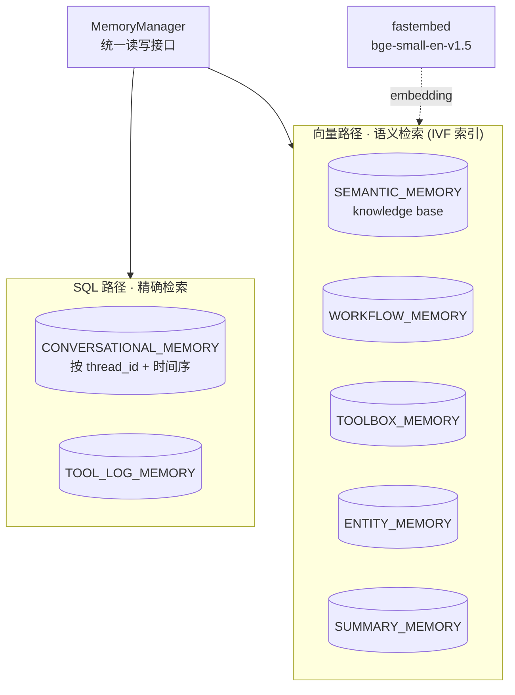

# 12a·L2 Memory Manager — 本地演示项目

课程 12a 的核心论点在这一课落地：**不同记忆类型需要不同的数据模型与检索策略**——会话记忆走 SQL 表按 `thread_id` 精确取，知识库等走向量表做语义检索，全部放在**同一个 Oracle 库**里，由 `MemoryManager` 统一编排。

## 架构



## 运行

```bash
# 1. 起 Oracle（一次性，~4.8GB 镜像，ARM 原生；等 30-60 秒初始化）
docker run -d --name oracle-memory-lab -p 1521:1521 \
    -e ORACLE_PASSWORD=YourPassword123 gvenzl/oracle-free:23-slim-faststart
docker logs -f oracle-memory-lab   # 看到 DATABASE IS READY TO USE! 即可

# 2. 环境（一次性）
cd L2
uv venv --python 3.11 .venv
uv pip install --python .venv/bin/python \
    oracledb langchain-oracledb langchain-community langchain-core fastembed python-dotenv datasets

# 3. 演示
.venv/bin/python main.py
```

演示五步：建 VECTOR 用户 → 建 7 张表 + 5 个 IVF 向量索引 → 灌 arXiv 论文（HF 拉不到自动退内置样例）→ 语义检索两连（`"space exploration"` 命中航天论文、`"agent long-term memory"` 命中 Generative Agents/RAG）→ 会话记忆写 3 轮按 `thread_id` 读回。

容器常驻后台即可反复跑；`docker stop oracle-memory-lab` 停掉，`docker start oracle-memory-lab` 再起。

## 与课程 notebook 的差异

| 差异点 | notebook | 本项目 | 原因 |
|---|---|---|---|
| Oracle | 课程平台预装 26ai Free | Docker `gvenzl/oracle-free:23-slim-faststart`（23ai） | 本课用到的 VECTOR 列 + IVF 索引 23ai 全支持；helper.py 一行没改 |
| Embedding | HuggingFaceEmbeddings（mpnet, 768 维, torch） | FastEmbedEmbeddings（bge-small, 384 维, ONNX 纯 CPU） | 免装 torch 全家桶；LangChain Embeddings 接口一致，OracleVS 无感 |
| 数据源 | HF `nick007x/arxiv-papers` 流式 100 篇 | 先试 HF（走 hf-mirror），失败退内置 10 篇样例 | 该数据集经镜像不可达；演示不该依赖网络 |
| 演示范围 | 只查 knowledge base | 加了会话记忆写读对比 | SQL 精确 vs 向量语义的对比正是本课论点 |

## 踩坑记录

- 课程 helper 的 `safe_create_index` 特意用 **IVF 而非 HNSW**（注释写明避开 Oracle Free 的 ORA-00600/51928/51962），本地 23ai Free 同样适用——别自己改回 HNSW
- `setup_oracle_database` 默认管理员密码 `YourPassword123`、DSN `127.0.0.1:1521/FREEPDB1`，与 gvenzl 镜像的 `ORACLE_PASSWORD` 环境变量和默认 PDB 名正好对齐，这是零改动的关键
