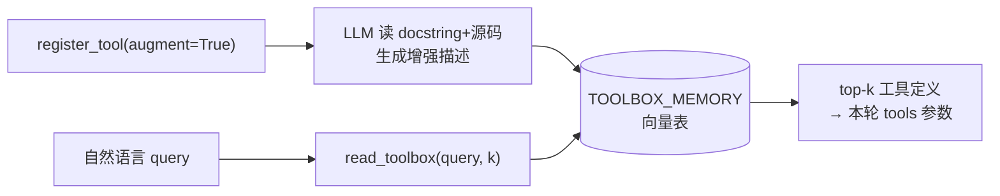

# 12a·L3 Semantic Tool Memory — 本地演示项目

课程主题：**工具定义也是记忆（程序性记忆）**。工具多了不能全量塞 context——上下文膨胀，且 LLM 的工具选择能力随选项数退化。解法：工具定义向量化存进 `TOOLBOX_MEMORY` 表，按 query 语义检索 top-k。`read_toolbox` 本身也注册为工具，形成"能找工具的工具"的自举设计。

## 架构



## 运行

```bash
# 前提：Oracle 容器在跑（见 ../L2/README.md）
cd L3
uv venv --python 3.11 .venv
uv pip install --python .venv/bin/python \
    oracledb langchain-oracledb langchain-community langchain-core \
    fastembed python-dotenv openai "arxiv==2.1.3" "pymupdf==1.23.26" langchain-text-splitters
cp .env.example .env   # 填 DeepSeek key

.venv/bin/python main.py
```

演示：注册 4 个工具（`read_toolbox` / `get_current_time` / `arxiv_search_candidates` / `fetch_and_save_paper_to_kb_db`，augment=True 的会先经 LLM 增强 docstring）→ 三个不同措辞的 query 验证语义映射：「Get more details on a paper on AI」→ fetch 工具、「find recent academic publications」→ arxiv 搜索、「what time is it」→ 时间工具。

## 与课程 notebook 的差异

| 差异点 | notebook | 本项目 | 原因 |
|---|---|---|---|
| LLM | `OpenAI()` + helper 写死 `gpt-5` | `ModelRewriteClient` 适配器统一改写为 `.env` 的 MODEL 并关 thinking | helper 不可改动的前提下接 DeepSeek |
| search_tavily | 注册 | 有 `TAVILY_API_KEY` 才注册 | 本机无 Tavily key |
| arxiv/pymupdf 版本 | 课程平台旧版 | pin `arxiv==2.1.3` + `pymupdf==1.23.26` | langchain_community 依赖 `Search.results()`（arxiv 4.x 已删）、`Result.download_pdf()`（4.x 已删）和 `fitz.fitz`（pymupdf 1.24+ 已删）；1.4.8 又因 arxiv.org 强制 HTTPS 而 301 全挂——2.1.3 是唯一三者兼容的窗口 |
| Embedding / Oracle | 同 L2 差异表 | 同 L2 | 同 L2 |
