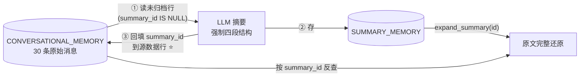

# 12a·L4 Memory Operations（压实与自更新）— 本地演示项目

课程主题：**Compaction ≠ Summarization**。摘要是有损压缩、不可还原；压实是无损卸载——原文搬进 DB，上下文只留 `[Summary ID] + 描述`，需要时 `expand_summary(id)` 换回来。等于给上下文做虚拟内存分页。

## 架构



⭐ 第 ③ 步是精髓：归档状态持久化在数据行本身而非内存游标——崩溃重启可恢复。

## 运行

```bash
# 前提：Oracle 容器在跑（见 ../L2/README.md）
cd L4
uv venv --python 3.11 .venv
uv pip install --python .venv/bin/python \
    oracledb langchain-oracledb langchain-community langchain-core \
    fastembed python-dotenv openai "arxiv==1.4.8" pymupdf langchain-text-splitters
cp .env.example .env

.venv/bin/python main.py
```

演示五步（已验证）：灌 30 条研究对话 → 监控 context（~2,000 tokens）→ `summarize_conversation`（四段结构摘要 + summary_id 回填）→ `expand_summary` 完整还原原文 → SQL 验证：未归档 0 条 / 已归档 32 条，conversation context 降到 ~141 tokens。

## 与课程 notebook 的差异

| 差异点 | notebook | 本项目 | 原因 |
|---|---|---|---|
| 压实函数来源 | notebook 内联定义（教学） | 直接 import helper 的同名实现 | helper 已导出，避免重复 |
| LLM / Embedding / Oracle / arxiv | 同 L3 差异表 | 同 L3 | 同 L3 |
| 距离策略 | EUCLIDEAN（同课程） | EUCLIDEAN | L4/L5 notebook 与 L2/L3 的 COSINE 不同，保持课程原样 |
