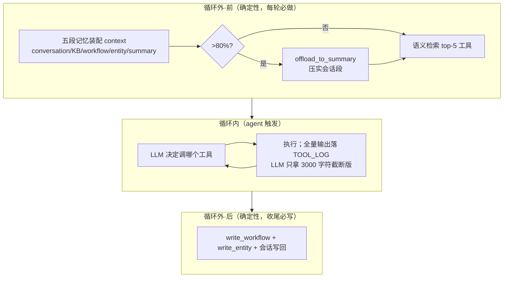

# 12a·L5 Memory-Aware Agent — 本地演示项目（课程终局）

L2 的存储层 + L3 的工具记忆 + L4 的压实机制，接成一个完整的 memory-aware agent loop。本课就是 12a 那张 2×2 触发矩阵的活体演示：**确定性操作在循环外，agent 触发的操作在循环内**。

## 架构



## 运行

```bash
# 前提：Oracle 容器在跑（见 ../L2/README.md）；需能访问 arxiv.org
cd L5
uv venv --python 3.11 .venv
uv pip install --python .venv/bin/python \
    oracledb langchain-oracledb langchain-community langchain-core \
    fastembed python-dotenv openai "arxiv==2.1.3" "pymupdf==1.23.26" langchain-text-splitters
cp .env.example .env

.venv/bin/python main.py    # 全程 ~5-10 分钟（含 arxiv 下载与 LLM 多轮调用）
```

演示是同一 thread 连续 5 问（课程原序列）：

| # | 问题 | 展示的记忆机制 |
|---|---|---|
| 1 | Can you get me the paper MemGPT | 语义工具检索 → arxiv 搜索 → 全文抓取入 KB |
| 2 | Can you save the content of the paper | 会话记忆接上文（"the paper"指代消解） |
| 3 | What are the main key takeaways | KB 记忆（论文 chunks 被检索进 context） |
| 4 | Summarize the conversation using your tool | agent 主动调 `summarize_and_store` 压实 |
| 5 | What was my first question? | 摘要记忆 + `expand_summary` 找回被压实的原文 |

第 5 问是全课的验收点：会话已被压实，agent 靠 Summary Memory 里的引用主动展开原文，准确答出第一问。

## 与课程 notebook 的差异

| 差异点 | notebook | 本项目 | 原因 |
|---|---|---|---|
| LLM | `OpenAI()` + `gpt-5-mini` | `ModelRewriteClient` 适配器（改写模型名 + 关 thinking） | 接 DeepSeek，helper 零改动 |
| arxiv/pymupdf | 课程平台旧环境 | `arxiv==2.1.3` + `pymupdf==1.23.26`（main.py 里的 shim 是版本漂移保险） | langchain_community 同时依赖 `Search.results()`、`Result.download_pdf()`、`fitz.fitz`——arxiv 4.x 删了前两个、pymupdf 1.24+ 删了第三个、arxiv 1.4.8 又因强制 HTTPS 全挂；2.1.3+1.23.26 是兼容窗口 |
| context 打印 | 全量 | 截断到 1500 字符 | CLI 可读性 |
| Embedding / Oracle | 同 L2 差异表 | 同 L2 | 同 L2 |

## 踩坑记录

- arxiv.org 对高频请求会 **429 限流**（连续跑几轮 demo 就会触发），shim 里的 `Client(page_size=20, delay_seconds=3, num_retries=3)` 是缓解；被 ban 后等几分钟自动恢复
- 一个有意思的观察：某轮 arxiv 全挂时，agent 靠**上一轮的会话记忆**照样答出了论文要点——记忆层本身成了外部依赖故障时的降级方案
