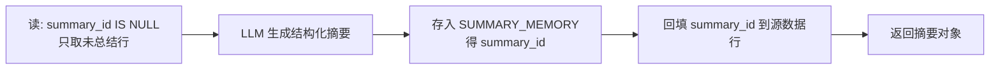

# L4 · 上下文工程：总结、压实与工作流记忆

## 1. 前提回顾：记忆类型决定存储形态

- **对话记忆** → SQL 表存原文（量大、要按时间回放，不需要相似度）
- **知识库 / 工作流 / 工具箱 / 实体 / 摘要** → 向量存储（都要做相似度检索）

## 2. 上下文工程与两种窗口缩减

上下文工程 = 在数据源（DB/API/MCP/互联网）远大于窗口的前提下，**精心挑选进入 context 的信息**。窗口满了怎么办——两条路，核心区别是信息**丢掉还是搬走**：

| | **Summarization 总结** | **Compaction 压实** |
|---|---|---|
| 本质 | 有损压缩（lossy） | 无损卸载（offload） |
| 做法 | 擦掉原文，注入摘要重启推理 | 原文进 DB，窗口只留 `ID + 描述` |
| 还原 | 不能，细节永久丢失 | 能，`expand_summary(id)` 按需换回 |
| 代价 | 损细节 | 多一次检索 |

> **架构师视角**：这不是二选一而是分层配合——本课实现是"压实为主"：摘要存进 `SUMMARY_MEMORY` 拿到 ID，窗口留引用。等于给上下文做**虚拟内存/分页**：热数据在窗口，冷数据在 DB，按需换入。面试讲多层记忆时用这个机制，比"滑动窗口+摘要"高一档。

## 3. 实现要点

**用量估算与触发**：`len(context) // 4` 估 token（廉价字符估算，做阈值判断够用；生产精确计费换 tiktoken），`monitor_context_window` 给出 ok / warning / critical 三档。同一套总结能力走**两条触发路径**：

- 确定性触发：代码判断 `usage > 80%` 自动压实（呼应 L2：由代码而非 LLM 决定）
- Agent 触发：`summarize_and_store` / `expand_summary` 注册进 toolbox，LLM 自主调用

**总结五步法（`summarize_conversation`）**：

> **精髓在第 4 步**：归档状态持久化在数据行本身而非内存游标——崩溃重启后查 `summary_id IS NULL` 即知哪些没总结，天然幂等、不重复总结。这就是 L1 说"记忆核心得是数据库"的具体体现。

**摘要 prompt**：强制四个固定小标题（Technical Information / Emotional Context / Entities & References / Action Items & Decisions），保留具体细节（名字/日期/API/错误/决策），区分已确认事实与开放问题，不得杜撰。另有 **fallback**：首次摘要为空时降级用简化 prompt 重试，保证不会整段丢失。

**压实的精准打击**：`offload_to_summary` 只替换 `## Conversation Memory` 段（最膨胀、可再生），知识库/工作流/实体段原样保留——不同记忆类型的"可压缩性"要区别对待。

## 4. Workflow Memory：把"步骤序列"存下来

多步任务（如查天气：定位 → 调 API → 组装回复）执行成功一次后，把**工作流名 + 描述 + 原始请求 + 有序步骤**连同 embedding 存进关系表。下次相似请求直接检索复用，LLM 不必现场重新规划——省 token、省推理。这是程序性记忆的第二种形态：toolbox 存"有什么工具"，workflow 存"上次按什么顺序办成的"（L5 系统提示要求 adapt patterns, do not copy blindly）。
