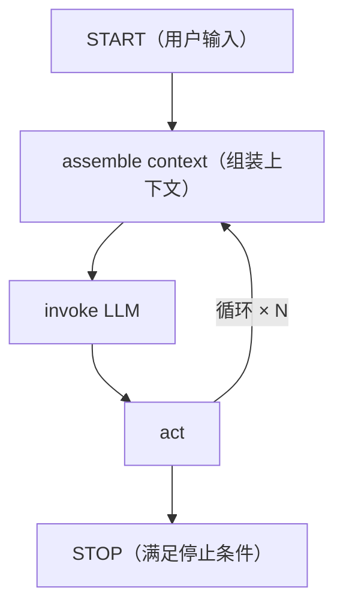

# L5 · 记忆感知智能体：Agent Loop、Harness 与全部组装

这一节把前四节全部拼起来，做出一个**跨会话持久、随时间改进**的完整智能体。

## 1. Agent Loop（智能体循环）

一个**循环迭代**的环境，LLM 在其中执行有限时间。三拍节奏：



- **assemble**：组装上下文（把各类记忆拼进去）
- **invoke**：把上下文喂 LLM 推理
- **act**：LLM 三选一——**回复用户** / **调用工具** / **要求用户补充输入**

**停止条件**：拿到最终答案 / 目标完成 / 出错或超时 / 达到 `MAX_STEPS`。

伪代码骨架：`for iteration in range(max_iterations): 调 LLM → 若要调工具则执行并把结果喂回 → 若给最终答案则 break`。

## 2. Agent Harness（智能体骨架）与"循环内/外"记忆操作

**Harness = 让智能体可靠执行的程序性脚手架**，由 agent loop **加上** 循环内外的记忆操作共同构成。区分"记忆操作发生在循环内还是循环外"是本节的核心框架：

| 位置 | 触发方式 | 典型操作 |
|---|---|---|
| **循环外·前**（START 前） | 确定性 | 读各类记忆装配初始上下文；查用量>80% 就总结；**检索相关工具** |
| **循环内** | 智能体触发 + 确定性 | LLM 调工具（搜网/展开摘要）；工具日志**卸载**进 DB（context offloading）；确定性总结 |
| **循环外·后**（STOP 后） | 确定性 | `write_workflow`（记步骤+结果）、`write_entity`、`write_conversational_memory`（写回最终答案） |

> **架构师视角**：这张"循环内/外 × 确定性/智能体触发"的 2×2，是本课最可迁移的心智模型。它回答了工程上最难的问题——**哪些记忆操作交给 LLM 自主决定，哪些必须代码强制执行**。原则：**信息装配和收尾写回用确定性（不能指望 LLM 记得做）；探索性动作（搜什么、要不要展开摘要）交给 LLM**。这个划分我要收进面试包，是"Agent 可靠性工程"的硬核答案。

## 3. 让 LLM"记忆感知"：系统提示分区

`AGENT_SYSTEM_PROMPT` 明确告诉 LLM——你的上下文是**分区的记忆窗口**，每段是一个独立记忆存储，各有用途：

```
# Context Window Structure (Partitioned Segments)
- ## Conversation Memory   ← 近期对话、用户偏好、未决请求
- ## Knowledge Base Memory ← 检索到的文档，用于事实/技术支撑
- ## Workflow Memory       ← 过往执行模式；参考不照抄(adapt, do not copy blindly)
- ## Entity Memory         ← 人名/机构/系统，用于消歧、保持命名一致
- ## Summary Memory        ← 压缩的旧上下文(summary IDs)；优先当前 thread 的摘要

# 冲突优先级：当前 Question > 最新对话 > 知识库证据 > 旧摘要/工作流
# 若关键细节只在 Summary 里 → 先 expand_summary(id) 再依赖它
```

> **记忆点**：用 **markdown 标题分区**是有讲究的——LLM 训练数据里充斥 markdown 结构化文本，所以它对"## 标题的层级语义"有很强的潜在理解力。用 markdown 给上下文打结构，等于用 LLM 最熟悉的格式喂它。**冲突优先级那一段**尤其关键：它显式规定了新旧信息矛盾时怎么裁决，直接对应 L0 承诺的"处理记忆中的矛盾"。

## 4. 完整 `call_agent` 骨架（串起全课）

```python
def call_agent(query, thread_id="1", max_iterations=10):
    # ① 循环外：装配上下文（读五类记忆）
    memory_context  = read_conversational_memory(thread_id)
    memory_context += read_knowledge_base(query) + read_workflow(query)
    memory_context += read_entity(query) + read_summary_context(query, thread_id)

    # ② 确定性：>80% 就压实卸载
    if calculate_context_usage(memory_context)['percent'] > 80:
        memory_context, summaries = offload_to_summary(..., thread_id=thread_id)

    context = f"# Question\n{query}\n\n{memory_context}"   # query 永远保留，绝不被总结

    # ③ 循环外：按 query 语义检索工具（只取 top-5，不全塞）
    dynamic_tools = memory_manager.read_toolbox(query, k=5)

    # ④ 写入用户消息 + 抽取实体
    write_conversational_memory(query, "user", thread_id)
    write_entity(..., text=query)

    # ⑤ Agent Loop
    messages = [{"role":"system","content":AGENT_SYSTEM_PROMPT},{"role":"user","content":context}]
    for iteration in range(max_iterations):
        response = call_openai_chat(messages, tools=dynamic_tools)
        if 要调工具:
            执行 execute_tool(...); 工具日志卸载进 DB; 结果喂回 messages
        else:
            final_answer = ...; break
    else:
        final_answer = "（达到最大迭代仍未完成）"   # 兜底模板

    # ⑥ 循环外：收尾写回
    write_workflow(steps, outcome); write_entity(final_answer); write_conversational_memory(final_answer, "assistant", thread_id)
    return final_answer
```

几个关键设计点：
- **`# Question` 永远置顶且绝不被总结**——当前问题是最高优先级信息，压缩只动历史。
- **工具动态检索 `k=5`**——L3 的 Toolbox 模式在这里生效，避免全量工具塞爆上下文。
- **`execute_tool` 对 `summarize_and_store` 自动补 `thread_id`**——保证总结时正确回填标记源行（呼应 L4 五步法第 4 步）。
- **兜底 `else` 分支**——`for...else` 在循环正常跑完（没 break）时给一个"未完成"模板响应，防止无声失败。

## 5. Demo 里验证的三种连续性

课程用一串对话演示记忆真的生效：
1. "帮我找 MemGPT 论文" → 首轮知识库无命中 → 调 `arxiv_search_candidates` → 次轮给答案
2. "保存这篇论文" → **不用重说是哪篇**（对话记忆生效）→ 调 fetch-and-save 工具
3. "总结这次对话" → 触发 `summarize_and_store`，标记 7 条消息、生成 summary_id、对话记忆被缩减
4. "我第一个问题是什么？" → 对话记忆里已没有 → LLM **自动 `expand_summary`** 展开摘要 → 答出"MemGPT 论文"及时间

> **架构师视角**：第 4 步是整套设计的"验收测试"——信息被压实进 DB 后，智能体**自己意识到细节不在窗口内、主动展开摘要取回**。这就是 L0 承诺的"记忆感知"的终极形态：不只是有记忆，而是**知道自己有什么记忆、该去哪取**。这层"元认知"是 memory-aware 区别于普通 RAG 的分水岭，值得作为面试的收尾金句。
