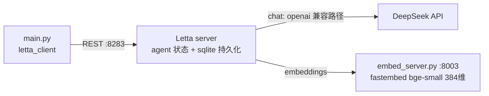

# L3 用 Letta 构建记忆智能体 — 本地演示项目

把 `Building_agents_with_Letta.ipynb`（12b·L3）改造成本地可运行演示。L1/L2 手搓的自编辑记忆，在 Letta（MemGPT 开源实现）里是服务端开箱能力：agent 的 memory blocks、消息历史、archival memory 全部持久化在 server 侧，客户端只发消息。

## 架构



- **chat**：`llm_config` 走 Letta 的 `openai` endpoint 类型指向 DeepSeek（原生 function calling）
- **embedding**：DeepSeek 没有 embeddings API，用 fastembed 起一个 OpenAI 风格 `/v1/embeddings` 本地服务，以 Letta 的 `hugging-face` endpoint 类型接入（它就是朝 `{base_url}/embeddings` 发请求、解析 `data[0].embedding`）

## 运行

```bash
cd L3
uv venv --python 3.11 .venv
uv pip install --python .venv/bin/python -r requirements.txt
cp .env.example .env   # 填入你的 API Key

# 终端 1：起两个服务（embedding :8003 + Letta server :8283）
./run_server.sh

# 终端 2：跑演示
.venv/bin/python main.py
```

演示五步：① 创建带 human/persona memory blocks 的 agent → ② 发消息看 reasoning/assistant 消息流与用量 → ③ 解剖 agent state（MemGPT 系统提示 + 6 个自带记忆工具 + blocks）→ ④ "我其实叫 Sarah" 触发 `core_memory_replace` 自编辑 → ⑤ archival memory 对话写入 / 显式插入 / `archival_memory_search` 语义搜索作答。

agent 状态在 `~/.letta/sqlite.db`，重启 server 也不丢；`main.py` 可重复运行（先删同名旧 agent）。

## 与课程 notebook 的差异

| 差异点 | notebook | 本项目 | 原因 |
|---|---|---|---|
| chat 模型 | `openai/gpt-4o-mini` handle | 显式 `llm_config` → DeepSeek | 本地 DeepSeek 栈；handle 依赖 server 侧 provider 列表 |
| endpoint 类型 | openai 官方 | `openai` 类型指向 DeepSeek base URL | letta 0.6.50 的 `deepseek` 专用路径靠裸 JSON 解析 function call，对新 DeepSeek 模型频繁解析失败（`response` UnboundLocalError 即此病）|
| embedding | `openai/text-embedding-3-small` | 本地 fastembed 384 维（`embed_server.py`）| DeepSeek 无 embeddings API，复用课程 lab 标准栈 |
| Letta server | 课程平台预启动 | `run_server.sh` 自起 | 本地化 |
| click/typer | — | pin `click==8.1.7 typer==0.12.5` | 0.6.50 CLI 与新版不兼容（"Secondary flag is not valid"）|
| 代理 | — | `NO_PROXY=localhost,127.0.0.1` | macOS 系统代理会劫持 httpx 的 localhost 请求（503）|
