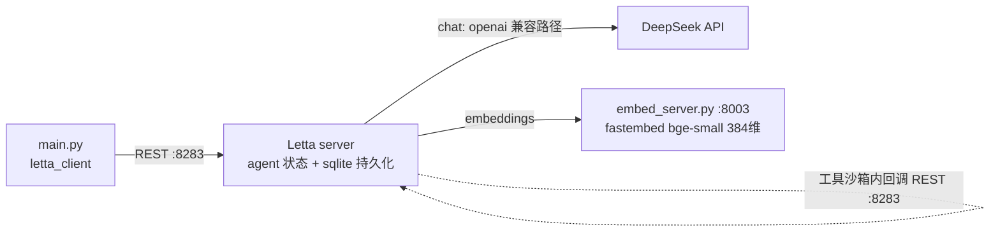

# L4 编程定制 Agent 记忆 — 本地演示项目

把 `Customizing_memory_management_in_MemGPT.ipynb`(12b·L4)改造成本地可运行演示。核心命题：MemGPT 的记忆不是黑盒——memory block 是带独立 id 的一等对象，工具函数能在运行时拿到 `agent_state` 自省，甚至可以剔除全部自带记忆工具、用自定义系统提示 + 自定义工具实现完全另一套记忆管理策略（task queue）。

## 架构



- **chat / embedding**：同 L3 —— `llm_config` 走 Letta 的 `openai` endpoint 类型指向 DeepSeek；embedding 用 fastembed 本地服务
- **自定义工具回环**：`task_queue_push/pop` 的函数源码被上传到 server，在 server 的工具沙箱里执行；函数体内再用 `letta_client` 连回 `localhost:8283` 读写自己的 `tasks` block —— 这就是"工具编程记忆"的机制

## 运行

```bash
cd L4
uv venv --python 3.11 .venv
# letta 0.6.50 声明 typer<0.10，resolver 一次装不下来，必须分两步：
uv pip install --python .venv/bin/python letta==0.6.50 letta-client==0.1.324 fastembed python-dotenv
uv pip install --python .venv/bin/python click==8.1.7 typer==0.12.5
cp .env.example .env   # 填入你的 API Key

# 终端 1：起两个服务（embedding :8003 + Letta server :8283）
./run_server.sh

# 终端 2：跑演示
.venv/bin/python main.py
```

演示三步：

1. **memory blocks 解剖**：`blocks.list` 看到每个 block 的独立 id → `client.blocks.retrieve(block_id)` 全局取 → `client.agents.blocks.retrieve(agent_id, block_label)` 按 label 取 → `core_memory.retrieve().prompt_template` 看 blocks 是怎么被 Jinja 模板编译进上下文窗口的
2. **工具访问 AgentState**：工具函数签名带 `agent_state: "AgentState"` 参数，Letta 运行时自动注入——`get_agent_id` 让 agent 报出自己的 id
3. **自定义 task queue 记忆**：`include_base_tools=False` 剔除全部自带记忆工具，只留 `send_message` + 自定义 `task_queue_push/pop`，配自定义系统提示（"每次运行必须先 pop 清空队列才准回话"）——布置两个任务后观察它连环 push/pop、队列清空后才 `send_message`

`main.py` 可重复运行（先删同名旧 agent：`blocks_agent` / `state_tool_agent` / `task_agent`）。

## 与课程 notebook 的差异

| 差异点 | notebook | 本项目 | 原因 |
|---|---|---|---|
| chat/embedding/服务 | openai handle + 课程平台 server | DeepSeek `llm_config` + 本地 fastembed + `run_server.sh` | 同 L3，见 L3 README |
| block_id | 手工从输出里复制粘贴 | 代码里直接取 `blocks[0].id` | 脚本化 |
| 消息接口 | `create_stream` 流式 | `create` 非流式 | 与 L3 一致，输出更稳定 |
| task_agent 行为 | 视频里第二条消息才开始清队列 | deepseek-chat 常在布置任务的同一轮就 push 完立刻连环 pop 清空 | 系统提示写了"最高优先级是清空队列"，deepseek-chat 执行得比 gpt-4o-mini 更激进；第二条 "Complete your tasks" 因此可能直接给结果 |
| requirements 安装 | 一步 pip install | 必须分两步 | letta 0.6.50 与 typer 0.12.5 的声明冲突，见 requirements.txt 注释 |
