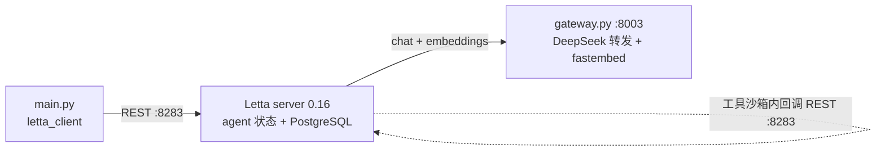

# L4 编程定制 Agent 记忆 — 本地演示项目

把 `Customizing_memory_management_in_MemGPT.ipynb`(12b·L4)改造成本地可运行演示。核心命题：MemGPT 的记忆不是黑盒——memory block 是带独立 id 的一等对象，工具函数能在运行时拿到 `agent_state` 自省，甚至可以剔除全部自带记忆工具、用自定义系统提示 + 自定义工具实现完全另一套记忆管理策略（task queue）。

## 架构



- **chat / embedding**：同 L3 —— 都走本地 gateway（见 code/README.md）
- **自定义工具回环**：`task_queue_push/pop` 的函数源码被上传到 server，在 server 的工具沙箱里执行；函数体内再用 `letta_client` 连回 `localhost:8283` 读写独立的 `tasks` block —— 这就是"工具编程记忆"的机制
- **0.16 的坑（重要）**：沙箱工具每次拿到的 `agent_state` 是 loop 开始时的快照副本，工具跑完后框架还会用该副本的 memory **回写数据库**（`sandbox_tool_executor` 的 `update_memory_if_changed`，loop 侧标着 `TODO: Integrate sandbox result`）。后果是同一轮内挂在 agent 上的 block 无法跨工具调用累积状态——课程原设计（tasks 放 agent core memory、工具带外 REST 写）在 0.16 下会被静默覆盖回旧值。本项目改为把 tasks 放**不挂 agent 的独立 block**（回写只覆盖已挂载的 core memory），工具经 REST 读写它

## 运行

```bash
# 环境/服务是全课程共享的，见 code/README.md
cd ..            # code/ 根目录
./run_server.sh  # 终端 1

cd L4 && ../.venv/bin/python main.py   # 终端 2
```

演示三步：

1. **memory blocks 解剖**：`blocks.list` 看到每个 block 的独立 id → `client.blocks.retrieve(block_id)` 全局取 → `client.agents.blocks.retrieve(agent_id, block_label)` 按 label 取（0.6 的 `core_memory.retrieve().prompt_template` 接口在 0.16 已移除）
2. **工具访问 AgentState**：工具函数签名带 `agent_state: "AgentState"` 参数，Letta 运行时自动注入——`get_agent_id` 让 agent 报出自己的 id
3. **自定义 task queue 记忆**：`include_base_tools=False` 剔除全部自带记忆工具，只留 `send_message` + 自定义 `task_queue_push/pop`，配自定义系统提示（"每次运行必须先 pop 清空队列才准回话"）——布置两个任务后观察它连环 push/pop、队列清空后才 `send_message`

`main.py` 可重复运行（先删同名旧 agent：`blocks_agent` / `state_tool_agent` / `task_agent`）。

## 与课程 notebook 的差异

| 差异点 | notebook | 本项目 | 原因 |
|---|---|---|---|
| chat/embedding/服务 | openai handle + 课程平台 server | DeepSeek `llm_config` + 本地 fastembed + `run_server.sh` | 同 L3，见 L3 README |
| block_id | 手工从输出里复制粘贴 | 代码里直接取 `blocks[0].id` | 脚本化 |
| 消息接口 | `create_stream` 流式 | `create` 非流式 | 与 L3 一致，输出更稳定 |
| task_agent 行为 | 视频里第二条消息才开始清队列 | deepseek-v4-flash 常在布置任务的同一轮就 push 完立刻连环 pop 清空 | 系统提示写了"最高优先级是清空队列"，deepseek-v4-flash 执行得比 gpt-4o-mini 更激进；第二条 "Complete your tasks" 因此可能直接给结果 |
| tasks block 位置 | agent core memory | 不挂 agent 的独立 block | 0.16 沙箱工具会用旧快照回写 agent 记忆，带外写被覆盖（见上） |
| 工具注册 | `tools.upsert_from_function` | `tools.upsert(source_code=...)` | letta-client 1.x 移除了前者 |
