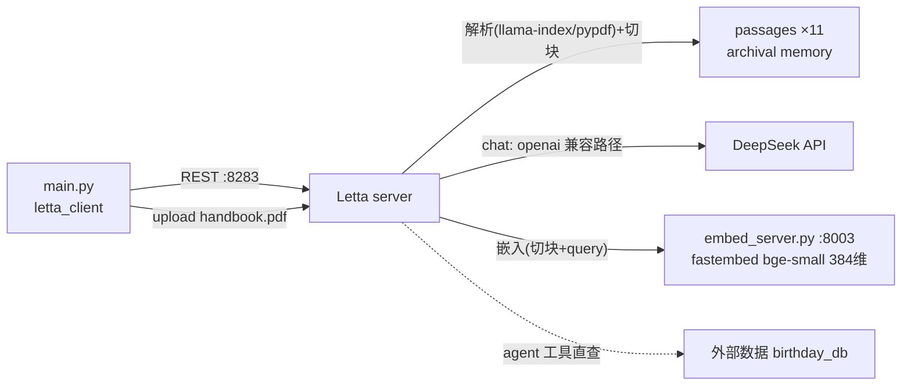

# L5 Agentic RAG 与外部记忆 — 本地演示项目

把 `Agentic_RAG_and_Accessing_External_Memory.ipynb`(12b·L5)改造成本地可运行演示。核心命题：agent 的记忆可以接外部数据，且有两种接法——

1. **Data Source → archival memory**：整份 PDF 上传到 Letta，server 侧解析/切块/嵌入，attach 到 agent 后成为 archival memory 的一部分，agent 用 `archival_memory_search` **自主决定何时检索**（Agentic RAG，区别于传统 RAG 每轮硬塞 top-k）
2. **自定义工具直连外部系统**：检索逻辑完全绕开 Letta 存储，工具函数直查外部数据库（演示里是个假 birthday dict，真实密钥可用 `tool_exec_environment_variables` 注入沙箱）

## 架构



- **chat / embedding**：同 L3/L4 —— DeepSeek + 本地 fastembed
- **关键约束**：source 的 `embedding_config` 必须与要挂载的 agent 完全一致，否则 attach 被拒；两处都用同一个 `EMBEDDING_CONFIG` 常量
- PDF 解析走 letta 自带的 llama-index `SimpleDirectoryReader`（依赖 pypdf，随 letta 一起装上，无需额外依赖）

## 运行

```bash
cd L5
uv venv --python 3.11 .venv
# letta 0.6.50 声明 typer<0.10，resolver 一次装不下来，必须分两步：
uv pip install --python .venv/bin/python letta==0.6.50 letta-client==0.1.324 fastembed python-dotenv
uv pip install --python .venv/bin/python click==8.1.7 typer==0.12.5
cp .env.example .env   # 填入你的 API Key

# 终端 1：起两个服务（embedding :8003 + Letta server :8283）
./run_server.sh

# 终端 2：跑演示
.venv/bin/python main.py
```

演示三步：

1. **Data Source**：`sources.create`（本地 embedding 配置）→ `sources.files.upload(handbook.pdf)` → 轮询 `jobs.retrieve` 看 created→running→completed → job metadata 报 11 个 passage → `sources.passages.list` 看切块内容
2. **Agentic RAG**：建 agent → `agents.sources.attach` → agent 的 archival 立即多出 11 个 passage → 问休假政策，观察它自己调 `archival_memory_search`、拿到手册原文后归纳作答（这本讽刺手册的政策是：想休假得先提交一个能替代你的 AI）
3. **外部数据工具**：`query_birthday_db` 注册 → persona 里告知有此库 → "whens my bday????" → agent 用 human block 里的名字 Sarah 查库得 07-06-1993

`main.py` 可重复运行（先删同名旧 agent `rag_agent`/`birthday_agent` 和旧 source `employee_handbook`）。

## 与课程 notebook 的差异

| 差异点 | notebook | 本项目 | 原因 |
|---|---|---|---|
| chat/embedding/服务 | openai handle + 课程平台 server | DeepSeek `llm_config` + 本地 fastembed + `run_server.sh` | 同 L3，见 L3 README |
| source 创建 | `embedding="openai/text-embedding-3-small"` handle | 显式 `embedding_config` | 本地栈没有 provider handle，且必须与 agent 的 embedding 配置逐字段一致 |
| passage 数 | 视频里 ~9 个 | 11 个 | 切块按 token 数（chunk_size 300）随 embedding 配置不同而不同 |
| 消息接口 | 第二问用 `create_stream` | 统一 `create` 非流式 | 与 L3/L4 一致，输出更稳定 |
| requirements 安装 | 一步 pip install | 必须分两步 | letta 0.6.50 与 typer 0.12.5 声明冲突，见 requirements.txt 注释 |
