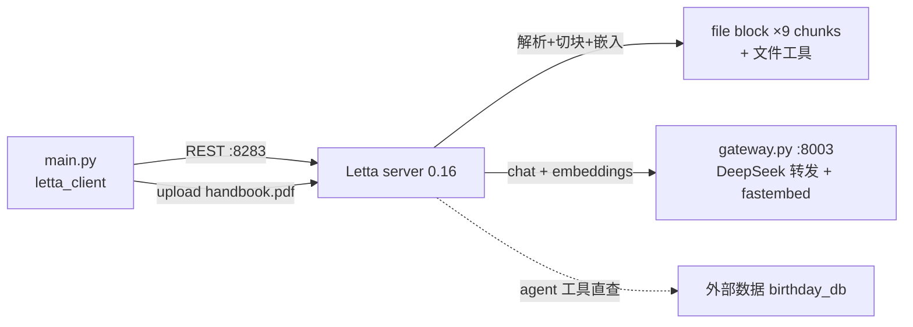

# L5 Agentic RAG 与外部记忆 — 本地演示项目

把 `Agentic_RAG_and_Accessing_External_Memory.ipynb`(12b·L5)改造成本地可运行演示。核心命题：agent 的记忆可以接外部数据，且有两种接法——

1. **Data folder → 文件工具检索**：整份 PDF 上传到 Letta（0.6 叫 source，0.16 改叫 folder），server 侧解析/切块/嵌入，attach 到 agent 后文件以 file block 进上下文、并自动挂上 `open_files/grep_files/semantic_search_files` 三个文件工具，agent 用 `semantic_search_files` **自主决定何时检索**（Agentic RAG，区别于传统 RAG 每轮硬塞 top-k）。0.6 时代切块进 archival passages + `archival_memory_search` 的通道在 0.16 已被这套文件通道取代
2. **自定义工具直连外部系统**：检索逻辑完全绕开 Letta 存储，工具函数直查外部数据库（演示里是个假 birthday dict，真实密钥可用 `tool_exec_environment_variables` 注入沙箱）

## 架构



- **chat / embedding**：同 L3/L4 —— 都走本地 gateway（见 code/README.md）
- **关键约束**：folder 的 `embedding_config` 与要挂载的 agent 保持一致；两处都用同一个 `EMBEDDING_CONFIG` 常量

## 运行

```bash
# 环境/服务是全课程共享的，见 code/README.md
cd ..            # code/ 根目录
./run_server.sh  # 终端 1

cd L5 && ../.venv/bin/python main.py   # 终端 2
```

演示三步：

1. **Data folder**：`folders.create`（本地 embedding 配置）→ `folders.files.upload(handbook.pdf)` → 轮询文件的 `processing_status` 看 parsing→completed → 报 9 个 chunk（0.6 时代是 jobs.retrieve 轮询）
2. **Agentic RAG**：建 agent → `agents.folders.attach` → file block 进上下文 + 自动挂文件工具 → 问休假政策，观察它自己调 `semantic_search_files`、拿到手册原文后归纳作答（这本讽刺手册的政策是：想休假得先提交一个能替代你的 AI）
3. **外部数据工具**：`query_birthday_db` 注册 → persona 里告知有此库 → "whens my bday????" → agent 用 human block 里的名字 Sarah 查库得 07-06-1993

`main.py` 可重复运行（先删同名旧 agent `rag_agent`/`birthday_agent` 和旧 folder `employee_handbook`）。

## 与课程 notebook 的差异

| 差异点 | notebook | 本项目 | 原因 |
|---|---|---|---|
| chat/embedding/服务 | openai handle + 课程平台 server | 本地 gateway + `run_server.sh` | 同 L3，见 code/README.md |
| 文档通道 | source 切块 → archival passages → `archival_memory_search` | folder → file block + `semantic_search_files` | letta 0.16 重构了文档源架构 |
| 上传轮询 | `jobs.retrieve` | 文件 `processing_status` | 0.16 上传直接返回文件元数据 |
| 检索提示词 | "Search archival for ..." | 点名 `semantic_search_files` | deepseek 会先 `open_files` 且猜错文件名后放弃 |
| 消息接口 | 第二问用 `create_stream` | 统一 `create` 非流式 | 与 L3/L4 一致，输出更稳定 |
