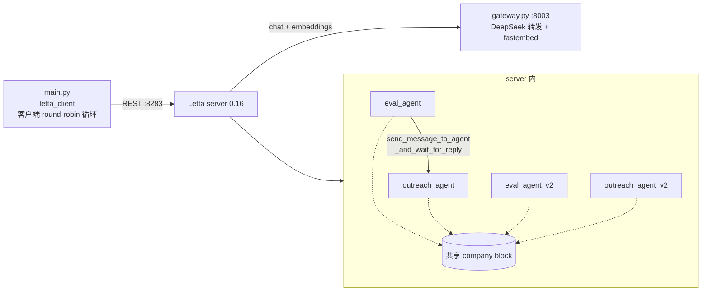

# L6 多智能体编排 — 本地演示项目

把 `Orchestrating_Agents_with_MemGPT.ipynb`(12b·L6)改造成本地可运行演示。核心命题：Letta 的多智能体协作靠两样东西——**共享 memory block**（一个 block 挂到多个 agent，谁改了大家都看见）和**跨 agent 消息**（`send_message_to_agent_and_wait_for_reply` 点对点，或 round-robin 轮转——课程用的 server 侧 group 在 letta 0.16 已退役，本项目在客户端复刻同样语义）。

## 架构



## 运行

```bash
# 环境/服务是全课程共享的，见 code/README.md
cd ..            # code/ 根目录
./run_server.sh  # 终端 1

cd L6 && ../.venv/bin/python main.py   # 终端 2
```

演示四步：

1. **共享 block**：`client.blocks.create` 独立创建 company block（不属于任何 agent 的一等对象），后续经 `block_ids` 挂到全部 4 个 agent
2. **显式编排**：eval_agent（只有 `reject` + 跨 agent 工具，`include_base_tools=False`，转发即 `exit_loop`）评估 Tony Stark 简历 → 判定强候选 → 跨 agent 工具把详情转发 outreach_agent 并拿到回复；再直连 outreach_agent 触发 `run_first` 规则强制起草邮件
3. **round-robin 轮转**：课程用 `client.groups.create` + 发消息给 group；letta 0.16 移除了 group 消息入口（/v1/groups 只剩 deprecated 管理路由，group 机制仅剩 sleeptime 在用），本项目在客户端按固定顺序把消息发给每个成员、把前一位回复拼进下一位的上下文——同样语义（eval 拒掉 SpongeBob，outreach 照样热情起草）
4. **共享记忆**：告诉 outreach_agent_v2 公司改名 Letta → 它 `core_memory_replace` 改共享 block → 连 ②里的老 eval_agent 读到的也是新值

`main.py` 可重复运行（先删同名旧 agent、`company` label 的旧 block）。

## 与课程 notebook 的差异

| 差异点 | notebook | 本项目 | 原因 |
|---|---|---|---|
| chat/embedding/服务 | openai handle + 课程平台 server | 本地 gateway（temperature=0）+ `run_server.sh` | 同 L3，见 code/README.md |
| round-robin | server 侧 group | 客户端轮转循环 | letta 0.16 移除了 group 消息入口 |
| 章节顺序 | 共享记忆(§3) → group(§4) | group(③) → 共享记忆(④) | 共享记忆演示改用不带 run_first 规则的 v2 agent 更干净 |
| outreach persona | 一句话 | 追加"先调工具再回复" + `run_first` 工具规则 | deepseek-v4-flash 倾向口头答应而不调 draft 工具，需硬约束 |
| eval persona | 一句话 | 追加"名字是占位符只看技能""转发时附详情并要求立即起草" | deepseek 会识破 Tony Stark 是虚构人名当假简历拒掉 |
| ②里的起草时机 | 转发那一轮 outreach 直接起草 | 转发轮只回复，另发直连消息触发强制起草 | 见下方"已知限制" |
| 预热消息 | — | 建完 outreach_agent 先发一条 hi | deepseek 会把"首次登录"事件和跨 agent 来信混在同一轮，固定选择寒暄 |

## 已知限制（deepseek-v4-flash，0.6.50 时代发现、0.16.8 仍成立）

跨 agent 来信的包装语硬编码了 *"make sure to use the 'send_message' at the end"*，deepseek 在 temperature=0 下会逐字服从——先 `send_message` 回复，回合即结束，永远轮不到 draft 工具；而 `run_first`（InitToolRule）只在直连消息路径可靠生效。所以 ② 里把"转发"与"起草"拆成两步演示，机制各自完整。
