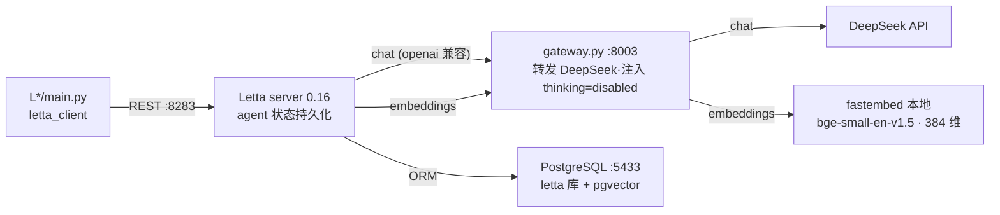

# 12b LLMs as Operating Systems: Agent Memory — 本地演示总说明

课程（DeepLearning.AI × Letta）L1-L6 的本地化演示：每课一个可直接 `python main.py` 跑的 `L*/main.py`，全课程共用**一个 venv、一份 .env、一套服务**（都在本目录）。

技术栈：letta 0.16.8（server）+ letta-client 1.12.1（SDK）+ DeepSeek 兼容 API（chat）+ fastembed 本地 embedding。

## 架构



- **gateway.py 为什么存在**：DeepSeek 没有 embeddings API（用 fastembed 本地补）；DeepSeek v4 默认开 thinking，thinking 模式不支持 letta 对 memgpt agent 固定发的 `tool_choice=required`/强制函数（400），网关统一注入 `thinking: disabled`
- **为什么要 PostgreSQL**：letta 0.16 的 ORM 引擎只支持 pg（sqlite 已废），复用 12a 的 pgvector 实例（5433）

## 首次安装

```bash
cd code
python3.13 -m venv .venv        # letta 要求 >=3.11,<3.14
.venv/bin/pip install -r requirements.txt
cp .env.example .env             # 填 API Key；LETTA_PG_URI 按需改

# 建库（一次性）：letta 的 pip wheel 不带 alembic 迁移，server 不会自己建表
# 前提：PG 里已有 letta 库并装了 pgvector 扩展（CREATE DATABASE letta; CREATE EXTENSION vector;）
.venv/bin/python init_db.py
```

## 日常运行

```bash
# 终端 1：起服务（gateway :8003 + letta server :8283，Ctrl-C 一并退出）
./run_server.sh

# 终端 2：跑某一课（L1 不需要服务）
cd L3 && ../.venv/bin/python main.py
```

## letta 0.6.50 → 0.16.8 迁移要点（各课 README 有细节）

| 变化 | 0.6.50（课程） | 0.16.8（本项目） |
|---|---|---|
| 默认 agent 类型 | memgpt_agent | letta_v1_agent → 须显式 `agent_type="memgpt_agent"` |
| 注册工具 | `tools.upsert_from_function(func=f)` | `tools.upsert(source_code=inspect.getsource(f))` |
| 文档源 | `sources.*` + jobs 轮询 | `folders.*` + 文件 `processing_status` 轮询 |
| 文档检索 | source 切块进 archival passages | file block 进上下文 + `semantic_search_files` 等文件工具 |
| block 修改 | `agents.blocks.modify` | `agents.blocks.update` |
| memgpt 默认工具 | 含 archival 两件套 | 换成文件式 `memory` 工具 → archival 要手动挂 |
| server 侧 group | round-robin group + 消息入口 | 已退役（仅剩 sleeptime 用）→ 轮转在客户端做 |
| 沙箱工具写记忆 | 工具内 REST 带外写可行 | 会被旧快照回写覆盖 → 改独立 block 或改传入的 agent_state |
| 列表返回 | list | 分页迭代器（`list(...)` 后再下标） |
| 存储 | sqlite | 仅 PostgreSQL |
