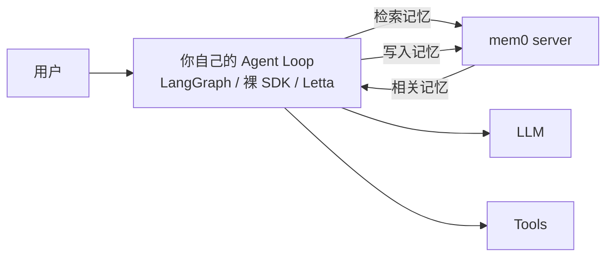

# L7 · 课程总结 + 12a/12b 横向对比复盘

## 1. 课程收官（结语要点）

一个"简单的文本生成器"（LLM）如何通过 **LLM OS** 构建复杂的 agentic 记忆系统——用**虚拟上下文（virtual context）**把记忆扩展到远超有限上下文窗口之外。核心能力链：从零手写 self-editing memory → MemGPT 概念体系 → Letta 落地 → 自定义记忆结构 → agentic RAG → 多 agent 共享记忆。

## 2. 12b 自身的 Top 5 带走点

1. **虚拟内存类比**是记忆管理的第一性框架：窗口=物理内存,外部存储=磁盘,agent=做换页决策的 OS。
2. **心跳（heartbeat）= 循环控制权交给 LLM**：每个工具带 `request_heartbeat`,LLM 显式声明"再叫我一次"。连回复用户都是工具（`send_message`），行动与回复机制统一。
3. **外部记忆统计**：窗口里必须留外部存储的"目录/统计"可见性,否则 agent 不知道自己不知道。
4. **Memory block 是可编程工作内存**：自定义 block 结构 + 配套 stateful 工具 + 换 system prompt + 砍默认工具 = 自定义记忆管理的标准四步改装。
5. **共享记忆块 = agent 界的共享内存段**：状态共享走存储层,事件协调走消息;tool_rules 给自治 agent 加确定性围栏。

## 3. 12a vs 12b 全面对比（本笔记的核心价值）

同一个问题——"agent 记忆怎么做"——两门课给出两种架构哲学：

| 维度 | 12a（Oracle 路线） | 12b（Letta/MemGPT 路线） |
|---|---|---|
| **哲学** | 记忆是**你构建的基础设施** | 记忆是 **agent 自治管理的资源** |
| **控制权** | 代码为主（80% 阈值、收尾必写回） | LLM 为主（heartbeat、自主换页） |
| **循环控制** | `for i in range(max_iterations)` | 工具的 `request_heartbeat` + tool_rules |
| **形态** | 库/自建（MemoryManager 类） | **服务**（Letta server + REST API） |
| **持久化** | 你写 SQL/向量表 | 框架默认全 state 入库 |
| **记忆分类** | 认知科学分类（情景/语义/程序性）→7 张表 | 位置分类（in-context/out-of-context）→core/recall/archival |
| **上下文缩减** | 总结（lossy）+ 压实（ID+描述占位） | 递归摘要 + 换出到 recall（永不删除） |
| **工具管理** | Toolbox 语义检索 top-k 动态注入 | 默认 6 件套 + 按需增删（无检索层） |
| **多 agent** | 未覆盖 | 共享 block + 跨 agent 消息 + group |
| **RAG 关系** | RAG ⊂ 记忆（知识库表） | RAG = archival memory 的用法 |
| **厂商绑定** | Oracle 26ai（方法论可迁移） | Letta 框架（概念即 MemGPT 论文,通用） |

**两门课惊人一致的共识**（这些就是"正确答案"级的结论）：
- 记忆必须外部化、持久化、结构化（数据库承载）
- 上下文窗口要分区，且要**告诉 LLM 分区语义**（12a 的 markdown 标题段 ≈ 12b 的 block 渲染标签）
- 压缩后必须留可展开的引用（12a 的 summary ID+描述 ≈ 12b 的递归摘要+recall 搜索）
- 记忆操作 = 数据（表/block） + 操作（工具） + 说明书（system prompt）三件套

**互补关系**：
- 12a 给了**记忆工程的方法论深度**（五模式：建模/检索/抽取/巩固/写回；确定性 vs agent 触发 2×2）
- 12b 给了**agent 自治的机制设计**（heartbeat/一切皆工具/统计元数据）+ **多 agent 记忆共享**
- 面试答"记忆系统设计"：用 12a 的五模式搭骨架，用 12b 的虚拟内存类比讲直觉，用两者的对比表讲取舍——完整闭环。

## 4. 架构师的裁决：什么时候选哪条路线

| 场景 | 建议 |
|---|---|
| 记忆行为必须可审计/可复现（金融、医疗） | 12a 路线：确定性触发为主,LLM 触发为辅 |
| 陪伴/助理类产品,记忆质量=体验核心 | 12b 路线：自治记忆让 agent"活"起来 |
| 已有重型数据库资产/DBA 团队 | 12a 路线：记忆核心复用现有库 |
| 快速起盘、不想自建持久层 | Letta 这类记忆内建框架 |
| 多 agent 共享组织知识 | 12b 的共享 block 模式（或等价物） |

真实生产常是**混血**：Letta 式自治记忆 + 12a 式确定性兜底（关键写回不交给 LLM 自觉）。tool_rules 的存在本身就说明纯自治不够用。

### 4.1 课外的第三条路线：把记忆外包（mem0 式 sidecar）

12a/12b 两门课都默认"记忆是 agent 系统的一部分"——12a 让你自己建，12b 让框架内建。但业界还有第三种：**把记忆整体外包成一个独立服务**，agent loop 完全不动。

**关键是看清主语**：mem0 可以自托管成 REST server（FastAPI + pgvector + Neo4j，docker-compose 一把起），也能包成 MCP server 直接挂进 Cursor/Claude Desktop。但它的 API 全集只有 `add / search / update / delete / reset`——**没有一个是"跑一轮 agent"**。`agent_id` 只是记忆的分区键（namespace），不是一个服务端 agent 实例。

于是三条路线的分野是这样的：

| 路线 | 主语 | 服务端持有什么 | agent loop 在哪 |
|---|---|---|---|
| **12a 自建** | 记忆是**我建的基础设施** | 我自己的 7 张表 | 我的代码里 |
| **12b Letta** | 记忆是 **agent 的内建状态** | **整个 agent 的生命周期**（含记忆） | Letta server 里 |
| **mem0 sidecar** | 记忆是**外挂的服务** | 只有记忆，不含 agent | 仍在我的代码里 |

一句话对比:**Letta 是"带记忆的 agent 服务"，mem0 是"给 agent 用的记忆服务"——主语不同。** 选型时问自己一句：*我需要服务端替我保管 agent 状态，还是只需要它保管事实？* 后者，mem0 更轻，且**不绑编排框架**（这是它唯一的结构性优势，也是它的边界）。

⚠️ mem0 无课程背书，是我为补全光谱主动引入的——详见 [`skills/agent-selection/6-memory.md`](../../../../skills/agent-selection/6-memory.md) 的四派光谱。

## 5. 与我资产体系的接口

- **面试包 `04-multi-layer-memory`**：补入 MemGPT 三层记忆（core/recall/archival）+ heartbeat 机制 + 上文对比表 → [[project_interview_prep]]
- **选型矩阵 记忆层**：新增"记忆框架形态"维度——自建（12a）/ 内建服务（Letta）/ 框架插件（LangGraph checkpointer+store），各自的持久化、控制权、部署代价 → [[project_selection_matrix]]
- **通用模式**（进 [[project_asset_reuse]]）：「外部存储必须在上下文留统计/目录级可见性」——12b 的 external memory statistics 与 12a 的摘要占位符是同一模式的两个实例。

## 6. 诚实的边界

- demo 模型是 gpt-4o-mini,行为概率性明显（任务队列可能一次清不完、群聊 agent 会自作主张发拒信）——课程自己也多次"为了可靠性,明示 agent 去搜档案"。**自治的可靠性天花板取决于基座模型**,这是 12b 路线在生产中最大的软肋。
- Letta server 是单点依赖,课程未讲扩缩容/高可用/多租户——"agent 即服务"的运维成本被 notebook 环境隐藏了。
- 课程完全没讲**记忆冲突消解**的系统方案（只有 core_memory_replace 的即时纠错）,矛盾记忆的巩固策略仍要看 12a 的 consolidation 思路或另行设计。
