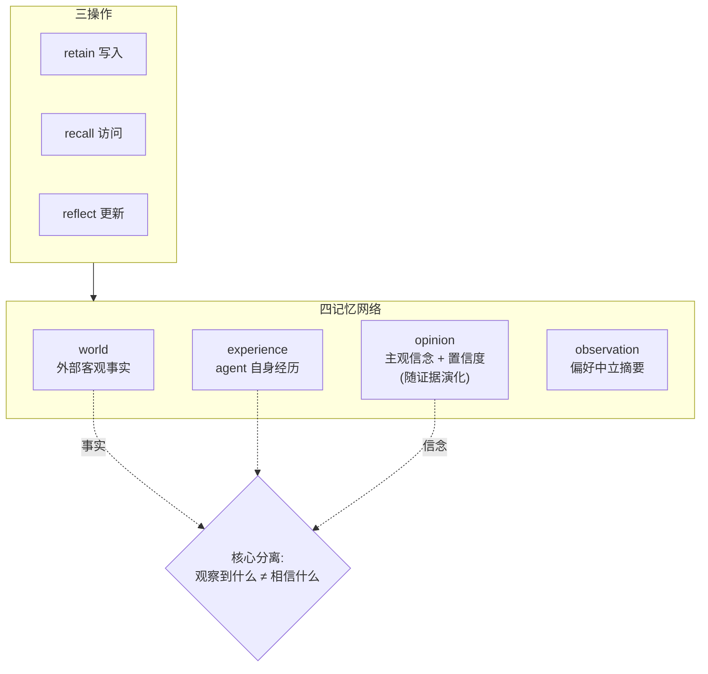
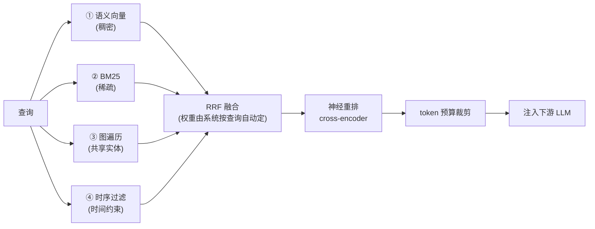

# Hindsight(Vectorize.io)—— 多策略检索派的代表

> **定位**:单产品深挖。它在 [`框架现状.md`](框架现状.md) §三 的四类路线里属于**「多策略检索」**那一档。
> **一句话**:把检索系统(IR)里已被验证的标准配方——**hybrid search + RRF + cross-encoder rerank**——第一次系统性地搬进 agent 记忆层,并额外提出「事实 vs 信念」的分离建模。
>
> **结论分级**:✅ 稳定 / ⚠️ 快照(易过期或未实测) / ❓ 待验证
> **来源**:标注在句末(VentureBeat / arXiv / GitHub / Vectorize 官方 / Emelia)。

> ## ⚠️ 先说利益相关(读本文和 `框架现状.md` 前必看)
>
> **`框架现状.md` §三 的"业界四类路线"分类,来源是 Vectorize——Vectorize 就是 Hindsight 的东家。**
> 那份分类把「多策略检索」单列一档、且只有 Hindsight 一个成员,**这不是中立的第三方扫描,是厂商自己的叙事框架**。
> 同理,本文里"打 Mem0 痛点""independently reproduced vs self-reported（独立复制vs自我报告）"这类对比姿态,**也都是 Vectorize 的叙事**。事实可以采信,**框架和姿态要打折**。

---

## 一、它是什么 ✅

- **Vectorize.io 开源**的 agent 记忆系统,**2025 年 12 月发布**。
- **这批框架里最年轻但蹿升最快的**。
- 背后有**正经学术工作**:由 **Vectorize.io + Virginia Tech + 《华盛顿邮报》**合作开发,论文 **"Hindsight is 20/20"(arXiv 2512.12818)**。(来源:VentureBeat)
- **MIT 协议**。

### 热度数据 ⚠️(实时快照,必然过期)

| 指标 | 数值 |
|---|---|
| GitHub stars | **18,231**(抓取当日) |
| star 增长 | 3 月初约 **2K** → 4 月底 **10K** |
| 下载量 | 30 天内 **76 万次**,总量**破百万**(官方 changelog) |

> **增长斜率比当年的 Mem0 还陡。**
>
> ⚠️ **两点存疑**:(1) 这些数字抓取于某个未记录的时点,**star 数是最容易过期的指标,别在面试里报具体数**,只说"2025-12 发布、半年内窜到万级 star、斜率超过当年 Mem0"这个**量级和趋势**;(2) 原文"3 月初→4 月底"未标年份,按发布时间推断应为 **2026 年**。

---

## 二、核心抽象:三操作 + 四记忆网络 ⭐

### 2.1 三个核心操作 ✅

| 操作 | 管什么 |
|---|---|
| **retain**(保留) | 信息的**写入** |
| **recall**(召回) | 信息的**访问** |
| **reflect**(反思) | 信息的**更新** |

> 👉 对照记忆:mem0 的对应面是 `add` / `search` / (隐含在 add 里的消解)。**Hindsight 把"更新"提成了一等公民 `reflect`,而不是藏在写入路径里。**

### 2.2 四个逻辑网络(不是扁平向量库)⭐

存储侧**不是扁平的向量库**,而是把记忆库组织成四个逻辑网络:

| 网络 | 存什么 |
|---|---|
| **world** | 关于**外部世界的客观事实** |
| **experience** | **agent 自身的经历** |
| **opinion** | **带置信度分数的主观信念**,随新证据到来而更新 |
| **observation** | **偏好中立的摘要** |

(来源:arXiv)



### 2.3 设计哲学:把「事实」和「信念」分开建模 ⭐⭐

**这是它区别于 Mem0/Zep 的根本处。**

论文的动机:**当前 agent 系统混淆了"agent 观察到什么"和"agent 相信什么"**,导致:

1. 无法在长交互中**维持稳定的行为特征**;
2. 没有机制让**主观信念随时间演化**。

(来源:arXiv)

> 👉 **这是本文最值得记住的一句话。** 其它框架(Mem0/Zep/Letta)都只建模"事实",隐式假设 agent 的态度是无状态的;Hindsight 说**态度本身也是需要持久化和演化的状态**——`opinion` 网络带置信度分数,新证据来了会调整,而不是覆盖。

---

## 三、多策略检索的落点:TEMPR ⭐⭐

> **TEMPR = Temporal Entity Memory Priming Retrieval**
> `框架现状.md` 里"多策略检索"这个词的具体落点,就是它。

**名字逐词拆解**——TEMPR 不是已有的通用术语,是把这套检索管线的关键成分拼进名字里,逐词对应下面 3.1 的四路检索:

| 词 | 含义 | 对应管线里的哪一步 |
|---|---|---|
| **Temporal**(时序) | 记忆带时间戳,能处理"上周说过什么""X 之前发生了什么"这类时间约束查询 | 第 ④ 路:时序过滤 |
| **Entity**(实体) | 写入时把记忆组织成图(见 3.2),检索时沿共享实体(同一人/项目/概念)做关系/多跳召回 | 第 ③ 路:图遍历 |
| **Memory**(记忆) | 检索对象是四个记忆网络(world/experience/opinion/observation),不是普通文档库 | 检索的数据源 |
| **Priming**(启动/预激活) | 借认知心理学的"启动效应":在 LLM 生成回答**之前**,把相关记忆预先注入上下文"预热"模型 | 最后一步:token 预算裁剪 → 注入下游 LLM |
| **Retrieval**(检索) | 整体是个检索流程:四路并行 → RRF 融合 → 重排 → 裁剪 | 全流程 |

> 一句话:**"带时间感知、沿实体图游走的多路混合检索,用来在生成前给 LLM 预注入相关记忆"**。名字听起来玄,拆开看就是成熟配方(见 3.3 的判断),"Priming"是认知科学的包装。

### 3.1 召回流程 ✅

**并行运行四路搜索** → **RRF 融合** → **神经重排** → **token 预算裁剪**:

| # | 检索路 | 干什么 |
|---|---|---|
| 1 | **语义向量相似度** | 稠密检索 |
| 2 | **BM25 关键词匹配** | 稀疏检索 |
| 3 | **图遍历**(经共享实体) | 关系/多跳 |
| 4 | **时序过滤** | 针对时间约束查询 |

- 四路结果用 **Reciprocal Rank Fusion(RRF)** 合并;
- 再经**神经重排器(cross-encoder)** 做最终精排;
- **系统根据查询自动决定各策略的权重**——**调用方不需要指定用哪一路**;
- 最终输出**裁剪到下游 LLM 的 token 预算内**。

(来源:VentureBeat / Emelia)



### 3.1.1 RRF 是什么/什么原理 ✅

**RRF(Reciprocal Rank Fusion,倒数排名融合)**:把多个检索器各自的排名列表合并成一个排名的融合算法,2009 年提出,至今是混合检索的默认选择。它解决的正是上面的场景:四路检索各返回一个有序列表,怎么合成一份?

**核心思想一句话:不看各路检索器打的分数,只看名次,名次的"倒数"就是得分。**

```text
RRFscore(d) = Σ_i  1 / (k + rank_i(d))

rank_i(d):文档 d 在第 i 路结果里的名次(第 1 名 = 1);某路没召回它就不加分
k:平滑常数,论文用 60,几乎所有实现沿用
```

算完按 RRFscore 从高到低重排即融合结果。例:向量检索返回 `[A, B, C]`,BM25 返回 `[C, A, D]`,k=60:

| 文档 | 向量名次 | BM25 名次 | RRF 得分 |
|---|---|---|---|
| A | 1 | 2 | 1/61 + 1/62 ≈ 0.0325 |
| C | 3 | 1 | 1/63 + 1/61 ≈ 0.0323 |
| B | 2 | — | 1/62 ≈ 0.0161 |
| D | — | 3 | 1/63 ≈ 0.0159 |

融合结果 `[A, C, B, D]`——**被多路同时召回的文档天然占优**,单路独有的靠后。

**为什么用名次而不用分数——这是它存在的全部理由:**

- 各路原始分数**量纲不可比**:余弦相似度 0~1,BM25 可以是 15、30 且无上界,图遍历可能根本没分数;想加权平均得先做分数归一化,而归一化本身难调、对分布敏感;
- RRF 直接扔掉分数只用名次,**任何能输出"有序列表"的检索器都能融合,零调参、零训练**——这是它 17 年不过时的原因:不是最优,是**最皮实**;
- **k=60 的作用是压平头部差距**:没有 k 时第 1 名(1/1)是第 2 名(1/2)的两倍分;加了 60 后是 1/61 vs 1/62,差距很小——单路把某文档排第一的"自信"被稀释,**必须多路共识才能赢**,对某一路的误判更鲁棒。

> 👉 对应到 Hindsight 的流水线分工:**RRF 便宜(纯算术,不调模型)负责"合",cross-encoder 贵但准负责"精"**——先粗排融合、再神经精排,是检索系统的标准两级配方。

### 3.2 写入侧配套 ✅

**不存孤立片段**,而是:

- 抽取**保留跨轮上下文的叙事性事实**;
- 组织成**带多种链接类型的记忆图**。

### 3.3 ⭐ 关键判断:它的贡献到底是什么

> **从 RAG 视角看,这本质上是把「混合检索(hybrid search)+ RRF + cross-encoder rerank」这套在检索系统里已被验证的标准配方,第一次系统性地搬进了 agent 记忆层。**
>
> **单独看每个组件都不新**——RRF 2009 年就有,hybrid search 和 cross-encoder rerank 是 RAG 的标配。
> **它的贡献是「组合进 memory 场景」+「自动路由权重」。**

这个判断很重要,因为它同时是**赞美和降温**:

- **赞美**:说明这条路走的是被验证过的工程路线,风险低;
- **降温**:说明**这里没有新科学**,别人复制的门槛不高。真正难复制的反而是 §2.3 的 opinion 建模(那才是新东西)。

---

## 四、另一半:CARA(行为一致性层)✅

除了检索,它还有一个**行为一致性层**:

> **CARA = Coherent Adaptive Reasoning Agents**

**名字逐词拆解**——和 TEMPR 一样是自造名字,把这层要解决的问题拼进了名字里:

| 词 | 含义 | 对应的设计点 |
|---|---|---|
| **Coherent**(连贯/一致) | 名字里的核心诉求:裸 LLM 没有稳定视角,同一 agent 今天激进明天保守,"局部合理但全局不一致";CARA 要保证反应风格跨会话连贯 | 解决的问题本身 |
| **Adaptive**(自适应) | "性格"不是写死的 system prompt,而是可配置、可随证据演化的参数,并与 opinion 网络联动——信念调整,推理姿态跟着适应 | 下表的三个性格参数 |
| **Reasoning**(推理) | 作用点在推理阶段:把性格/态度参数**条件化到每次推理里**,让模型带着稳定"人设状态"思考,而不只是在检索层拼上下文 | 偏好条件化 |
| **Agents**(智能体) | 定位:给 agent 一个持久化的性格/视角层 | 行为一致性层 |

> 一句话:**CARA = 用可配置的性格参数给 agent 一个持久、可演化的"稳定人设",让它跨会话推理保持一致**。
> 和 TEMPR 的关系:**TEMPR 管"记得什么"(检索层,成熟配方的搬运),CARA 管"以什么姿态回应"(行为层,真正的赌注)**。

把**可配置的性格参数**整合进推理:

| 参数 | 含义 |
|---|---|
| **skepticism** | 怀疑度 |
| **literalism** | 字面性 |
| **empathy** | 共情度 |

**解决的问题**:跨会话**推理不一致**。

> **没有偏好条件化,agent 会产生「局部合理但全局不一致」的回应——因为底层 LLM 没有稳定视角。**(来源:VentureBeat)

> 👉 CARA 和 §2.2 的 `opinion` 网络是**同一个赌注的两面**:Hindsight 认为 agent 的**"视角/态度"是需要显式建模的状态**,而不是每次调用现推。这是它和所有"只管存事实"的框架的分水岭。

---

## 五、基准表现 ⚠️(必读附带的怀疑)

在 **LongMemEval** 和 **LoCoMo** 上:

| 配置 | 结果 |
|---|---|
| full-context 基线 | 39% |
| Hindsight + **开源 20B 模型** | **83.6%**(超过 full-context GPT-4o) |
| Hindsight + 更强 backbone | **LongMemEval 91.4%** / **LoCoMo 最高 89.61%** |
| 此前最强开源系统 | 75.78% |

 backbone（主干模型） 就是指 Hindsight 底下实际干活的那个 LLM。
(来源:arXiv / GitHub)

### 5.1 值得注意的一点:独立复现 ⭐

> 其基准数据经 **Virginia Tech Sanghani 中心**和**《华盛顿邮报》**的研究合作者**独立复现**,
> **而其他厂商的分数是自报的**。

**这个「independently reproduced vs self-reported」的对比姿态本身,就是打 Mem0 的**——Mem0 自报 LongMemEval **94.4**(数字比 Hindsight 还高,但没人复现过)。

### 5.2 ⚠️ 但这个姿态本身也要打折

- "独立复现"的两方(Virginia Tech、华盛顿邮报)**同时也是论文的合作开发方**——这不是完全独立的第三方,是**合作者互相背书**。姿态比 Mem0 的纯自报好,但**离真正的第三方评测还有距离**。
- **两个 benchmark(LongMemEval / LoCoMo)都是长对话记忆的窄评测**,和你的实际业务分布未必对齐。
- ❓ **要采信,自己跑**:用你自己领域的对话造一批矛盾/时序/多跳问题,和 mem0 对着跑一遍。

---

## 六、商业定位与工程形态 ✅

### 6.1 它刻意打 Mem0 的痛点:feature wall

| | Mem0 | **Hindsight** |
|---|---|---|
| 协议/自托管 | 有 OSS 版 | **MIT,Docker 自托管全功能免费** |
| 实体关系 / 多跳查询 | ⚠️ **要撞 Pro 付费墙**($249/月的图记忆) | ✅ 包含 |
| 图 / 时序 / 四路检索 | 部分在付费层 | ✅ **所有层级(含自托管)全都有,永远不会碰到 feature wall** |

(来源:Vectorize / GitHub)

> ⚠️ 这套对比是 Vectorize 的官方说法,**定价和分层随时会变**,签约前自己去官网核。

### 6.2 集成方式很轻 ✅

- **LLM Wrapper**:**两行代码**换掉现有 LLM client,之后**记忆随 LLM 调用自动存取**。
- **MCP-first** 设计。
- 现成集成:**CrewAI、Pydantic AI、Microsoft Agent Framework**。

> 👉 和 mem0 一样,**它也不绑编排框架**(甚至比 mem0 更轻——mem0 至少要你显式调 `add()`,Hindsight 的 wrapper 是自动挂载)。
> ⚠️ **但"自动存取"是双刃剑**:写入时机完全隐式,你更难知道它到底记了什么、什么时候记的。mem0 的 `add()` 至少还是你自己调的。**调试性上这是退步,不是进步。**

---

## 七、对你的映射

### 7.1 面试角度 ⭐(原文要点)

如果被问 **"如何设计 agent 记忆的检索层"**,Hindsight 提供了一个**可引用的完整答案模板**:

> **写入时**:结构化抽取(**实体 + 关系 + 时序 + 稀疏/稠密双向量表示**)
> **读取时**:**多路并行 → RRF 融合 → 重排 → token 预算裁剪**

**加分的那句话**:把它和 **RAG 里 hybrid retrieval 的演进史**连成一条线,展示这个判断——

> **"记忆层正在重演检索系统五年前走过的路。"**

这句话的分量在于:它不是在夸 Hindsight,是在**给整个记忆层赛道定位**。你顺着可以推出两个预测:(1) 下一步记忆层会长出**查询理解/改写**(RAG 里下一站就是这个);(2) 评测基准会从"准确率"转向"**成本/延迟/准确率**三维(RAG 走过同样的路)。

### 7.2 架构角度 ❓(原文缺失,此处补齐)

> ⚠️ 原文写"对你的两点映射"但**只写了一点**,第二点缺失。以下是补的,**不是原始笔记内容**。

**选型上它和 mem0 的真实分野,不在检索强度,而在两个问题:**

| 问题 | 选 mem0 | 选 Hindsight |
|---|---|---|
| **agent 需要有"稳定视角/态度"吗?** | 不需要——只存事实 | **需要** → opinion 网络 + CARA(§2.3/§四)**这是它唯一真正难被复制的东西** |
| **你的查询里有多少多跳/时序?** | 少 → mem0 的向量+图够用 | **多** → TEMPR 四路并行是为此而生 |
| **写入可调试性重要吗?** | **重要 → mem0**(`add()` 你自己调) | 不重要 → Hindsight 的 wrapper 自动挂载(§6.2)|
| **成熟度/生产验证** | ⚠️ 更久,生态更大 | ⚠️⚠️ **2025-12 才发布,极年轻**——生产上线是在赌 |

> 👉 **最诚实的判断:Hindsight 的检索层(TEMPR)是成熟配方的搬运,技术风险低但也不独特;它真正的赌注是 opinion/CARA 那套「态度即状态」的建模——这个想法很好,但没有任何生产验证。** 拿它做**个性化陪伴/长期助手**(态度一致性值钱)有道理;拿它做**企业事实检索**,你付的年轻框架风险溢价换不回什么。

---

## 八、相关资产

- **同目录**:[`框架现状.md`](框架现状.md) —— 记忆框架 landscape 扫描(⚠️ 其 §三 的四类分类出自 Vectorize,即本文主角的东家,见文首利益相关声明)。
- **选型决策**:[`agent/skills/agent-selection/6-memory.md`](../../../skills/agent-selection/6-memory.md) —— 要下结论走这里。
- **相关层**:`agent/skills/agent-selection/3-retrieval.md` —— **TEMPR 的四路检索本质是 RAG hybrid search 的搬运,该文档里的 RRF / rerank / 稀疏稠密混合等结论直接适用。**
- **论文**:"Hindsight is 20/20",arXiv **2512.12818**。

> **最后核对:2026-07**
