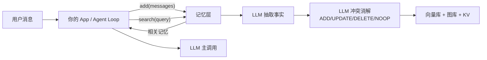
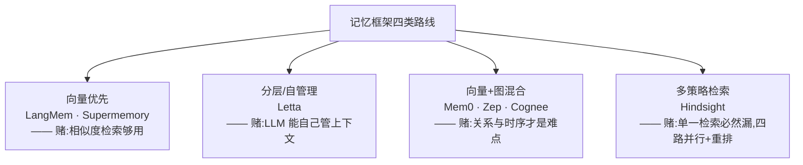

# Memory 框架现状(landscape 扫描 · 2026-07 快照)

> **定位**:这是**业界扫描**,不是选型结论。要做决策请走 [`agent/skills/agent-selection/6-memory.md`](../../../skills/agent-selection/6-memory.md)(记忆层选型矩阵)。
> 本文回答"市面上有什么、各自赌了什么",选型矩阵回答"我该选哪个"。
>
> **结论分级**:✅ 稳定 / ⚠️ 快照(易过期或未实测) / ❓ 待验证
> **来源**:标注在句末(DataCamp / InfoWorld / GitHub·Mem0 官方 / AWS / Vectorize)。**凡是厂商自跑的评测数字一律记 ⚠️**。

---

## 一、记忆层到底解决什么问题

一句话:**不要把整段对话历史塞进上下文。**

在 app 和 LLM 之间插一层,自动把对话里的事实抽出来、去重、更新、冲突消解,存进向量库(可选再加图库),下次提问时按相关性检索出来注入 prompt。

这层的存在前提是**上下文窗口是稀缺资源**——如果你的场景每次对话就三五轮、全塞进去也不超预算,那这一层是纯负债。这个判据后面 §七 会再展开。

---

## 二、mem0 深入(当前最常被点名的一个)

### 2.1 一句话定位 ✅

**mem0** = 给 LLM 应用/Agent 用的"记忆层"。开源库 `mem0ai` + 托管版 Mem0 Platform。
它是一个**位于 AI 应用和 LLM 之间**的记忆层,从用户交互中抽取并存储相关信息。

**结构性特征(也是它最被低估的卖点):它不绑编排框架。** LangMem 绑 LangGraph、Letta 干脆自己就是运行时,而 mem0 是纯 sidecar——你保留自己的 agent loop,两个调用接进去。

### 2.2 写路径 `add()` —— 核心机制(面试重点)⭐

**不是把原始对话直接存下来**,而是用 LLM 做**事实抽取 + 冲突消解**,两阶段:

1. **抽取**:一次 LLM 调用,从新消息里提取候选事实。
   - 例:"我是素食者且对坚果过敏" → 自动拆成**两条独立事实**。
   - 例:"住在杭州"、"用户是素食者"。
2. **更新决策**:拿候选事实去向量库检索**已有的相似记忆**,再一次 LLM 调用判 **ADD / UPDATE / DELETE / NOOP**。
   - 例:新说"我搬到上海了" → 应该 **UPDATE 掉**"住在杭州",而不是并列存两条互相矛盾的记忆。

> 👉 **这个 ADD/UPDATE/DELETE/NOOP 决策步骤,就是它区别于朴素 RAG 的关键**:朴素 RAG 只会往里堆,矛盾事实并存;mem0 会主动消解。(来源:DataCamp)
>
> ⚠️ **但这也是它的主要风险面**:触发是确定的(你显式调 `add()`),**"记成什么样"却是一次非确定的 LLM 判断**。事实可能被静默改错或误删,而你的代码看不出来。选它 = 接受"记忆写入不可复现"。

### 2.3 读路径 `search()` ⭐

跨多个存储检索后,经过一个**打分层**,按 **相关性 / 重要性 / 时近性(recency)** 加权,**只把最有用的记忆注入 prompt**(而不是全灌)。

最新算法把 **语义相似度 + BM25 + 实体匹配** 融合成单一分数。⚠️ 官方称在时序查询上提升 **29.6 分**、多跳推理提升 **23.1 分**(来源:GitHub / Mem0 官方)——**厂商自跑,当参考不当依据**。

### 2.4 存储架构:混合存储 ✅

| 存储 | 职责 |
|---|---|
| **向量数据库** | 语义检索(默认 Qdrant) |
| **图数据库** | 建模实体关系(Neo4j / Kuzu) |
| **KV 存储** | 快速事实查询 |

**Graph Memory** 会自动抽取实体(人、主题、工具、时间)及其关系,解决这类问题:

> "Alex 先学了 matplotlib、后转向 Seaborn" —— 这种**时序/关系型上下文**,**纯向量存储只能存孤立事实,丢失进展关系**。(来源:InfoWorld / DataCamp)

⚠️ **注意:mem0 不是存储后端,是存储之上的一层。** 它自己也要落到 Qdrant/Chroma/pgvector。所以"选 mem0"和"选 Postgres"不是同一个决策——选了它,你仍然要给它挑底座。

### 2.5 记忆作用域(scope)✅

三级 scope,可组合实现多 Agent 共享或隔离——**这直接对应多租户隔离问题**:

| scope | 含义 |
|---|---|
| `user_id` | 用户级(跨会话) |
| `agent_id` | Agent 级(agent 自身的记忆) |
| `run_id` | 会话级(单次 run) |

### 2.6 API 面 ✅

极小:`add(messages, user_id=…)` / `search(query, user_id=…)` / `get_all` / `update` / `delete`。

底座**全可插拔**:任意 LLM、任意向量库(默认 Qdrant)、任意 embedder。

### 2.7 生态与部署 ⚠️(快照,易过期)

- 截至 **2026 年初**:官方集成覆盖 **21 个框架**、**20 个向量库后端**,**三种托管模式**(云托管 / 自托管 / 本地 MCP)。
- **一等集成**:LangGraph、AutoGen、Vercel AI SDK、Mastra。
- **AWS 官方组合方案**:Mem0 OSS + ElastiCache for Valkey(向量)+ Neptune Analytics(图)。(来源:Mem0 / AWS)
- **自托管**:默认 Qdrant + Docker Compose 就能起。

### 2.8 代价清单(选它前先认下账)⚠️

| 代价 | 说明 |
|---|---|
| **成本 + 延迟** | 每次 `add()` 烧 **1–2 次额外 LLM 调用**(抽取 + 消解) |
| **写入非确定** | 记成什么样是 LLM 判断,错了难 debug、不可复现 |
| **无时间轴** | UPDATE/DELETE 是**就地覆盖**,旧事实直接消失——追溯不了"他当时在哪家公司"(见 §六) |
| **数据出境**(仅托管版) | Mem0 Platform 记忆数据离开本地,合规敏感慎选 |

### 2.9 ❓ 待验证:选它之前该做的两件事

本包**无课程背书、无本地复现**(2026-07 依据官方文档与架构定位写成,非实测)。要把 ⚠️ 降级成 ✅,至少验:

1. **抽取/消解在你的领域上错得多不多**:造 10 条**会互相矛盾**的对话喂进去,看它 UPDATE/DELETE 判对几条。
2. **多出的 1–2 次 LLM 调用**在你的延迟/成本预算内吗。

> ⚠️ 它自称在 **LOCOMO** 上比 OpenAI Memory 准确率高 **26%**、省 **90% token**——**自跑评测 + 单一长对话 benchmark,不足以当选型依据。**

---

## 三、业界格局:四类路线(来源:Vectorize)

> ## ⚠️ 利益相关:这份分类不是中立的
>
> **Vectorize 就是「多策略检索」那一档里唯一成员 Hindsight 的东家。**
> 一个厂商画的赛道图,把自己单列一档、描述最详尽——**事实可以采信,但"四类"这个切法本身是它的叙事框架,不是行业共识。**
> 读的时候把它当作"**Hindsight 如何看待竞争格局**",而不是"行业客观现状"。详见 [`Hindsight.md`](Hindsight.md)。

| 路线 | 代表 | 赌的是什么 |
|---|---|---|
| **向量优先** | LangMem、Supermemory | 主打相似度检索和个性化 |
| **分层 / agent 自管理** | Letta | OS 式层级,agent 自己管自己的上下文 |
| **向量 + 图混合** ⭐ | **Mem0**、Zep、Cognee | 强调实体关系和时序推理 |
| **多策略检索** | Hindsight | 语义、BM25、图遍历、时序**四路并行** + cross-encoder 重排 |

> 👉 **读法**:这四类不是功能多寡之分,是**对"记忆的难点在哪"的四种下注**。向量优先赌"检索够用";图混合赌"关系/时序才是真难点";Letta 赌"LLM 自己能管好";Hindsight 赌"任何单一检索都会漏"。**选型时先认自己的难点在哪一栏,再看产品。**

---

## 四、选型的常见共识(速查)⚠️

| 你的处境 | 常见共识选择 |
|---|---|
| 需要**治理型企业记忆 + 时序真值** | **Zep** |
| 快速个性化、**最少管线改动** | **Mem0** |
| 想让 **agent 运行时本身以记忆为核心** | **Letta** |
| 重视**开源图记忆 + MCP 集成** | **Cognee** |
| **coding agent 工作流** | **Supermemory**(走 MCP) |
| **已经在 Redis 上** | **Redis Agent Memory Server**(低延迟后端) |

> ⚠️ 这是"业界常见说法"的汇总,不是实测排名。真要下决策,走 [`6-memory.md`](../../../skills/agent-selection/6-memory.md) 的决策树。

---

## 五、放进选型坐标:控制权光谱

> ⚠️ **本节已随 6-memory.md 修订(2026-07)。** 原先写的是"三派光谱,mem0 属于框架控制那一极"——**这个说法不够准,保留原始三分法如下,但下面有修正**:

**原始三分法(按"谁决定记什么"):**

- **Agent 自己控制**(Letta/MemGPT):记忆是 agent 手里的 tool,它自己决定写什么——你在**课程 12b** 手写过最小实现。
- **框架自动控制**(mem0、LangMem 的 background 模式):你只管把对话丢进去,抽什么、忘什么由框架的 LLM 判断。
- **开发者显式控制**:自己定义 profile 表结构,代码里明确写字段。

**✅ 修正:「谁触发写」和「谁决定写什么内容」是两件事**,上面的三分法把它们压成了一维。拆开看,mem0 落在原来没有的格子里:

| | **触发时机**由谁定 | **写入内容**由谁定 |
|---|---|---|
| Oracle 26ai(课程 12a) | 代码(阈值 / 生命周期钩子) | 代码规则 + LLM 抽取 |
| LangMem(课程 12) | hot path 给 LLM / background 给代码 | LLM |
| Letta(课程 12b) | **LLM**(agent 自己决定何时调 `core_memory_replace`) | LLM |
| **mem0** | **代码**(你在应用里显式 `add()`) | **LLM**(两阶段抽取 + 消解) |

> 👉 mem0 = **确定性触发 + 非确定性内容**。这正是 §2.2 那条风险的结构性来源。
> 完整四派光谱见 [`6-memory.md` §四](../../../skills/agent-selection/6-memory.md)。

---

## 六、放进面试知识框架

### 6.1 用四层记忆模型映射 mem0 ⭐

| 记忆层 | 谁负责 |
|---|---|
| **working memory**(线程内短期状态) | ❌ 不是 mem0 的事 → **LangGraph checkpointer** |
| **semantic memory**(用户事实/偏好) | ✅ **Mem0 主攻** |
| **episodic memory**(过往案例/时序) | 🔶 **部分**(靠 graph memory 的时序关系) |
| **procedural memory**(规则/指令演化) | ❌ 不管 |

**标准架构答案(可以直接背这句):**

> **LangGraph checkpointer 管线程内短期状态,LangGraph Store 或 Mem0 管跨线程长期记忆。**
> **Mem0 相比裸 Store 的增值** = 自动抽取 + 冲突消解 + 混合检索;
> **代价** = 每次 `add` 多一次 LLM 调用的成本和延迟。

### 6.2 竞品对比时可以提

- **Zep**(时序知识图谱路线,Graphiti)
- **Letta/MemGPT**(自管理记忆的 agent 范式)
- **Engram 路线**(你研究过的)

### 6.3 面试加分点:主动圈出边界

**别只背参数,主动指出这一层的未解问题**——显得判断力在线。见 §七。

### 6.4 可能被追问的反问(提前想好)

- **"那什么时候不该上记忆框架?"** → **该记哪些字段你事先说得清(窄领域)时**。5 个用户偏好字段,一张结构化 profile 表 + 代码显式写入几乎总是更优:确定、可复现、零 LLM 成本、好审计。**自动抽取的价值只在"开放域、事先不知道该记什么"时才兑现。**
- **"mem0 的 UPDATE 判错了怎么办?"** → 承认这是结构性风险(§2.2),缓解手段是**关键事实走确定性写入,体验型记忆才交给自动抽取**——即 6-memory.md 里的"写入分流"。
- **"为什么不直接用 LangMem?"** → 因为 **LangMem 绑 LangGraph**;如果已有自研 agent loop,mem0 是唯一不要求你换编排层的选项(§2.1)。

---

## 七、记忆层的"未解问题"(全行业共享)❓

**所有这些框架共享两个尚未解决的难题:**

1. **高相关记忆的 staleness** ——
   用户换了工作,旧记忆**"自信地错着"**。⚠️ 关键点:**decay 机制只处理低相关记忆**,而高相关的陈旧事实恰恰因为"相关"而被优先召回,反而错得最响。
   - mem0 的 UPDATE/DELETE 是**就地覆盖**,没有时间轴,追溯不了历史真值。
   - **唯一有系统性解法的是 Zep/Graphiti**:temporal knowledge graph,边带 `valid-at` / `invalid-at` 失效区间。
2. **跨交互的身份归并** —— 同一个人在不同 session/渠道出现,怎么认出是同一个实体。目前无成熟方案。

> 👉 **面试里主动圈出边界,比背参数更加分。**(来源:Mem0 官方也承认这两点)

---

## 八、相关资产

- **选型决策**(要下结论时走这里):[`agent/skills/agent-selection/6-memory.md`](../../../skills/agent-selection/6-memory.md) —— 记忆类型 / 更新模式 / 控制权四派 / 存储 + 组合参考架构。
- **课程回溯**:
  - 课程 12(LangGraph/LangMem,混合派):`../12-Long-Term Agentic Memory With LangGraph/notes/`
  - 课程 12a(Oracle 26ai,确定性派):`../12a-Agent Memory Building Memory-Aware Agents/notes/`
  - 课程 12b(Letta/MemGPT,自治派):`../12b-LLMs as Operating Systems Agent Memory/notes/`
- **相关层**:`agent/skills/agent-selection/3-retrieval.md`(**RAG ⊂ Agent Memory**——RAG 只是"只读语义记忆"子集)。

> **最后核对:2026-07**
