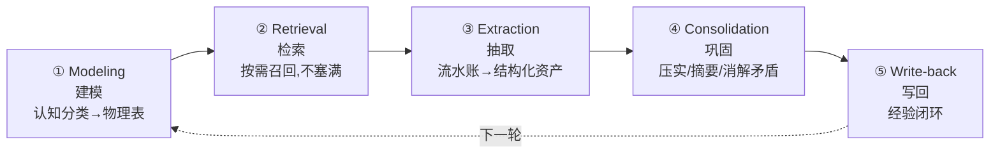

# Agent 记忆系统 · 面试回答骨架

> **这份文档回答的不是"记忆有哪些机制"，而是"被问到记忆时，我按什么顺序讲、讲哪几句、怎么应对追问"。**
>
> **与已有资产的分工（别混用）：**
> | 文档 | 管什么 | 什么时候看 |
> |---|---|---|
> | [`interview/jd-senior-agent-engineer/04-multi-layer-memory.md`](../../interview/jd-senior-agent-engineer/04-multi-layer-memory.md) | **机制与取舍**（三条正交轴、生命周期、namespace、Memory vs RAG、伪码） | 复习知识点 |
> | **本文** | **回答的组织方式 + 判断力主线**（控制权四派、三门课的独有弹药、预判追问） | 开口之前 |
> | [`skills/agent-selection/6-memory.md`](../../skills/agent-selection/6-memory.md) | **真实选型决策**（决策树、场景表） | 干活时 |
>
> **来源**：课程 12（LangGraph/LangMem）、12a（Oracle 26ai）、12b（Letta/MemGPT）+ [`Memory框架/`](Memory框架/) landscape。
> **最后核对：2026-07**

---

## 零、30 秒版（如果只给你一分钟）

> "Agent 记忆不是一个存储，是**三条正交轴**叠出来的能力层：**作用域**（工作/会话/跨会话）× **内容类型**（semantic/episodic/procedural）× **控制权**（谁触发写、谁决定写什么）。
>
> 前两条轴决定**存什么、存哪**；**第三条轴才是架构分野**——记忆写入到底交给代码还是交给 LLM。业界四种立场：Oracle 那派用代码确定性触发、不指望 LLM 自觉；LangGraph/LangMem 混合，热路径交 LLM、后台交代码；Letta/MemGPT 让 agent 自己 self-edit；mem0 则是确定性触发但内容由 LLM 抽取流水线定。
>
> **我的判据是一句话：这个写入能不能容忍 LLM 偶尔忘记做？** 不能容忍（数据完整性、审计）→ 代码兜底；错了不致命（个性化体验）→ 交给自治。真实生产是**混血**。"

**这段的杀伤力在于**：绝大多数候选人只会讲前两条轴（那是背书），第三条轴才证明你**读过不止一种实现、并且能裁决**。

---

## 一、主线骨架：被问"设计一个 Agent 记忆系统"时的五步

> 按 12a 的**五模式**走，每步挂一个具体机制。这是最稳的叙述主干——因为它是**生命周期**顺序，不是名词罗列。

| 步 | 一句话 | 挂什么机制 |
|---|---|---|
| **① Modeling** | 把认知分类落成**物理表**，不是一坨 blob | semantic/episodic/procedural 三类各有 schema |
| **② Retrieval** | 记忆（**含工具定义**）按语义**按需**检索 | 向量 + metadata filter；top-k + token 预算裁剪 |
| **③ Extraction** | 从对话抽实体/事实 | LLM 抽取 → 结构化 |
| **④ Consolidation** | 处理记忆**增长**与**新旧矛盾** | 摘要/压实、冲突消解、遗忘 |
| **⑤ Write-back** | 执行结果回写，形成"从经验学习"闭环 | 收尾必写（**确定性**，见 §二） |

> 💎 **开场金句（12）**："**记忆类型的选择是行为设计，不是存储设计。**" 三类记忆可以躺在同一个 store 里靠 namespace 区分——差别不在存哪，而在**怎么改变 agent 行为**：Semantic 补知识、Episodic 改判断、Procedural 改规则。**先问"我要改变 agent 的什么"，再选类型。**

---

## 二、脊椎：控制权四派（本骨架的核心，也是 `04` 缺的那根轴）

### 2.1 先把一个常见误区拆开 ⭐⭐

> **「谁触发写入」和「谁决定写什么内容」是两件事**，绝大多数人（包括很多资料）把它们压成一维。

| 路线 | **触发时机**由谁定 | **写入内容**由谁定 |
|---|---|---|
| **Oracle 26ai**（12a·确定性派） | 代码（80% 阈值、生命周期钩子） | 代码规则 + LLM 抽取 |
| **LangGraph/LangMem**（12·混合派）⭐ | hot path 给 LLM / background 给代码 | LLM |
| **Letta/MemGPT**（12b·自治派） | **LLM**（agent 自己决定何时 `core_memory_replace`） | LLM |
| **mem0**（服务化抽取派） | **代码**（你显式调 `add()`） | **LLM**（两阶段抽取+消解流水线） |

> 👉 **mem0 = 确定性触发 + 非确定性内容**，落在原来三分法没有的格子里。它的风险面由此而来：**触发是确定的，但"记成什么样"是一次不可复现的 LLM 判断**——事实可能被静默改错，你的代码看不出来。

### 2.2 裁决判据（背这一句）

> **"这个写入能不能容忍 LLM 偶尔忘记做？"**
> - **不能**（数据完整性、审计、合规）→ **代码确定性兜底**
> - **能**（个性化体验，错了不致命）→ **交给 LLM 自治**
> - **介于两者** → **混合**（默认答案）

### 2.3 12a 的 2×2 触发矩阵（最可复用的落地判据）⭐

两个维度：**在 Agent Loop 内 / 外** × **确定性 / 智能体触发**。

| | **确定性触发** | **智能体触发** |
|---|---|---|
| **循环外·前** | 读记忆装配上下文；用量 >80% 就压实；按 query 检索 top-k 工具 | — |
| **循环内** | 同一套 summarize 函数被代码强制调用 | LLM 调工具、主动 `expand_summary`（探索性动作） |
| **循环外·后** | `write_workflow` / `write_entity` / **收尾必写回** | — |

> 💎 **判据原句**：**信息装配和收尾写回必须确定性——不能指望 LLM 记得做**；探索性动作（搜什么、要不要展开摘要）才交给 LLM。
> ⭐ **设计哲学**：同一能力（如 summarize）**一套底层函数、两条触发路径**。能讲到这一层，说明你真设计过。

### 2.4 两派的"共识"级结论（12b·L7 复盘，直接引用）

无论走哪派，这四条是共通的**正确答案**：

1. 记忆必须**外部化、持久化、结构化**；
2. 上下文要**分区**，且**要告诉 LLM 分区的语义**（12a 用 markdown 标题段 ≈ 12b 用 block 渲染标签）；
3. 压缩后必须留**可展开的引用**（summary ID + 描述 ≈ 递归摘要 + recall 搜索）；
4. 一个记忆操作 = **数据（表/block）+ 操作（工具）+ 说明书（system prompt）** 三件套。

> 💎 **杀手句**：**"真实生产是混血——自治记忆 + 确定性兜底。Letta 自己要引入 `tool_rules`，这件事本身就证明了纯自治不够用。"**

---

## 三、三门课的独有弹药（哪句话只有读过这门课才说得出来）

### 3.1 课程 12（LangGraph/LangMem）—— 行为设计视角

- **三类记忆 = 三种改变行为的方式**（不是三种存储）：

  | | 记什么 | 怎么改变行为 | 更新模式 | 挂在哪 |
  |---|---|---|---|---|
  | **Semantic** | 事实句、用户偏好 | LLM **主动调工具**读写 → 补知识 | Hot Path | Response Agent 的工具列表 |
  | **Episodic** | 完整案例（输入+期望输出） | **代码无条件检索**注入 few-shot → 改判断 | Background | Triage 的 prompt |
  | **Procedural** | 自然语言规则（**system prompt 本身**） | prompt 被优化器改写 → 改规则 | Background | 两处 prompt |

- ⭐ **注意 Semantic 是唯一的"工具"**：另两类都是**被动注入 prompt**（agent 无感），只有 Semantic 是 agent **主动调用**。这就是"要不要把决策权交给模型"的经典取舍在同一个系统内的两种答案。
- 💎 **"用户教 Agent"的三个杠杆，成本递增、泛化递增**：**打一个标签**（Episodic）< **给一句反馈**（Procedural 优化器改 prompt）< **改代码**。把前两个做进产品，agent 才能**不发版持续进化**。
- 💎 **"Prompt 不再是源码里的固定字符串，而是住在 store 里、可被 LLM 改写的运行时数据。"**
- **Episodic vs Procedural 的取舍**：具体例子 → Episodic（靠向量相似度泛化）；通用规则 → Procedural（LLM 直接执行）。
- **可迁移判断（L2 的远见）**：**凡是未来可能被 LLM 改写的东西，先从源码里剥出来。**

### 3.2 课程 12a（Oracle 26ai）—— 工程基础设施视角

- 💎 **`Compaction ≠ Summarization`（高区分度）**：核心区别是信息**丢掉**还是**搬走**。
  - **Summarization = 有损压缩**，不可还原；
  - **Compaction = 无损卸载**——原文进 DB，窗口只留 `[Summary ID: xxx] + 描述`，LLM 按需 `expand_summary(id)` 换回来。
  - ⭐ **一句话**：**"这等于给上下文做虚拟内存分页。"**
- **80% 阈值 + 五步压实**：读未归档行 → LLM 总结（强制四个小标题）→ 存 SUMMARY → **回填 summary_id 到源数据行** → 返回。**第 4 步是精髓：归档状态持久化在数据行本身，而不是内存游标——崩溃重启可恢复。**
- 💎 **`RAG ⊂ Agent Memory`**：RAG 只是**只读的语义记忆**，缺写回、缺多类型、缺矛盾消解。这是对付**"我们已经有 RAG 了，还要记忆干嘛"**的标准反驳。
- **SQL vs 向量的分工**：精确/结构化/时序（按 `thread_id` 拉最近 10 条）走 SQL；模糊/语义走向量。**无脑全上向量库是反模式**——那种精确查询用向量库又慢又贵。
- ⭐ **Toolbox = 程序性记忆**：工具定义也是记忆单元，应该**按语义检索 top-k**，而不是全量塞进 context。**为什么是真问题**：MCP 时代接几十上百个工具 → 上下文膨胀 + **工具选择能力随选项数退化**。
  - **`read_toolbox` 是"能找工具的工具"**——自举设计，agent 卡住时自己去检索还有什么能力可用，不被启动时的固定工具集锁死。
- 💎 **元认知是分水岭**：**"memory-aware 不是'有记忆'，是'知道自己有什么记忆、缺的细节该去哪取'。"**

### 3.3 课程 12b（Letta/MemGPT）—— LLM 即 OS 视角

- **类比映射**：物理内存 → 上下文窗口；虚拟内存 → 外部存储；缺页中断 → 需要的信息不在窗口。
- ⚠️ **别停在"窗口=内存"这句话（那是修辞）。类比的锋利处在"谁做换页决策"**——OS 内核 vs **LLM 自己**。这一句直接切进 §二的架构分野。
- ⭐⭐ **External Memory Statistics（最精妙的一条）**：上下文里常驻"archival N 条、recall M 轮"——**不给内容，只给"内容存在性"的信号**。
  - 💎 **"没有它，agent 不知道自己不知道"**——也就无法做"要不要检索"的决策。
- **Core Memory Blocks**：渲染时带 `characters="123/2000"` ——**agent 能看见自己的配额**，这是它自主决定"该腾位了"的信息基础。
- **递归摘要 + 永不删除**：溢出消息进 recall，窗口换成递归摘要。**对比主流框架的 truncate = 永久丢失。**
- **Heartbeat = 控制反转**：每个工具带 `request_heartbeat`，LLM 显式声明"我还没做完，再叫我一次"——把**循环控制权交给 LLM**（对比 `for i in range(max_iter)`）。
- ⭐ **L1 的"祛魅"（面试可现场手写，含金量 > 背 API）**：最小可行的 self-editing memory = **一个 dict + 一个改 dict 的函数 + tool calling + while 循环，约 50 行**。
  - 三个要点：① 记忆注入在 **system prompt 区**（不进 chat history），且 prompt 必须**显式告知 LLM 它有记忆区**；② 用 **JSON schema 的 `enum` 约束 section**——**用 schema 约束代替祈祷式 prompt**；③ 循环退出：**非工具调用即 break**。
  - 💎 **"框架卖的不是这个机制，而是持久化、并发、可观测、多 agent 这些工程外围。"**
- **多 agent 共享记忆**：**共享 block = agent 界的共享内存段**（同一 block ID 挂多个 agent = 各自窗口里是同一行 DB 记录）。
  - **分工原则**：**状态共享走存储层（缓变公共事实），事件协调走消息。**

---

## 四、预判追问（面试官大概率会挖这几刀）

| 追问 | 骨架 |
|---|---|
| **"短期/长期 和 semantic/episodic 是一回事吗？"** | **不是，是两条正交轴。** 短期/长期是**生命周期**，三类是**内容性质**。短期记忆里也能有 semantic（刚抽到的实体放 working memory）。混为一谈的人，通常会用**一套 upsert 处理所有记忆**，然后踩 episodic 被去重、procedural 没法回滚的坑。 |
| **"我们已经有 RAG 了，还要记忆吗？"** | **RAG ⊂ Agent Memory**——RAG 是**只读的语义记忆**。**semantic 的召回 = RAG 检索，代码几乎可共用；区别全在写入侧**：memory 多了写入/更新/巩固/遗忘的生命周期，且内容会**自相矛盾**。所以 memory 比 RAG 多一套**冲突解决 + 遗忘**的运维。episodic/procedural 离 RAG 更远。 |
| **"上下文窗口都 1M 了，还要外部记忆吗？"** | **要。** context stuffing 是 **O(n) 成本且信噪比递减**（lost-in-the-middle）。**能力上限提高 ≠ 工程手段作废。** |
| **"记忆写错了怎么办？"**（**最该主动引出的一刀**） | 承认这是**结构性风险**，然后给**写入分流**方案：关键事实（数据完整性）走确定性写入，体验型记忆才交给自动抽取。→ §2.2 判据 |
| **"hot path 还是 background？"** | 取舍轴 = **延迟 vs 反馈滞后**。**默认 background**；只有"这一句必须当场记住并立刻影响后续回答"才上 hot path。 |
| **"Letta 和 LangGraph 选哪个？"** | 它们在**编排层互斥**（Letta 是完整 agent server，agent 本体活在它 DB 里）。单助手快速起盘 → Letta 全家桶；复杂编排/多 agent → LangGraph。**已有自研 agent loop、只缺跨会话记忆 → mem0 sidecar（唯一不绑编排层的）。** |
| **"什么时候不该上记忆框架？"**（**反向问题，答对加分**） | **该记哪些字段你事先说得清（窄领域）的时候。** 5 个用户偏好字段 → 一张 **profile 表 + 代码显式写入**几乎总是更优：确定、可复现、零 LLM 成本、好审计。**自动抽取的价值只在"开放域、事先不知道该记什么"时才兑现。** |

---

## 五、主动圈边界（这一节比前面都值钱）

> **面试里主动指出这一层的未解问题，比多背十个 API 更能体现判断力。** 三门课 + 全行业都没解决：

1. **事实时效（staleness）** ⭐ ——
   用户换了工作，旧记忆**"自信地错着"**。关键点：**decay 机制只处理低相关记忆**，而高相关的陈旧事实恰恰因为"相关"而被优先召回，**错得最响**。
   - 12 靠优化器改 prompt、12a 只有 prompt 层的冲突优先级排序、12b 只有即时 `replace`、mem0 是**就地覆盖**（旧事实直接消失，追溯不了"他当时在哪家公司"）。
   - **唯一有系统性解法的是 Zep/Graphiti**：temporal knowledge graph，边带 `valid-at`/`invalid-at` 失效区间。
2. **跨交互的身份归并** —— 同一个人在不同 session/渠道出现，怎么认出是同一实体。无成熟方案。
3. **记忆投毒（安全面）** ⭐ —— **Procedural 记忆的天然攻击面**：用户可以诱导 agent 把恶意规则写进 system prompt。三门课**只字未提**。
4. **prompt 被自动改写后，谁保证没退化？** —— 没有 A/B、没有 prompt 版本/回滚、没有记忆质量的 eval（召回率、注入有效性、"记错"的代价）。
5. **自治路线的可靠性天花板 = 基座模型能力**（12b 自认）——课程 demo 用小模型时行为明显概率化。**这是自治派生产中最大的软肋。**

---

## 六、⚠️ 查缺补漏：`04` 目前没有的东西

> 本文档的存在理由。如果要把这些并回 `04`，优先级从高到低：

| 缺口 | 为什么该补 |
|---|---|
| **控制权四派 + 触发/内容双轴拆分** | `04` 只有 `framework-driven vs model-driven` 一条轴，缺了整个 12a/12b 的对立 |
| **12a 的 2×2 触发矩阵** | 最可复用的落地判据 |
| **Compaction ≠ Summarization** | 高区分度考点，`04` 完全没有 |
| **External Memory Statistics** | "agent 不知道自己不知道" —— 极精妙、极易记 |
| **记忆投毒攻击面** | `04` 有 PII 但无此项 |
| **LangMem 的 `kind` 三档** | `04` 只写了 `prompt_memory`；**默认其实是 `gradient`**（`prompt_memory` 单步最省，`gradient` 拆提议+应用两步，`metaprompt` 加反思最贵）。⭐ **Procedural 跑在 background、延迟不敏感 → 理论上该往贵的选**；课程用 `prompt_memory` 是为教学省钱，**别把"课程默认"当"推荐默认"** |

---

## 七、相关资产

- **机制细节**：[`interview/jd-senior-agent-engineer/04-multi-layer-memory.md`](../../interview/jd-senior-agent-engineer/04-multi-layer-memory.md)
- **选型决策**：[`skills/agent-selection/6-memory.md`](../../skills/agent-selection/6-memory.md)（决策树 / 场景表 / 四派光谱）
- **产品 landscape**：[`Memory框架/框架现状.md`](Memory框架/框架现状.md)、[`Memory框架/Hindsight.md`](Memory框架/Hindsight.md)
- **课程回溯**：`12-…/notes/00-总结回顾.md`、`12a-…/notes/L6-课程总结与架构师复盘.md`、`12b-…/notes/L7-课程总结与12a对比复盘.md`（**L7 是三派对比的主源**）
- **context 数据结构分层**：`interview/3.md`

> **最后核对：2026-07**
