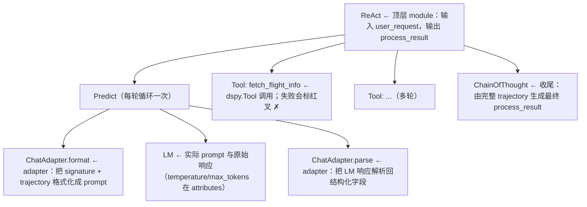

# L3 · 用 MLflow Tracing 调试 DSPy Agent（ReAct 航司客服实战）

> 课程：DSPy: Build and Optimize Agentic Apps（DeepLearning.AI × Databricks）
> 本课任务：为 DSPy 程序接入 **MLflow tracing**（一行 `mlflow.dspy.autolog()`），并在它的帮助下构建一个航司客服 agent——用 `dspy.ReAct` 组合 7 个工具，帮用户订票、改行程，全程可逐层回看每一次 module / LM / tool 调用。

## 0. 本课目标与路线

前两课（L1-L2）建立了 DSPy 的两大抽象：**signature**（LLM 调用的输入输出契约）和 **module**（带自定义逻辑的 LLM 交互接口），并用内置 module 做了情感分析、用自定义 agent 做了"猜名人"游戏。本课转向工程侧：GenAI 程序越搭越复杂之后，**怎么看清它内部发生了什么**。路线两步：**① 理解 tracing 与 MLflow → ② 实战：ReAct 航司客服 agent + 逐层读 trace**。

## 1. 为什么需要 Tracing

Tracing = **记录 AI 程序内部每个中间函数的输入和输出**，并捕获层级化的调用栈（module A 调 module B…）。痛点：

- GenAI 应用内部可以非常复杂，但**只有最终输出暴露在外**——出了问题很难回溯根因；
- 例：一个 DSPy 程序由 5 个子模块组成，其中某次 LM 调用因为"没看懂 prompt"而失败——虽然 DSPy 提供 `inspect_history()` 检查 LM 调用（L2 用过），但在多模块场景下仍然难以定位是哪一层出的问题；
- Tracing 提供了一条**可解释性 + 调试**的捷径：不止看到某个子模块的输入输出，还能看到模块层级、耗时等信息；出错的模块会直接标一个红叉（cross mark）指出来。

## 2. MLflow：一行接入的自动插桩

MLflow 是开源的 AI ops 包，覆盖 GenAI 应用开发全生命周期，保证每一步**可追溯、可复现**；server 和 client 都完全开源，可自行搭建。接入 DSPy tracing 只需一行：

```python
mlflow.dspy.autolog()   # 或 mlflow.autolog()；此后程序自动被 trace，存入 MLflow server 随时回看
```

**autolog 会 trace 四类东西**：

| 被 trace 的对象 | 内容 |
|---|---|
| 每个 module 调用 | 顶层 module 和所有内部 module，含层级关系 |
| Adapter 调用 | adapter 如何把 query 格式化成 prompt、如何解析 LM 响应 |
| LM 调用 | **实际发出的 prompt 和 LM 原始响应**（点开 LM trace 即见，比 `inspect_history` 更方便） |
| `dspy.Tool` 调用 | DSPy 工具调用的包装层，失败会标红 |

trace 的每个节点还带 **attributes**（函数调用的实参；LM 节点则是 temperature、max tokens 等配置）和 **events** tab（有错误时存放报错信息）。

> **对比 5-observability-eval.md 的 tracing 层**：选型笔记里把可观测性拆成"埋点层 ≠ 后端层"两个子决策——`mlflow.dspy.autolog()` 正是**埋点层的框架原生自动插桩**路线（对应课程 21 里 Phoenix 的 `instrument()`），MLflow tracking server 则是后端层。价值在于零侵入：不需要在业务代码里手写 span。MLflow 同样集成了 LangChain、LlamaIndex 等框架的 autolog，埋点层选型时它和 OTel/Phoenix 属于同一格。

## 3. 环境搭建（lab 代码）

```python
import mlflow, dspy

mlflow.set_tracking_uri(get_mlflow_tracking_uri())  # 指向 MLflow tracking server（lab 已代建，生产需自建）
mlflow.set_experiment("dspy_lesson_3")              # 给实验一个唯一标识
mlflow.dspy.autolog()                               # 一行开启自动 tracing

dspy.configure(lm=dspy.LM("openai/gpt-4o-mini"))    # 与前课相同的 LM 配置
```

## 4. 数据建模：Pydantic 模型充当"数据库 schema"

真实生产里这是数据库 schema，lab 里用 Pydantic 模型 + 内存 dict 模拟四张表：

```python
class Date(BaseModel):
    # 实测 LLM 不擅长直接生成 datetime.datetime，拆成四个 int 字段更稳
    year: int
    month: int
    day: int
    hour: int

class UserProfile(BaseModel):   # 用户：user_id / name / email
    ...
class Flight(BaseModel):        # 航班：flight_id / date_time / origin / destination / duration / price
    ...
class Itinerary(BaseModel):     # 行程：confirmation_number + user_profile + flight
    ...
class Ticket(BaseModel):        # 客服工单：user_request + user_profile

user_database   = {"Adam": UserProfile(...), ...}   # 4 个用户
flight_database = {"DA123": Flight(...), ...}       # 4 班航班（SFO→JFK 两班、SFO→SNA 两班）
itinery_database, ticket_database = {}, {}          # 订单库与工单库，初始为空
```

## 5. 定义 7 个工具：docstring + type hints 就是工具协议

DSPy 里定义 tool/function 的规则：**docstring 描述这个函数能干什么**（LLM 靠它决定何时调用），**type hints 标注入参类型**（LLM 靠它填参数）：

```python
def fetch_flight_info(date: Date, origin: str, destination: str):
    """Fetch flight information from origin to destination on the given date"""
    # 按 日期+起点+终点 过滤 flight_database，返回候选航班列表

def pick_flight(flights: list[Flight]):
    """Pick up the best flight that matches users' request."""
    # 确定性业务规则：先比时长、同时长比价格 —— 这类逻辑写死，不交给 LLM 判断
    return sorted(flights, key=lambda x: (x.duration, x.price))[0]

def book_itinerary(flight: Flight, user_profile: UserProfile):
    """Book a flight on behalf of the user."""
    # 生成不重复的 confirmation_number，写入 itinery_database

def file_ticket(user_request: str, user_profile: UserProfile):
    """File a customer support ticket if this is something the agent cannot handle."""
    # 兜底：agent 处理不了就开工单转人工
```

| 工具 | 职责 |
|---|---|
| `fetch_flight_info` | 按日期/起终点查航班 |
| `fetch_itinerary` | 按确认号查已订行程 |
| `pick_flight` | 从候选中挑最优（最短→最便宜） |
| `book_itinerary` | 代用户订票、写库 |
| `cancel_itinerary` | 取消行程 |
| `get_user_info` | 按姓名查用户资料 |
| `file_ticket` | 无法自动解决时开客服工单 |

> **架构师视角**：`pick_flight` 值得咀嚼——"怎么选航班"是确定性规则（时长优先、价格次之），课程把它做成**普通 Python 函数**而不是让 LLM 在 prompt 里自由裁量。Agent 设计的分工原则：LLM 负责"下一步该干什么"的编排决策，业务规则下沉为确定性工具；`file_ticket` 则是必备的 human-in-the-loop 兜底出口。这两个模式与工具边界设计（4-tools.md）直接对口。

## 6. Signature + dspy.ReAct 组装

Signature 定义整个程序的输入输出契约：输入是一条用户请求字符串，输出是处理结果消息（订票成功要带确认号，解决不了要带工单号）：

```python
class DSPyAirlineCustomerSerice(dspy.Signature):
    """You are an airline customer service agent. You are given a list of tools to
    handle user request. You should decide the right tool to use..."""   # docstring = 类式 signature 的 instruction
    user_request: str = dspy.InputField()
    process_result: str = dspy.OutputField(
        desc="总结处理结果的消息，如订票成功需含 confirmation_number，转人工需含工单号")

react = dspy.ReAct(          # ReAct = Reasoning + Acting
    DSPyAirlineCustomerSerice,
    tools=[fetch_flight_info, fetch_itinerary, pick_flight, book_itinerary,
           cancel_itinerary, get_user_info, file_ticket],
)

result = react(user_request="please help me book a flight from SFO to JFK "
                            "on 09/01/2025, my name is Adam")
```

ReAct 的机制：把 signature（程序目标）和工具清单交给 LM，由 LM 决定是先调工具获取事实信息、还是已经可以直接回答。

## 7. 逐层读 Trace：一次订票请求的完整 trajectory

MLflow Trace UI 里能看到本次调用的完整层级：



ReAct 内部是**多跳循环**：每轮 LM 输出"下一步 thought"（调某个工具 or 结束），工具结果追加进 **trajectory 字段**再喂回 LM。本次订票请求的实际轨迹：

| 轮次 | LM 的决策（thought） | 工具调用 | 结果 |
|---|---|---|---|
| 1 | 手头没有航班信息，先查询；并自行填好参数（日期/起终点） | `fetch_flight_info` | 返回 2 个候选航班 |
| 2 | 有一批候选，挑最优的一班 | `pick_flight` | 最短且最便宜的一班 |
| 3 | 订票需要用户资料 | `get_user_info("Adam")` | 拿到 UserProfile |
| 4 | 信息齐全，直接下单 | `book_itinerary` | 写库，得 confirmation_number |
| 5 | 任务看起来完成了 | `finish`（DSPy 内置 dummy tool，标记 ReAct 循环结束） | 退出循环 |
| 收尾 | — | `ChainOfThought`：输入全部工具调用历史 + 用户请求 | 生成 `process_result`（含确认号） |

有了这张 trace，"复杂多跳调用里哪一步出了问题"变成点开对应模块看输入输出的事。

## 8. 生产注意事项

- lab 里 MLflow server 是代建的；实际开发需要自己部署（open source），或直接用 **Databricks 托管 MLflow**（Databricks Lakehouse 提供 free trial）；
- MLflow autolog 同样支持 LangChain、LlamaIndex 等框架——tracing 埋点方案可跨框架复用。

## 9. 本课总结

| 要点 | 一句话 |
|---|---|
| Tracing 动机 | GenAI 程序只暴露最终输出，出错难回溯；trace 记录每个中间调用的输入输出 + 层级 |
| 一行接入 | `mlflow.dspy.autolog()`，自动 trace module / adapter / LM / tool 四类调用 |
| 工具定义协议 | docstring 说明用途 + type hints 标注参数，LLM 据此选工具、填参数 |
| dspy.ReAct | signature + tools 交给 LM，多跳循环：thought → 工具 → 结果回填 trajectory → 再 thought |
| 调试方式 | Trace UI 逐层点开看输入输出，错误模块标红叉，LM 节点直接看实际 prompt |

> **记忆点（引出 L4）**：Tracing 解决的是"**看见**"——程序哪一步、哪个 prompt 出了问题一目了然；但"看见"之后的**改进**仍然是手工活：改 docstring、调 few-shot、重跑。L4 引入 DSPy optimizer（MIPROv2）把这一步也自动化：给一个 metric 和几十条数据，让程序自己搜索更好的 instruction 和 few-shot examples。

## 与我的资产映射

- 可观测层选型：`agent/skills/agent-selection/5-observability-eval.md`（埋点层 vs 后端层——`mlflow.dspy.autolog` 补充为埋点层"框架原生 autolog"一格，与 Phoenix/OTel 并列）
- 工具层：`agent/skills/agent-selection/4-tools.md`（docstring+type hints 的工具协议；确定性规则下沉为工具、LLM 只做编排的分工原则）
- 课程 21 Evaluating AI Agents：同为 trace 驱动调试，Phoenix 的 span 树与本课 MLflow trace 层级一一对应，可互为参照
- [[project_selection_matrix]]
