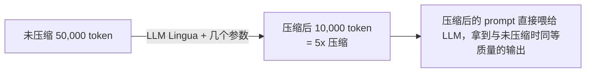

# L5 · 用 Prompt Compression 压缩 token 降本（LLM Lingua 收官篇）

> 课程：Prompt Compression and Query Optimization（DeepLearning.AI × MongoDB，讲师 Richmond Alake）
> 本课任务：用 **LLM Lingua** 把送进 LLM 的 prompt 从几千 token 压到几百 token，在几乎不损失输出质量的前提下大幅降低 LLM 调用成本。这是全课收官——检索侧优化（L1-L4）之后，转向**生成侧的成本控制**。

## 0. 承上：优化到这里，剩下的贵在 prompt 本身

L1-L4 一路把检索侧打磨完：L1 向量检索、L2 元数据 pre-filter、L3 projection 裁字段、L4 boosting 重排。召回准了、字段瘦了、排序对了。但这批文档最终要**拼成 context 塞进 prompt 发给 LLM**，而这一步的成本还没碰。

L5 的动机链条：

- 各种 prompting 策略（in-context learning、chain-of-thought、ReAct）**都在往 LLM 里灌大段文本**；
- 大 context window 成了新常态——10 万 token、甚至 100 万 token（等于把一整本小说塞进一次推理）；
- 但通过 **REST API** 调这种大 context 模型**极贵**。举例：$10 / 100 万 token，放到 Airbnb 这种每天几百万用户的应用上，光交互量就是巨额运营开销；
- 还有**延迟**——模型要处理更多输入才能抽出有用信息来回答。

> 构建健壮的 AI 应用要**提前为可扩展性设计**，解决那些会变成瓶颈的问题。别等量上来了才想省 token。

## 1. Prompt Compression 是什么

一句话定义：**prompt compression（有时叫 token compression）是减少 token 数量的过程**。

课程演示的直觉：一段原始未压缩的 prompt 横跨三个长句，用 **LLM Lingua** 处理后压成两句两行——语义保留，措辞变瘦。规模化的效果：



本课实测（见 §5）甚至做到 **8x**：4284 token → 512 token。

## 2. LLM Lingua：用"小模型"压"大模型的输入"

核心思路巧妙：**用一个专门为压缩微调过的小语言模型**，去决定大 prompt 里哪些 token 可以删。

```python
from llmlingua import PromptCompressor

llm_lingua = PromptCompressor(
    model_name="microsoft/llmlingua-2-bert-base-multilingual-cased-meetingbank",
    model_config={"revision": "main"},
    use_llmlingua2=True,    # 启用最新的 LLM Lingua 2 压缩逻辑
    device_map="cpu",       # 指定用 CPU 跑压缩模块
)
```

- `model_name`：一个 BERT-base 量级的**小模型**，专为 prompt compression 微调；
- `use_llmlingua2=True`：用最新一代 LLM Lingua 2 算法；
- `device_map="cpu"`：这个压缩小模型跑在 CPU 上。

## 3. 输入结构：demonstration / instruction / question

LLM Lingua 要求输入按**组件化结构**组织，三个字段：

| 字段 | 含义 | 本课对应 |
|---|---|---|
| `demonstration` | context / 传给 LLM 的附加信息 | **数据库检索返回的文档**（RAG 召回结果） |
| `instruction` | 告诉压缩小模型**怎么压** | `"Write a high-quality answer for the given question using only the provided search results."` |
| `question` | 用户 query 本身 | 用户的原始查询 |

```python
def compress_query_prompt(query):
    demonstration_str = query['demonstration_str']
    instruction = query['instruction']
    question = query['question']

    compressed_prompt = llm_lingua.compress_prompt(
        demonstration_str.split("\n"),  # ① 按换行把每条 context 切开
        instruction=instruction,        # ② 压缩指令
        question=question,              # ③ 用户问题
        target_token=500,               # ④ 目标压缩到多少 token
        rank_method="longllmlingua",    # ⑤ 用最新的 longLLMLingua 算法
        context_budget="+100",          # ⑥ 允许预算超支 100 token
        dynamic_context_compression_ratio=0.4,  # ⑦ token 在 context/指令间的分配比
        reorder_context="sort",         # ⑧ 允许压缩器用 sort 算法重排 context
    )
    return json.dumps(compressed_prompt, indent=4)
```

逐个参数（讲师逐条解释）：

1. **切分方式**：`demonstration_str.split("\n")`——按换行把每条 context 拆开；
2. instruction；3. question；
4. **`target_token=500`**：想把 prompt 压到多少 token；
5. **`rank_method="longllmlingua"`**：用最新的 longLLMLingua 压缩算法；
6. **`context_budget="+100"`**：context 预算，允许超出 100 token；
7. **`dynamic_context_compression_ratio=0.4`**：压缩逻辑如何在 context（demonstration）与整体 instruction+question 之间分配 token；
8. **`reorder_context="sort"`**：让压缩器用排序算法**重排 context**。

返回的是一个 JSON，含**原始 token 数**和**压缩后 token 数**。

## 4. 接进 RAG 流水线：两个新函数

L5 把 L4 的 boosting 三阶段原样保留（`additional_stages = [review_average_stage, weighting_stage, sorting_stage_sort]`，权重这里用 0.3/0.7），然后加两个函数：

**① `handle_user_query_with_compression`**——检索 + 组装 query_info + 压缩：

```python
def handle_user_query_with_compression(query, db, collection, stages=[], vector_index=...):
    get_knowledge = custom_utils.vector_search_with_filter(query, db, collection, stages, vector_index)
    if not get_knowledge:
        return None, "No results found."

    search_results_models = [SearchResultItem(**r) for r in get_knowledge]
    search_results_df = pd.DataFrame([item.dict() for item in search_results_models])

    query_info = {
        'demonstration_str': search_results_df.to_string(),  # 检索结果 = context
        'instruction': "Write a high-quality answer for the given question using only the provided search results.",
        'question': query,                                   # 用户 query
    }
    compressed_prompt = compress_query_prompt(query_info)    # 调 §3 的压缩函数
    return search_results_df, compressed_prompt
```

**② `handle_system_response`**——把**压缩后的 prompt** 连同 query 发给真正的大模型（gpt-3.5-turbo）拿回答：

```python
def handle_system_response(query, compressed_prompt):
    completion = custom_utils.openai.chat.completions.create(
        model="gpt-3.5-turbo",
        messages=[
            {"role": "system", "content": "You are an Airbnb listing recommendation system."},
            {"role": "user",
             "content": f"Answer this user query: {query} with the following context:\n{compressed_prompt}"},
        ],
    )
    return completion.choices[0].message.content
```

分工清晰：**小模型（LLM Lingua）负责压，大模型（GPT）负责答**。

## 5. 实测：8x 压缩，省 $0.2/次

跑下来的数据（讲师现场读出）：

```
原始 uncompressed prompt : 4284 token
压缩后 compressed prompt :  512 token
压缩比                   : ≈ 8x
本次调用节省             : $0.2（喂给 GPT-4 计价）
```

放大到规模：

> Airbnb 这种每天几百万次推理调用的应用，这一下能省**几十万美元**级别。

**延迟的取舍要诚实**：压缩这一步本身要跑小模型，**会增加延迟**（本课单次要几分钟，因为在 CPU 上跑）。但**整体运营成本下降**——这是一笔"拿延迟换成本"的交易。

**质量对照**：压缩后的输出**和未压缩输出不完全一样，但质量相近、且满足 query 要求**。压缩前系统推荐的是 "homely room in five star new condo"；压缩后推荐的房源同样落在"warm friendly neighborhood、next to restaurants"——正是 query 里要的。结论：

> 用更低的 token 数，能从大模型拿到质量相近的输出。

## 6. 本课总结

| 要点 | 一句话 |
|---|---|
| Prompt compression | 减少 token 数，直接砍 LLM API 成本 |
| LLM Lingua | 用微调过的小模型决定删哪些 token |
| 输入三段式 | demonstration(context) / instruction / question |
| 关键参数 | target_token、rank_method、context_budget、compression_ratio |
| 实测效果 | 4284 → 512 token（8x），省 $0.2/次，质量相近 |
| 取舍 | 拿"压缩延迟"换"运营成本"，规模越大越值 |

## 全课收官

### ① Conclusion 要点

课程结语（Richmond Alake）三句话收束全课：

1. 实现了 **vector search**；
2. 用 **metadata + MongoDB aggregation pipeline** 优化 RAG 系统，提升效率与输出相关性；
3. 用 **prompt compression** 降低 LLM 应用运营成本。

推荐的后续资源：**MongoDB Developer Center**（教程/文章/视频）、**GenAI Showcase repo**（RAG 与 agentic 用例代码）、**DeepLearning.AI 论坛**。

### ② L1-L5 全课回顾表

| 课 | 主题 | 技术 | 优化的是什么 | pipeline 增量 |
|---|---|---|---|---|
| L1 | Vector Search | embedding + MongoDB `$vectorSearch` + Pydantic | 召回的**语义相关性** | `$vectorSearch` |
| L2 | Metadata & Filtering | 多阶段 aggregation + pre-filter | 召回的**精准度与效率** | + `$match`/pre-filter |
| L3 | Projections | `$project` 投影 | 返回文档的**体积/隐私/token** | + `$project` |
| L4 | Boosting | `$addFields` + 加权 + `$sort` | 结果的**排序质量** | + 三阶段重排 |
| L5 | Prompt Compression | LLM Lingua 小模型压缩 | LLM 调用的**成本与 token** | 生成侧（离开 pipeline） |

一条主线：**L1-L4 都在优化"检索侧"（让送进 prompt 的内容又准又瘦又有序），L5 转到"生成侧"（把送进 LLM 的 token 再压一道）。** 全课本质是一句话——**用一个成熟数据库（MongoDB）的既有能力（aggregation pipeline、projection、$addFields）来削减一个大规模 RAG 应用的服务成本**（这正是 L0 开篇 Andrew 点明的课程主旨）。

### ③ 架构师的裁决

> **架构师的裁决**：Prompt compression 和 query optimization 治的是两个不同的病，别混用。
>
> **Query optimization（L2-L4，检索侧）优先做，因为它多数无损**：pre-filter 少召回垃圾、projection 砍整字段、boosting 修排序——这些几乎不损失信息、不花额外算力，是"免费的午餐"，任何 RAG 都该先做满。
>
> **Prompt compression（L5，生成侧）是有损的、要花算力的重武器**：它靠小模型删词，本质是有损压缩，还引入压缩延迟。所以它的正确触发条件是——**当 context 已经裁到不能再裁（L3 做完）、召回已经准到不能再准（L2/L4 做完），prompt 依然大到 LLM token 成本成为规模化瓶颈时**，才上 compression。判断阈值就是 L5 那笔账：单次省 $0.2 看着小，乘以百万级日调用才显出价值——**低频/低量应用别上，它的延迟成本压过收益**。
>
> **和语义缓存的组合**：这三者构成一条完整的降本链，触发顺序是——
> ```mermaid
> flowchart TB
>     R["请求进来"]
>     C1["① 语义缓存命中？命中就直接返回，0 次 LLM 调用（最便宜）"]
>     C2["② 未命中 → query optimization（L2-L4）：精准召回 + 裁字段 + 重排"]
>     C3["③ prompt compression（L5）：把已经精简的 context 再压一道"]
>     C4["④ 调 LLM，结果写回语义缓存"]
>     R --> C1 --> C2 --> C3 --> C4
> ```
> **语义缓存省的是"调不调 LLM"（频次），compression 省的是"每次调用多贵"（单价），projection 省的是"塞多少进去"（体积）**。三者正交、可叠加。架构师的活儿不是三选一，而是按这个顺序把三道闸门都装上——但要清楚每道闸的启用阈值不同：缓存和 projection 几乎无条件开，compression 只在真有规模时才开。

## 与我的资产映射

- 成本层选型：`agent/skills/agent-selection/8-cost-economics.md`（prompt compression 是"生成侧"降本的核心手段，与检索侧裁字段互补）
- 检索层：`agent/skills/agent-selection/3-retrieval.md`（L1-L4 的向量检索 + 后处理全景）
- **对比 Semantic Caching for AI Agents (Redis)**：那门课用 Redis 语义缓存省"调用频次"，本课用 compression 省"单次单价"、用 projection 省"context 体积"——三者是降本三闸门，见上方"架构师的裁决"里的触发链
- 面试包：`agent/interview/jd-senior-agent-engineer/`（RAG 降本三板斧：缓存频次 / 压缩单价 / 投影体积——成本优化类问题的标准答法）
- [[project_selection_matrix]]
- [[project_interview_prep]]
