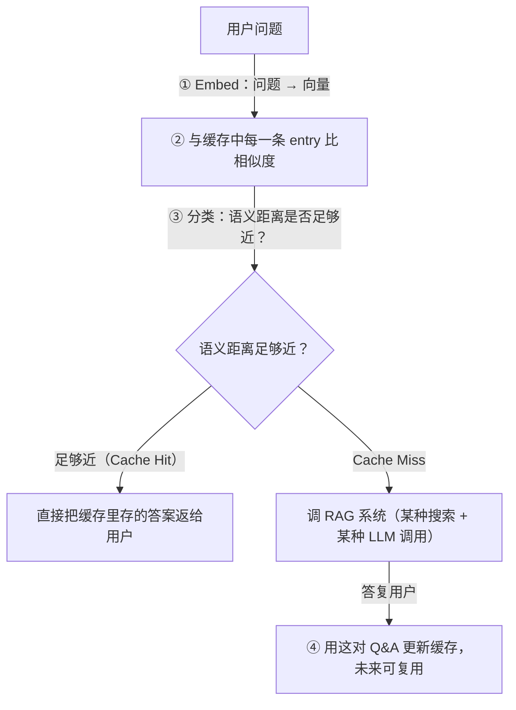

# L1 · 语义缓存总览与 Walmart 生产案例

> 课程：Semantic Caching for AI Agents（DeepLearning.AI × Redis）
> 本课任务：搞清楚 Semantic Caching 是什么、为什么重要、如何帮 AI Agent 复用结果降低成本与延迟；并拆解 Walmart 的 waLLMartCache 生产案例。

## 0. 本课目标与路线

先从"为什么"讲起：成本/延迟为什么是 Agent 部署的门槛 → 传统缓存为什么失效 → 语义缓存四步工作流 → 生产化四大关切与四个指标 → Walmart 真实案例 → 课程最终要造的 LangGraph Agent。

## 1. 成本与延迟：真实部署的门控因子

- **模型质量随每 token 成本上升**。这条曲线在改善，但**价格与延迟的 trade-off 仍是真实部署的门控因子（gating factor）**——擅长推理和复杂任务的热门模型（GPT-5、Claude 一类）就是更贵、也更慢（artificialanalysis.ai 的多基础模型 intelligence vs price 对比图）。
- 对许多团队来说，**现在主导单位成本的是推理（inference），而不是数据管道（data plumbing）**。
- 组织在建 RAG 系统：把领域知识在运行时注入 prompt——在正确的时间插入正确的信息以减少幻觉、并保持信息新鲜（模型没见过的最新数据）。
- **AI Agent 天生是 token 饕餮（token hungry）**：本性上要提取、规划、行动、反思、迭代，多轮往复——执行全程发起多次 LLM 调用，消耗更多 token、叠加延迟，且 prompt 长度随时间增长。
- TheAgentCompany 基准（2025 年 9 月论文，多个真实任务 × 多个 LLM）：某些情况下**单次端到端执行成本高达 $6.8**。

> **架构师视角**：这一节给了"为什么要缓存"的经济学论证链：推理是主导单位成本 → Agent 按次数放大它 → 于是省钱的最大杠杆不在压单价，而在**砍调用次数**。缓存正是"确定性步骤不调 LLM"原则在问答场景的实例——答过的问题就是确定性数据。

## 2. 客服场景：exact match 缓存为何失效

客服是最典型的 Agent 用例：Agent 加速客服工单/咨询的解决时间（time to resolution），**慢 Agent 直接伤害终端用户体验**。客服场景产生海量 FAQ——随时间累积的冗余数据，而对这些数据反复做 RAG 操作会推高基础设施成本。

多个用户问同一件事：*How can I get a refund? / How can I get my money back? / What is the refund policy?* —— Agent 却在对每一个从头求解。

**缓存的经典原则：不要在冗余信息上重复劳动（don't repeat yourself）。** 查一下缓存里有没有答过的问题，能不调 LLM 就不调。

但**朴素的 exact match 缓存对自然语言失效**：

| 缓存方式 | 匹配依据 | Precision | Recall / Hit Rate | 上面三个退款问句 |
|---|---|---|---|---|
| Traditional（exact match） | 字符/词/token 完全一致 | 完美 | 极差（自然语言下命中率很低） | 全部 Cache Miss |
| Semantic Caching | 问题的**意思** | 引入 false positive 风险 | 更高 recall、更高命中率 | 可全部命中 |

语义缓存换来了性能影响力，但也**引入了"命中到错误答案"的可能**——false positive 是全课要对抗的核心风险。

## 3. 语义缓存工作流：四步

语义缓存的骨干是**向量搜索（vector search）**：向量就是一组数字，这些数字表示数据、编码含义与语义。向量搜索的应用远不止缓存——内容发现、搜索、推荐系统、甚至欺诈/异常检测。

## 4. 生产化：比向量搜索多得多的关切

生产环境的语义缓存**不只是向量搜索**，有四大关切：

| 关切 | 具体问题 |
|---|---|
| 效果——准确性（Accuracy） | 命中时返回的结果是**正确**的吗？ |
| 效果——性能（Performance） | 命中得**足够频繁**、真的产生价值吗？大规模下能不影响往返延迟地服务吗？ |
| 可更新/可扩展性（Updatability） | 数据演化时能否刷新、失效（invalidate）、预热（warm）缓存？ |
| 可观测性（Observability） | 能否度量正确的指标：命中率、延迟、成本节省、缓存质量？ |

**本课程聚焦四个指标**：

- **Cache Hit Rate**：给定距离阈值下命中缓存的频率——**主要决定成本节省**；
- **Precision / Recall / F1 Score**（排序指标）：命中时缓存**有多准**。

**改进手段一览**（课程后面逐个实现）：

- 提升 precision/recall：**调距离阈值**、加重排步骤（**cross-encoder 模型** 或 **LLM-as-a-judge**）；
- 提升效率：**Fuzzy Matching** 在触发 embedding 之前先处理拼写错误和 exact match 情形——省计算；
- 额外过滤器：**时间敏感（temporal）查询**、**代码检测（Code Detection，Python/Java 等领域代码）**——这类查询应当**完全绕过缓存**。

## 5. 真实案例：Walmart 的 waLLMartCache

Walmart 发论文讲了内部用例与外部客服用例对语义缓存的需求，起名 **waLLMartCache**，综合几项技术把整体准确率提到**接近 90%**：

| 组件 | 做法 | 目的 |
|---|---|---|
| Load Balancer | 水平扩展，随时加计算节点 | 缓存服务能力随全球规模伸缩 |
| Dual-tiered 存储 | **L1 = 向量数据库**：语义搜索找相似 entry；**L2 = 内存缓存（如 Redis）**：拿 L1 返回的 ID 做简单查找，取数据与元数据 | 检索与取数分层，各干各的快事 |
| Multi-tenancy | 多团队/多租户/多应用共用同一套缓存存储基础设施 | 组织级复用 |
| Decision Engine | **Code Detection + Temporal Context Detection**，放在语义搜索**之前**；涉代码或时间敏感的查询完全跳过缓存，直走传统 LLM/RAG 工作流 | 把纯语义搜索之外的 precision 拉上去 |
| 预加载 FAQ | 常见问题提前灌入缓存 | 冷启动即有命中 |

> **对比 8-cost-economics 的三级缓存**：选型矩阵把缓存分三级——prompt 前缀（cache_read ≈ 0.1× 单价、零质量损失、最先做）/ **语义**（相似 query 命中历史答案，有错配风险）/ 结果（完全相同输入查表）。本课整门都在第二级，而 Walmart 的 Decision Engine 正是那张表里"语义缓存有错配风险"的工程答案：与其全靠阈值，不如先用确定性规则把"不该缓存的流量"（代码、时效性问题）挡在缓存外。exact match 缓存即第三级"结果缓存"，L1 已论证它对自然语言 recall 极差。

## 6. 课程终点：带缓存的 LangGraph Agent

课程最后会从零构建一个 **LangGraph workflow** 的 AI Agent：

1. 接到大而复杂的用户问题（客服场景）→ **分解（decompose）**成小问题；
2. **逐个子问题查缓存**——过去答过就直接用；
3. 没答过 → Agent 走额外的研究与评估迭代，保证答案质量；
4. 最后 LLM 把结果**个性化地综合**返回用户。

配套前端：输入任意网站 URL → 抓取全部原始内容 → 与数据对话。测试中常问的问题会逐渐填满语义缓存，Agent 的性能随缓存变热持续提升。

## 7. 本课总结

| 要点 | 一句话 |
|---|---|
| 为什么缓存 | 推理是主导单位成本，Agent 多轮调用放大它（单次执行可达 $6.8） |
| exact match 失效 | 完美 precision、极差 recall，自然语言同义不同形全部 miss |
| 语义缓存四步 | embed → 比相似度 → 阈值分类 → hit 直接返 / miss 走 RAG 并回填缓存 |
| 核心风险 | 更高 recall 换来 false positive——命中到错误答案 |
| 四个指标 | Hit Rate（决定省钱）+ Precision/Recall/F1（决定命中质量） |
| Walmart 案例 | LB + L1/L2 双层存储 + 多租户 + Decision Engine（代码/时间检测前置绕行）≈ 90% 准确率 |

> **记忆点（引出 L2）**：本课把语义缓存的"图纸"画完了——四步工作流、一个阈值旋钮、四个指标。L2 动手：先用 SentenceTransformers + 余弦距离**从零手搓**一个语义缓存看清内部构造，再换 RedisVL SDK 与缓存专用微调 embedding 模型（langcache-embed-v1）重写成生产形态，实测 cache hit ~65ms vs LLM 1s+ 的延迟差。

## 与我的资产映射

- 成本经济学：`agent/skills/agent-selection/8-cost-economics.md`（三级缓存阶梯、"确定性步骤不调 LLM"、四类 token 分开打点）
- 检索层：`agent/skills/agent-selection/3-retrieval.md`（cross-encoder 重排/LLM-as-judge 与本课改进手段同源——检索后修正）
- 面试包：`agent/interview/jd-senior-agent-engineer/05-context-engineering-and-caching.md`（prompt/KV 缓存 + 本课语义缓存 = 缓存问题的完整答法；waLLMartCache 是现成的生产案例素材）
- [[project_selection_matrix]]
