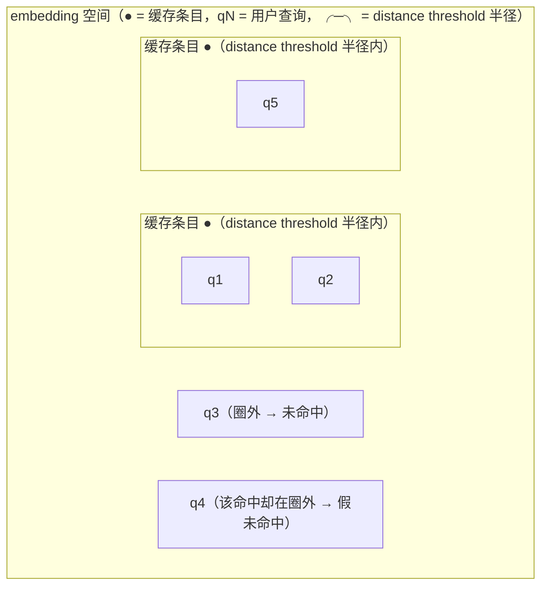

# L3 · 用精确率/召回率与延迟评估语义缓存

> 课程：Semantic Caching for AI Agents（DeepLearning.AI × Redis）
> 本课任务：给 L2 建好的缓存装上"仪表盘"——用 hit rate / precision / recall / F1 度量缓存质量，用 with-cache latency 公式度量性能收益，最后用 LLM-as-a-Judge 自动生成评估标签。

## 0. 本课目标：缓存的两种失败方式

缓存会以两种方式失败：**Low Quality（质量差）**或 **Poor Performance（性能差）**。度量方法与度量机器学习模型的性能类似——质量侧用分类指标（precision / recall / F1 / 混淆矩阵），性能侧用延迟与 token 节省。

```
缓存失败
├── Low Quality —— 命中了不该命中的（错答）/ 该命中的没命中（白跑 LLM）
│     └── 指标：Hit Rate / Precision / Recall / F1 / 混淆矩阵
└── Poor Performance —— 加了缓存但没省到时间和钱
      └── 指标：With-Cache Latency / 加速比 / 节省的 LLM tokens
```

## 1. 评估数据集与标签来源

本课 Lab 用一个四列数据集：

| 列 | 含义 |
|---|---|
| user query | 进入系统的用户查询 |
| cache hit | 该查询的最近缓存匹配（closest match） |
| distance | 到该缓存条目的向量距离 |
| **label** | 这次命中是否**真的**正确（true/false） |

label 列的两种来源：**人工反馈（human feedback）**或 **LLM-as-a-Judge 标注**——本课两种都会做（Lab 里因数据集是自动生成的、query↔cache 对应关系已知，可以先自动打标）。

> **对比课程 21 的 eval 方法**：这套评估和课程 21《Evaluating AI Agents》的路数完全同构——先攒带 ground truth 标签的评估集，再算指标，标签贵就上 LLM-as-a-Judge。区别只在评估对象：课程 21 评的是 Agent 的输出/轨迹，这里评的是**检索式组件的二分类决策**（该不该命中）。语义缓存本质是一个"以距离阈值为决策边界的二分类器"，所以整套 ML 分类评估工具箱可以直接搬过来。

## 2. 三个质量指标：嵌入空间视角

把缓存条目和用户查询都画在 embedding 空间里，以缓存条目为圆心、distance threshold 为半径画圈：



| 指标 | 定义（口播原义） | 示例 |
|---|---|---|
| **Hit Rate** | 全部进入系统的查询里，落进 distance threshold 圈内的比例 | 5 个查询有 3 个落圈 → 3/5 |
| **Precision** | 落进圈内的条目里，label 判定**真的有效**的比例 | 有效性来自 label 列 |
| **Recall** | **本该命中**的查询里，实际命中的比例 | 有一个该命中的因阈值太小被挡在圈外 |

## 3. 混淆矩阵与阈值取舍

每个样本落进混淆矩阵四格之一。幻灯片示例：**2 TP、1 TN（离谁都远，正确地没命中）、1 FP（命中了但错了）、1 FN（该命中，只因阈值太小没进圈）**。我们希望值集中在**主对角线**（TP + TN）上。

**distance threshold 就是 precision/recall 的调节旋钮**：

| 阈值动作 | Precision | Recall |
|---|---|---|
| 调低（圈变小） | ↑ | ↓ |
| 调高（圈变大） | ↓ | ↑ |

平衡两者用 **F1 score**。本课先立指标，L4 会用"threshold sweep（阈值扫描）"找 F1 最大的阈值。

> **对比 3-retrieval.md 的相似度阈值调优**：这和 RAG 检索层"卡相似度分数线"是同一个问题的两张面孔——检索阈值卡松了引入噪声 chunk（伤生成质量），缓存阈值卡松了直接把**错误答案端给用户**（FP 的代价更刚性、更用户可见）。所以缓存侧通常偏向 precision：宁可漏命中多花一次 LLM 调用，也不能错命中。这也是为什么 L4 的四个改进手段里有三个都在打 precision。

## 4. 性能指标：With-Cache Latency 公式与 token 节省

延迟收益用三个变量算：**ACL**（Average Cache Latency，缓存平均响应时间）、**ALL**（Average LLM Latency，LLM 平均响应时间）、**CHR**（Cache Hit Ratio，命中率）：

```
WithCacheLatency = CHR × ACL + (1 − CHR) × (ACL + ALL)
                   ─────────   ────────────────────────
                   命中：只付缓存   未命中：缓存查找白付一次，
                   查找的钱          还要再付整段 LLM 延迟
```

幻灯片实例：ACL = 11ms，ALL = 350ms（讲师注明这还是低估值），CHR = 30% → WithCacheLatency ≈ **256ms**，对比加缓存前的 350ms，**改善 26%**。

token 节省：课程给了一个在线计算器（输入 cache hit rate、日均查询量、输入/输出 token 数），估算**年度成本节省**。

> **对比 8-cost-economics.md**：这个公式就是成本经济学里"期望成本 = 命中率加权"模型的延迟版。注意结构性结论：**收益上限由 CHR 锁死**——ACL 再快（11ms→2ms）对总延迟几乎无感，因为大头永远是 `(1−CHR)×ALL`。所以优化语义缓存的优先级是：先抬 CHR（阈值调优、L4 的手段），再压 ACL；反过来做是白费功夫。

## 5. 代码：CacheEvaluator 质量评估流水线

```python
wrapper = SemanticCacheWrapper(...)      # 包一层缓存：hydrate / check 等 helper
wrapper.hydrate(faq_df)                  # FAQ 数据灌入缓存
wrapper.check(faq_df.user_query[0])      # 单查询 → 格式化对象：query + 全部 matches

results = wrapper.check_many(test_queries)   # 批量查询，可配阈值 / 匹配数

evaluator = CacheEvaluator(cache_results=results,
                           true_labels=...)  # 数据集自动生成，data_container 可直接产出标签
evaluator.report_metrics()               # 打印混淆矩阵 + 该阈值下的全部指标
```

`report_metrics` 结果：混淆矩阵值大多在对角线上，**precision 0.79 / recall 0.79**。

两个深挖工具：

```python
m = evaluator.get_metrics()   # dict 形式的全部指标 + confusion_mask
# confusion_mask：不是数字版混淆矩阵，而是覆盖在数据集上的掩码，
# 可按 TP/TN/FP/FN 分组把原始样本捞出来看
evaluator.matches_df          # 查询/匹配/距离/标签 四列 DataFrame
evaluator.matches_df[m.confusion_mask.false_positives]   # 只看 FP 组
```

FP 案例（错误命中长什么样）：
- *"Can I get a refund if I change my mind?"* → 命中 *"How do I get a refund?"*——检索模型被表面相似骗了，但数据集刻意把它标为 false（前者语义不够特定）；
- *"Can I schedule a specific delivery time?"* → 命中 *"Can I change my delivery address?"*——听着像、实则完全两件事，距离却低到过了阈值。

讲师强烈建议把 mask 换成 FN / TP / TN 组逐一翻样本——**看原始错例比看聚合指标长进大**。

## 6. 代码：PerfEval 延迟评估——161x 与 1.42x 的差别

```python
def simulate_llm():                  # 模拟 LLM 延迟：随机 sleep 200~500ms
    time.sleep(random.uniform(0.2, 0.5))

# PerfEval：同时对比两种执行路径的性能
metrics = perf_eval(...)   # 80 次 cache 命中 vs 80 次 LLM 调用
# 平均延迟：cache 2.2ms vs 模拟 LLM 361ms → speedup 161x
```

**161x 不是公平比较**——那是"纯缓存命中"对"纯 LLM"的原始对比。公平算法是套第 4 节公式：取实测 ACL/ALL，假设 CHR = 30%，得到 cached LLM latency → **延迟下降 29%、系统整体加速 1.42x**。

> **架构师视角**：向老板汇报时说 161x 还是 1.42x，是工程诚实度问题。任何缓存/加速方案的收益都必须按**流量加权**后报告，否则上线后"怎么没感觉快"的落差会反噬方案本身。同样的纪律适用于 prompt caching、KV cache、CDN——单点 benchmark 永远只是分子。

## 7. LLM-as-a-Judge 自动标注

人工标 label 列贵，用 LLM 自动标：

```python
full = wrapper.check_many(test_queries,
                          distance_threshold=1)   # full retrieval：不管阈值，人人都取最近邻

judge = LLMEvaluator(llm=ChatGPT_API)   # 自带预配置 prompt：比较 (query, cache hit) 对
res   = judge.predict(pairs, batch_size=...)      # pairs = 测试查询 × full retrieval 匹配
res.df   # 每对给出 is_similar 布尔标签 + reason（LLM 的判断理由）

# 用 LLM 标签替换 data_container 标签重新评估
evaluator = CacheEvaluator.from_full_retrieval(   # full retrieval 结果必须用这个专用构造器
    ..., true_labels=res.df.is_similar.values)
evaluator.report_metrics()
```

结果对照：真实标签下 **79% P / 79% R**，LLM 自动标签下 **75% P / 90% R**——足够接近，说明 LLM-as-a-Judge 能产出"good enough"的评估标签。收尾：清空缓存，进入下一课。

## 8. 本课总结

| 要点 | 一句话 |
|---|---|
| 两种失败 | Low Quality（分类指标管）与 Poor Performance（延迟/token 指标管） |
| 缓存 = 二分类器 | distance threshold 是决策边界，P/R/F1/混淆矩阵全套适用 |
| 阈值旋钮 | 调低阈值 P↑R↓，调高反之，F1 找平衡点 |
| 延迟公式 | WithCacheLatency = CHR×ACL + (1−CHR)×(ACL+ALL)，收益上限被 CHR 锁死 |
| 公平比较 | 161x 是命中样本的分子；按 CHR=30% 加权后是 1.42x |
| 自动标注 | LLM-as-a-Judge 标签与真实标签指标接近（75/90 vs 79/79），可替代人工 |

> **记忆点（引出 L4）**：本课只是把仪表盘装上——79% precision 意味着每 5 次命中就有 1 次把错答案端给用户。L4 上四种手段抬质量：threshold sweep 找 F1 最优阈值、cross-encoder 重排、LLM validator 兜底、fuzzy matching 前置拦截错别字。

## 与我的资产映射

- 成本层：`agent/skills/agent-selection/8-cost-economics.md`（CHR 加权的期望延迟/成本模型，可直接补一节 with-cache latency 公式）
- 检索层：`agent/skills/agent-selection/3-retrieval.md`（相似度阈值调优——缓存侧偏 precision、检索侧偏 recall 的取舍分野）
- 观测/评估层：`agent/skills/agent-selection/5-observability-eval.md`（LLM-as-a-Judge 标注成本路线）
- 面试包：`05-context-engineering-and-caching`（语义缓存评估指标是缓存章节的硬通货问题）
- [[project_selection_matrix]]
