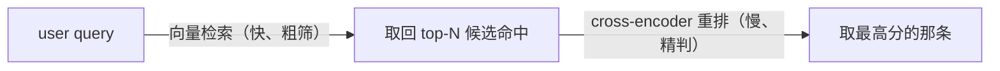
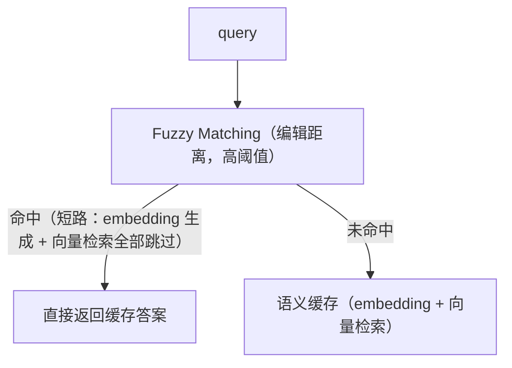

# L4 · 提升缓存质量的四种策略（阈值扫描 / Cross-Encoder / LLM 校验 / 模糊匹配）

> 课程：Semantic Caching for AI Agents（DeepLearning.AI × Redis）
> 本课任务：在 L3 评估基线（0.3 阈值下 79% P / 79% R）之上，用四种技术把缓存做准：threshold sweep、cross-encoder 重排、LLM check、fuzzy matching。

## 0. 四种策略总览

| # | 策略 | 原理 | 主要收益 | 代价 |
|---|---|---|---|---|
| 1 | Threshold Sweep | 扫阈值找 F1 最大点 | P/R 平衡最优 | 需要带标签的评估集 |
| 2 | Cross-Encoder 重排 | 双句同时进模型，表达力强 | precision 显著提升 | 缓存延迟增加 |
| 3 | LLM Validator | 直接问 LLM"这对句子语义相似吗" | precision 可到 100% | 延迟 + token 开销 |
| 4 | Fuzzy Matching | 编辑距离前置匹配 | 拦截错别字，降延迟增精度 | 配置不当引入 FP |

代码基线：hydrate 缓存 → `check_many(distance=0.3)` → CacheEvaluator 出报告，作为后续所有指标的对照。

## 1. Threshold Sweep：用 F1 找最优阈值

用不同阈值反复评估缓存，选 **F1 最大**的那个。规律（见 L3）：阈值升高 → recall 升、precision 降；F1 是两者的函数，**在中间某个阈值达到峰值**——那就是通常要选的点。

```python
full = wrapper.check_many(test_queries, distance_threshold=1)  # full retrieval：先把最近邻都拿回来
evaluator = CacheEvaluator.from_full_retrieval(full, ...)      # 注意专用构造器
evaluator.report_threshold_sweep()   # evaluator 已有全部信息，直接扫阈值出图+表
```

```
 指标
 1.0 ┤ precision ╲            ╱ recall
     │            ╲   F1峰值 ╱
     │             ╲ ▲▲▲▲ ╱
     │           ╱  ╳    ╲
     │        ╱ ╱          ╲╲
     └──────────┬────────────── distance threshold →
            0.2828 (F1 max)
```

扫描结果：最优阈值 **0.2828** → **90% precision / 85% recall / 25% cache hit rate**，混淆矩阵值大多在对角线上。90% precision 已经相当好，且命中率不寒碜。

> **对比 3-retrieval.md 的相似度阈值调优**：RAG 检索层调 top-k/分数线大多凭手感 + 人肉看 bad case，因为"这个 chunk 相关吗"缺 ground truth；缓存这边一旦有了 L3 的标签集，阈值就从"手感参数"升级成**数据驱动的一次优化求解**。可迁移的教训：任何相似度阈值，先花钱造一个几百条的标注集，比拍脑袋改十次阈值便宜。

## 2. Cross-Encoder 重排序

**原理**：cross-encoder 把两个句子**同时**送进模型打相似分，能捕捉比 bi-encoder（embedding 模型）更细的语义差别，表达力更强。但它**不能取代 embedding 模型**——它不产出可快速检索的向量。所以标准用法是两级：



预期：precision 大幅提升（在自己数据上微调更佳），代价是缓存延迟上升。

**杀手级例子**——歧义词 "bank"：

| 句对 | embedding 距离 | cross-encoder |
|---|---|---|
| "The bank raised its interest rates." vs "The river overflowed near the bank after heavy rain." | 相对接近（**被骗了**） | 判得很远（**正确**） |
| "What is the capital of China?" vs "Beijing" | — | 相似分很高 |
| "how to implement quick sort in python?" vs "Introduction of quick sort" | — | 高分匹配 |
| "how to implement quick sort in python?" vs "The weather is nice today" | — | 极低分 |

```python
cross_encoder = CrossEncoder("Alibaba-NLP/...")   # 基于 modernbert-base 的 reranker
wrapper.register_reranker(cross_encoder.as_reranker())  # 把重排机制注入缓存

results = wrapper.check_many(test_queries,
                             distance_threshold=1,   # full retrieval
                             num_results=10)         # cross-encoder 评估并重排 10 个候选
# 注意：cross-encoder distance = 1 − cross-encoder score
```

重排后再扫阈值：最优阈值 **0.11** → **94% precision / 79% recall / 23% cache hit rate**——precision 比单纯阈值优化又高一截。

## 3. LLM Validator：让 LLM 做最后一道闸

**原理**：直接问 LLM"这对句子语义相似吗"。让它经济可行的三个要点：

1. 用**更便宜的 LLM**做校验（校验不需要旗舰模型）；
2. **判相似比生成完整回答省 token**，所以比"干脆别缓存、直接调 LLM 回答"便宜；
3. 实践中可配成 **fallback 机制**——只对距离值落在模糊地带（ambiguous distance）的命中触发 LLM 校验，明确命中/明确未命中不花这笔钱。

```python
llm_validator = LLMEvaluator(llm=OpenAI(...))     # L3 见过的抽象，复用为校验器
wrapper.register_reranker(llm_validator)          # 同样经 register_reranker 注入
results = wrapper.check_many(test_queries, distance_threshold=已知较优值)
```

结果：**100% precision**——false positive 全部被滤掉；recall 显著下降（LLM 判得太严，产生一批"本可命中却被否掉"的 FN）；cache hit rate 仍有 **21%**。讲师评价：在很多领域这笔交换仍然划算。

> **架构师视角**：这三级结构（向量粗筛 → cross-encoder 精排 → LLM 终审）就是搜索工程的经典漏斗在缓存上的复刻：**越往后单位成本越高、吞吐越低、判断越准，所以流量必须逐级递减**。设计任何"AI 判断链"都可以套这个漏斗：先用便宜信号砍掉 90% 流量，把贵模型留给灰色地带。fallback-only 的 LLM 校验是最实惠的形态——为 5% 的模糊样本付 LLM 的钱，换全局 precision。

## 4. Fuzzy Matching：编辑距离前置层

**原理**：算法式字符串匹配，度量**编辑距离**（edit distance）——把一个字符串通过删除/替换/插入变成另一个所需的操作数。小差异句对得高相似分，完全不同的句对得极低分。适合**关键词式检索域**，能轻松滤掉错别字（typo）。

**部署位置：放在语义缓存前面**，配高相似阈值：



收益：延迟下降 + precision 上升；风险：配置不当会引入 false positive。

```python
def fuzzify_string(s, n):   # 造评估数据：随机交换相邻字符 n 次
    ...                      # fuzziness = 2/3/4/10/100，100 次时几乎不可辨认

fuzzy = FuzzyCache(...)      # 接口与 SemanticCacheWrapper 几乎一致
fuzzy.hydrate(faq_df)
fuzzy.check_many(fuzzified_queries)
# 连极难的高 fuzziness 样本也映射回了正确缓存条目

evaluator = CacheEvaluator(..., true_labels=valid_fuzzy_labeling)  # 合法 query↔hit 对
evaluator.report_metrics(distance_threshold=0.6)
# → 100% precision / 94% recall / 很高的命中率
```

讲师自注：这个实验**刻意构造且规模很小**，只为演示"可以在缓存前架这么一层"，数字别当真。

> **对比 8-cost-economics.md**：fuzzy 层的经济学妙处在于它把最便宜的计算（CPU 字符串算法，无模型调用）放在流量最大的位置。错别字/复述在真实客服流量里占比很高，每一次 fuzzy 短路都同时省了 embedding 调用 + 向量检索 + 可能的 LLM 调用——是罕见的"延迟、成本、precision 三个都赚"的改动，前提是阈值卡得够严。

## 5. 四种策略实测对比

| 配置 | 最优阈值 | Precision | Recall | Cache Hit Rate |
|---|---|---|---|---|
| 基线（L3，阈值 0.3） | — | 79% | 79% | — |
| Threshold Sweep | 0.2828 | 90% | 85% | 25% |
| + Cross-Encoder 重排 | 0.11 | 94% | 79% | 23% |
| + LLM Validator | 已知较优值 | **100%** | 显著下降 | 21% |
| Fuzzy Matching（独立实验） | 0.6 | 100% | 94% | 很高（数据集刻意构造） |

规律一眼可见：**沿着漏斗往下走，precision 单调上升，recall 和命中率被逐步交换出去**。选哪一档取决于业务对"错答"的容忍度。

## 6. 本课总结

| 要点 | 一句话 |
|---|---|
| Threshold Sweep | 有标签集后阈值是求解出来的（F1 max @ 0.2828），不是拍出来的 |
| Cross-Encoder | 双句同进、表达力强但无向量可检索 → 只能做第二级重排（94% P） |
| LLM Validator | 便宜 LLM + 少 token 的相似判断，可 fallback 化；100% P 换 recall |
| Fuzzy Matching | 编辑距离前置短路层，专治错别字，延迟成本双降 |
| 组合心法 | 便宜粗筛在前、昂贵精判在后，流量逐级递减 |

> **记忆点（引出 L5）**：到此为止缓存缓的都是"问答对"这一种东西。L5 把它装进真正的 AI Agent——LangGraph deep research agent 会把用户问题拆成子问题，**按子问题粒度**查缓存/回填缓存，缓存的对象从最终回答扩展到工具输出、生成代码、LLM 计划等中间态，Agent 由此"越用越快"。

## 与我的资产映射

- 检索层：`agent/skills/agent-selection/3-retrieval.md`（reranker 两级检索、阈值调优——本课给出了带标签求解的完整范式）
- 成本层：`agent/skills/agent-selection/8-cost-economics.md`（漏斗式分级判断的成本模型；fuzzy 前置层 = 零模型成本的流量削峰）
- 面试包：`05-context-engineering-and-caching`（"如何降低语义缓存误命中率"的标准答案：sweep → cross-encoder → LLM fallback 三连）
- [[project_selection_matrix]]
