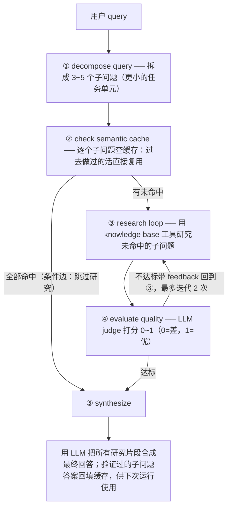

# L5 · 把语义缓存装进 AI Agent（LangGraph Deep Research Agent）与全课收官

> 课程：Semantic Caching for AI Agents（DeepLearning.AI × Redis）
> 本课任务：收官篇。把语义缓存集成进 LangGraph 构建的 deep research agent——按**子问题粒度**缓存中间结果，让 Agent 复用过去的工作、跳过冗余步骤、越用越快；末尾并入课程 Conclusion。

## 0. 为什么 Agent 是语义缓存的最佳客户

Agent 难以规模化的原因是**token 消耗大**；而 Agent 的独特之处在于执行过程**多步**——每一步都是复用中间态（intermediate state）的机会。

关键转念：**不只缓存"原始问题 → 最终回答"**。端到端缓存在某些场景可行，但 Agent 的原始输入往往更复杂、要多步才能得到高质量答案，可缓存的东西远不止最终响应：

| 可缓存的中间态 | 例子 |
|---|---|
| 用户画像 / 偏好 | user profiles & preferences |
| 工具调用输出 / 推理结果 | tool call outputs, reasoning |
| LLM 生成的计划 | LLM generated plans |

预期效果：**缓存随时间被 enrich**，后续执行需要的 token 越来越少。

> **对比课程 12a 的 Semantic Cache**：memory 课程里语义缓存是作为"记忆金字塔"的一层出现的——它和 long-term memory 的边界在这里看得最清楚：**缓存存的是"可复用的计算结果"（子问题答案、生成代码），记忆存的是"关于用户的事实"**。有趣的是本课把 user profile 也丢进了缓存——工程上两者常用同一套 Redis 向量检索基建实现，区别只剩 TTL 策略和 key 的语义粒度。

## 1. Redis 案例：Dataframe Explorer Agent（TTL 分级缓存）

Redis 内部构建的 agent：给定 data schema + 用户问题，生成 Python 代码分析 pandas dataframe。它在流程中缓存**三类**东西，且 TTL 策略不同：

| 缓存对象 | 策略 | 理由 |
|---|---|---|
| 端到端问题 → 答案 | **低 TTL**（time to live） | 底层数据变化频繁，答案会过期 |
| LLM 生成的分析代码 | 正常缓存 | 相似问题来了直接执行已有代码拿结果 |
| 常见报错的解决指引 | 正常缓存 | 生成代码的常见错误可复用修复经验 |

对照图：同样三个问题，第一遍（无缓存，红色路径）vs 第二遍问相似问题（缓存开启）——第二遍 token 消耗大幅下降。**每一次成功的执行周期都在充实缓存**，后续执行答案更即时、总 token 更少。

> **架构师视角**：TTL 分级是这页最值钱的细节——"答案"和"得到答案的方法"时效性完全不同。数据天天变，所以*答案*只配低 TTL；但*生成的代码*和*报错修复指引*是方法论，寿命长得多。设计 Agent 缓存时先问一句：**这个条目是事实（易腐）还是过程（耐存）？** 按易腐程度定 TTL，而不是全局一刀切。

## 2. Deep Research Agent 架构：LangGraph 五步 + QA 循环

本课要亲手建的 agent：LangGraph 编排 agentic RAG 认知架构 + 质量保障循环（quality assurance loop），并**按子问题粒度跨执行缓存**。



无缓存时这个 workflow 又贵又慢——**20~60 秒**不等，取决于问题难度。加缓存后 agent "learns over time"：跨请求降本，同时维持回答质量。

## 3. 代码：知识库 + 语义缓存双基建

技术栈：OpenAI（LLM + embedding）、langchain / LangGraph（workflow）、Redis + **redis-vl** 开源 SDK（语义缓存与向量化），Redis 跑在 `localhost:6379`（先 ping 确认连通）。

场景：**客服 agent**，需要访问一个内容知识库（文档/手册/PDF 类内容）回答问题。

```python
# 基建一：知识库（RAG 用）—— 原始文档逐条用 OpenAI embedding 向量化后入库
load_knowledge_base(raw_docs)

# 基建二：语义缓存 —— 用贯穿全课的 FAQ 数据集 hydrate，共 8 条 FAQ 入缓存
hydrate_cache(faq_df)

# LangGraph 组装：节点 = 各步骤 helper 函数，state 在工作流里传递
workflow.add_node("decompose_query", ...)   # 查询分解
workflow.add_node("check_cache", ...)       # 缓存检查
workflow.add_node("research", ...)          # 补充研究
workflow.add_node("evaluate_quality", ...)  # LLM judge 质检
workflow.add_node("synthesize", ...)        # 合成最终回答
workflow.set_entry_point("decompose_query")

# 边：确定性边 + 条件边（conditional edge = 基于决策的路由）
workflow.add_conditional_edges("check_cache",
    有未命中子问题 → "research",     # 需要研究就去研究节点
    全部命中      → "synthesize")   # 全命中直接跳到合成
workflow.add_edge("research", "evaluate_quality")   # 每次研究后必过 LLM judge
workflow.add_conditional_edges("evaluate_quality",
    质量不够 → "research",          # 回炉，最多 2 次
    达标     → "synthesize")
agent = workflow.compile()   # LangGraph 还能把编排图可视化出来
```

## 4. 三个场景实测：缓存如何随时间变浓

三个不同用户、同一软件产品、不同购买阶段的连续请求：

| 场景 | 用户阶段 | 子问题 | 缓存命中 | LLM 调用 | 延迟 |
|---|---|---|---|---|---|
| S1 软件评估 | 购前调研 | 4 个 | 1 个（**25%**） | **8** 次（2×GPT-4 + 6×GPT-4-mini） | ~20s（研究占近 10s） |
| S2 实施规划 | 推进实施 | 4 个 | 3 个（**75%**） | **4** 次（2+2） | **13s** |
| S3 采购终审 | Pro 计划购前验证 | 4 个 | 3 个（**75%**） | **6** 次 | ~18s |

- S1 回答覆盖 SOC 2 / GDPR 合规、API rate limits、Salesforce 集成；三个未命中子问题走研究循环，**验证合格后回填缓存**；
- S2/S3 的话题与前人请求重叠，直接吃到 S1 攒下的缓存红利；
- `analyze_agent_results` 汇总可视化：**累计 cache hit rate 爬到 60%**；后两个场景端到端延迟约为首场景的 **1/3**。讲师外推：在数百/百万用户的系统里，这种命中率会随流量继续放大省钱效果。

> **对比 8-cost-economics.md**：这是"缓存经济学在多步 Agent 上的复利"实证——单请求视角 CHR 只有 25%，但**子问题级缓存让不同用户的请求互相搭便车**（S2/S3 吃 S1 的缓存），共享度随用户基数上升。评估 Agent 缓存 ROI 不能用单发压测，要用"用户群 × 时间"的累计曲线，这正是 L3 的 CHR 加权公式里 CHR 本身是个随时间上升的变量。

## 5. Gradio 交互 Demo：AT&T 国际套餐

收尾 demo 把一切串起来：Gradio 界面，输入任意 URL → 爬取页面内容入知识库 → 同一个 deep research agent 做 agentic RAG 对话，**语义缓存随对话逐渐建立**。

实测（AT&T 国际手机套餐页面）：

| 轮次 | 问题 | 缓存表现 | LLM 调用 |
|---|---|---|---|
| Q1 | 邮轮上 AT&T 信号能用吗 | 无命中（冷启动） | 4 次 |
| Q2 | 国际旅行邮轮 vs 陆地覆盖差异 | 1 个子问题命中 | **2** 次 |
| Q3 | 在西班牙有 AT&T 覆盖吗 | 命中缓存 | 2 次、~300 tokens（答 International Day Pass） |
| Q4 | 西班牙行程一半邮轮一半陆地，怎么保信号 | 用到缓存，比首问高效 | — |

最后用 `distance_threshold=1` 做一次"地毯式"缓存巡检：能看到 Q1 的邮轮问题条目已入缓存，且其 response **在后续执行中被复用了多次**。讲师留作业：换 URL、换网站、多问问题，观察 agent 随时间的表现——"你已经拥有构建 production-ready 语义缓存 AI agent 所需的一切"。

## 6. 本课总结

| 要点 | 一句话 |
|---|---|
| Agent 缓存的粒度 | 不止端到端问答：子问题、工具输出、生成代码、计划、用户画像都可缓 |
| TTL 分级 | 事实易腐（低 TTL）、方法耐存——Dataframe explorer 的三类缓存策略 |
| 认知架构 | decompose → cache check → research → LLM judge（0~1 分，最多回炉 2 次）→ synthesize |
| 条件边 | 全命中直通合成、有未命中才研究——缓存决定图的走向 |
| 复利效应 | 25% → 75% 命中率、8 → 4 次 LLM 调用、延迟降至 1/3、累计 CHR 60% |
| 学习型 Agent | 每次成功执行回填缓存，Agent 越用越快、越用越便宜 |

## 全课收官

### Conclusion 要点

课程结语只有一句话，但就是全课的论题：**语义缓存让 AI Agent 更快、更省，同时保住回答质量**（faster and more efficient while keeping quality high）——"保质量"三个字对应的正是 L3 的评估体系和 L4 的精度工程，缺了它们前半句只是危险的省钱。

### L1–L5 全课回顾

| 课 | 主题 | 核心交付 |
|---|---|---|
| L1 | 为什么需要语义缓存 | 推理成本/延迟是规模化的门槛；exact-match 缓存认不出 "how can I get a refund" ≈ "I want my money back"，语义缓存用 embedding 在意义空间度量相似 |
| L2 | 从零构建 | 客服 FAQ 场景手写语义缓存，再用 Redis 开源 SDK（redis-vl）重实现 |
| L3 | 评估体系 | 缓存 = 阈值二分类器：hit rate / P / R / F1 / 混淆矩阵；WithCacheLatency = CHR×ACL+(1−CHR)×(ACL+ALL)；LLM-as-a-Judge 自动标注 |
| L4 | 精度工程 | threshold sweep（90% P）→ cross-encoder 重排（94% P）→ LLM validator（100% P）→ fuzzy matching 前置层 |
| L5 | Agent 集成 | LangGraph deep research agent 按子问题粒度缓存中间态，累计 CHR 60%、延迟降至 1/3，Agent 越用越快 |

> **架构师的裁决**：语义缓存不是默认件，是一道**命中率 × 时效性 × 个性化**的三元判据题。**该上**：查询分布高度重复（客服 FAQ、产品咨询、文档问答——不同用户问的是同几十个问题的变体）、答案与提问者无关、内容更新周期以天/周计——此时 CHR 可观，L3 公式的 `(1−CHR)×ALL` 才压得下来。**不该上**：答案强个性化（"我的订单到哪了"——query 相似但答案人各不同，语义命中 = 事故）、数据分钟级易变（行情、库存——除非像 Dataframe explorer 那样只给低 TTL 或改缓"生成的代码"这种耐存的过程性资产）、查询长尾发散（CHR 起不来，白付缓存查找 + 精度工程的复杂度）。折中形态记住两个：**个性化场景把 user_id 编进缓存 key 的作用域**（牺牲跨用户共享保正确性），**易变场景缓过程不缓结论**。最后，上了就必须配 L3 的评估闭环——没有 precision 监控的语义缓存，等于在生产环境放了一台无人值守的错答分发器。

## 与我的资产映射

- 成本层：`agent/skills/agent-selection/8-cost-economics.md`（子问题级缓存的跨用户复利、累计 CHR 曲线是新素材，可回填"缓存经济学"一节）
- 记忆层：`agent/skills/agent-selection/6-memory.md` + 课程 12a Semantic Cache（缓存 vs 记忆的边界：可复用计算 vs 用户事实，同基建不同 TTL/作用域）
- 框架层：`agent/skills/agent-selection/2-framework`（LangGraph 条件边做缓存路由是 workflow 型编排的典型用例）
- 面试包：`05-context-engineering-and-caching`（本篇"架构师的裁决"三元判据可直接作为该文档的裁决模板）
- [[project_selection_matrix]]
