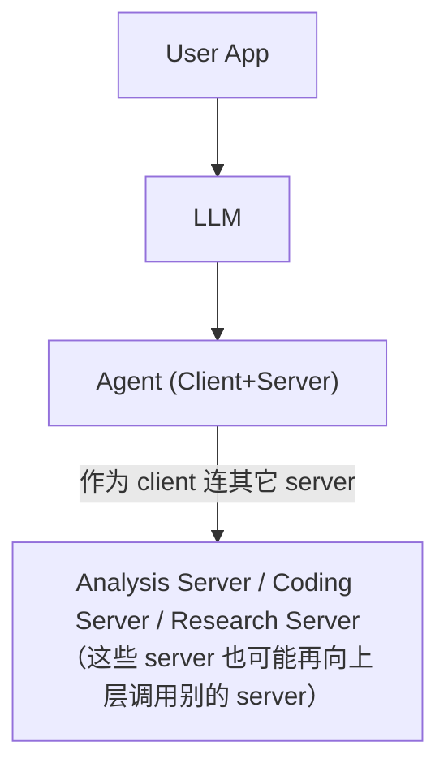

# Conclusion 高级特性与展望

前面九讲已经覆盖了 MCP 的基本盘：架构 / 三大原语 / 多 server 协作 / Claude Desktop 集成 / 远程部署。本讲总结剩下还在快速演化的几个方向。

## 1. 认证：OAuth 2.1

2025 年 3 月规范更新引入 **OAuth 2.1** 作为远程 server 的认证机制。

### 典型流程

1. Client 向 server 发请求。
2. Server 要求用户认证。
3. 用户完成授权 → client/server 交换 token。
4. 后续请求都带 token，访问受保护数据源。

### 适用范围

- **远程 server**：强烈推荐。
- **stdio 本地 server**：用环境变量传凭据就够，不需要 OAuth。

这一块仍在快速演化，建议跟踪官方规范与 GitHub discussions。

## 2. Client 端原语：Roots

之前学的 tools / resources / prompts **都是 server 暴露给 client**。MCP 还定义了**client 暴露给 server** 的原语，**roots** 是其中之一。

- **是什么**：一个 URI（文件路径或 HTTP URL），client 告诉 server "你的操作应该限定在这里面"。
- **典型用途**：限制 filesystem server 只能读写指定目录、限制 web server 只能访问某个域名。

### 价值

- **安全边界**：缩小 server 可触达的范围。
- **聚焦**：让 server 不被无关数据干扰。
- **灵活**：URI 形式通用，能是文件路径也能是 HTTP URL。

越来越多 client 在跟进这个原语。

## 3. Sampling：让 server 反向请求模型推理

通常通信方向是"client → 模型 → server"。**sampling** 让 server **直接向 client 请求一次 LLM 推理**。

### 用例：网站性能诊断

用户反映网站慢。

- Server 收集服务器日志、性能指标、错误日志（这些数据可能非常多）。
- **不是**把所有日志塞回 client 的上下文窗口，而是**server 把数据 + 问题发给 client 端的模型**，让模型分析。
- 模型返回诊断结论，server 据此生成修复步骤。

### 为什么重要

- 避免把大量原始数据塞进 client 上下文。
- 避免 server↔client 之间不必要的数据外泄。
- 让"server 也能用 LLM 思考"，能力倍增——这是 agent 化的关键能力之一。

## 4. MCP 的可组合性：Agent 即 Client 又是 Server

由于 client 和 server 是协议两端，**一个组件可以同时扮演两个角色**：

这就构成了**多智能体架构**：所有 agent 用同一种 MCP "语言"协作。

- App 把请求发给主 agent。
- 主 agent 把任务拆分给专精 agent（分析 / 编码 / 调研）。
- 每个专精 agent 既能用工具，也能 sampling 反向调用模型。
- 整张网都遵守 MCP 规范。

Anthropic 团队相信 **MCP 会成为 agent 时代的底层协议**。

## 5. Unified Registry：服务器发现与可信源

随着生态膨胀，"GitHub 的 MCP server 该用哪个？"会变成普遍问题——类似 npm/PyPI 包的可信问题。计划中的 **registry API** 要解决：

- **发现**：集中索引 server。
- **信任**：标记官方/认证过的 server，识别可能的恶意实现。
- **版本管理**：像锁依赖一样锁住 server 版本。
- **自动发现**：让 agent 自己根据任务去找合适的 server。

### 与"well-known JSON"模式联动

类似 OAuth 和 Google 的 agent-to-agent 协议，未来一个域名可以放一份 `.well-known/mcp.json`，里面写：

- 端点
- 暴露的能力 / 原语
- 需要的认证方式

例：用户说"帮我管理 Shopify 商店"。AI 应用查 shopify.com 的 well-known MCP json → 找端点 + 认证流程 → 用户授权 → agent 执行操作。

**动态发现 + OAuth 2.1 = 用户首次提需求才连接，按需且安全。**

## 6. 协议还在路上的其它方向

- **Streamable HTTP 普及**：让 stateful / stateless 切换更顺畅，replacing SSE。
- **远程 server 生态扩张**：更多托管选项、更多商业化 server。
- **工具命名冲突治理**：多个 server 可能都有 `fetch_users`，需要分组 / 命名空间 / 标签机制避免模型选错。
- **更广泛的 sampling 采用**：让"server 主动用模型思考"成为常态。
- **大规模认证 / 授权**：OAuth2.1 是起点，企业级场景还有很多要解决。

## 课程整体回顾

- 你已经走过：概念 → 协议原语 → 自建 server / client / host → 多 server 协作 → Claude Desktop 集成 → 远程部署。
- 已经具备能力：**为任意数据源/能力造一个 MCP server**，**让任意 MCP 兼容应用用上它**。
- 接下来重点关注：authentication、roots、sampling、registry 这几条线，它们决定了 MCP 在 agent 时代能走多远。

继续关注 [modelcontextprotocol.io](https://modelcontextprotocol.io) 的规范更新和 GitHub discussions——这是一个非常活跃的开放协议。
