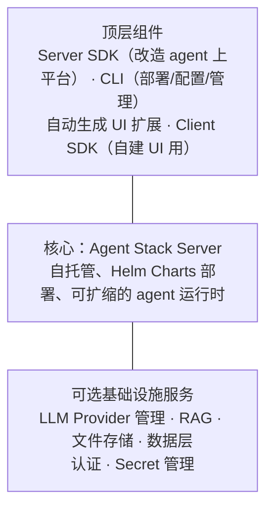

# L11 · 生产部署难题与 Agent Stack 自托管平台（纯概念课）

> 课程：A2A: The Agent2Agent Protocol（DeepLearning.AI × Google Cloud × IBM Research）
> 本课任务：直面一个"关注度严重不足"的问题——**把 agent 部署到生产出乎意料地难**。把前面构建的全部 A2A agent 部署到 IBM Research 开源的 **Agent Stack**（Linux Foundation 项目）：自托管、框架无关、不锁云。无 notebook，以字幕 + 演示为准。

## 0. 问题定式：笔记本能跑 ≠ 组织能用

你用 LangGraph / BeeAI / ADK / 自研代码搭好了 agent，本机运行完美。现在要让全组织用起来——从"locally running on your device"到"ran remotely"的一步，突然掉进一整张基础设施清单。

## 1. 从本机到生产的基础设施 to-do 清单

字幕逐项点名的"platform plumbing"：

| 层 | 需要解决的事 |
|---|---|
| 持久化存储 | session 与会话历史的持久保存 |
| LLM 接入 | 配置 LLM API、管理连接与凭证 |
| RAG 基础设施 | 文件存储 + 向量检索（如果做 RAG） |
| 部署层 | 容器、扩缩容、监控、日志…… |
| 安全 | 限流、认证（authentication）、访问控制 |
| 交互入口 | 终端用户和已部署 agent 交互的 UI |

> **架构师视角**：这张表和 `9-serving-deployment.md` 里"agent 服务化 ≈ 普通微服务 + 三件新东西（LLM 网关、会话状态、轨迹观测）"的判断互相印证。注意清单里**没有一项与 agent 逻辑有关**——生产化的成本几乎全部花在 agent 之外。评估任何"agent 平台"就该拿这六行当 checklist：它替你做掉几行、剩下几行你自己焊。

## 2. 四条路线的取舍矩阵

| 路线 | 例子 | 优点 | 锁定/代价 |
|---|---|---|---|
| 框架专属平台 | LangGraph Cloud、CrewAI platform | 可自托管、和框架深度整合 | **锁框架**：团队想换框架/多项目多框架不支持 |
| 云厂商平台 | Azure AI、Vertex AI、AWS Bedrock、Vercel AI | **框架无关** | **锁云**：绑定特定 vendor 与栈的特定部分，换 setup 失去灵活性 |
| 完全自建 | — | 全控制 | **数月**基础设施工作才能部署第一个 agent |
| Agent Stack | 本课主角 | 自托管、框架无关、按需取用组件 | 需要自己运维平台本身 |

还有一条硬约束：某些行业/场景**数据不能离开自有基础设施**——托管平台直接出局，只剩自建或自托管开源平台两条路。

Agent Stack 的定位：Linux Foundation 开源项目（IBM Research 发起），"部署任何框架构建的任何 agent，从数周/数月缩到数小时"；**因为是基础设施（而非一体化产品），可以只采用适合你的组件，其余自己建**。目标用户两类：探索多框架、不想被锁死的 **agent 开发团队**；管理多个内部项目、要一套统一部署系统的**平台团队**。共同诉求：数据可控、框架自由、部署要快。

## 3. Agent Stack 三层架构



关键设定：**平台上部署的每个 agent 隐式就是 A2A agent**——Agent Stack SDK server 直接构建在 A2A 协议之上。平台内 agent 通信的标准化不是附加功能，而是地基。

安装即一行 CLI，随后交互式向导：启动平台 → 配置 LLM provider（课程选 Google Gemini，模型 `gemini-2.5-flash-lite` + 推荐 embedding 模型）→ 之后随时 `agentstack model setup` 换供应商。

## 4. 改造既有 Agent 上平台：ProviderAgent 示范

用公开仓库 **AgentStack-HealthcareAgent** 演示。核心论断：**不重写 agent 逻辑，只加平台接线**（"You don't need to rewrite the agent logic. Instead, you're adding the platform plumbing."）。以 L8 的 LangGraph ProviderAgent 为例，改造点五步：

```python
server = Server()                      # ① 实例化 Agent Stack server

@server.agent(name="ProviderAgent")    # ② 装饰入口：绑定到 server + 平台上可按名发现
async def provider_agent_wrapper(...): # ③ 包一层 wrapper 以使用平台扩展能力
    llm = build_langchain_client(      # ④ LLM 凭证来自平台（LLM extension），
        credentials_from_platform)     #    而非本地 env vars / secrets
    ...                                #    ——LangChain 的 agent 逻辑原封不动
    yield agent_message                # ⑤ 输入输出都用 AgentStack message 对象

server.run(host=..., port=...)         # ⑥ run() 入口启动 server
```

字幕给出的**改造 checklist**（任何框架通用）：

1. 包 server + `@server.agent` 装饰器绑定；
2. 输入/输出改用 AgentStack 兼容的 message 类；
3. 用 LLM extension 构建 LLM client，弃用本地 secrets/env；
4. 有状态则通过平台 load/store/maintain session history；
5. 可选加 trajectory（观测）；
6. 配置 `run()` 入口启动 server。

## 5. HealthcareAgent 上平台：发现、编排、UI 三件事升级

L10 的 BeeAI 编排 agent（更名 **Healthcare Concierge**）上平台后多了几处生产化升级：

| 本机版（L10） | 平台版（L11） |
|---|---|
| 手工配 URL + 端口连三个 agent | **从平台活跃 agent 目录按名发现**，再包成 HandoffTool |
| 会话记忆在进程内 | helper 把 session memory 存平台，**跨 agent handoff 保持** |
| notebook 里看 trajectory | **TrajectoryExtension** 把执行轨迹流式推给 UI，用户可见 |
| 无 UI | `@server.agent` 带元数据（输入输出模态、AgentDetail、UI 问候语、contributors、tools），**自动生成 UI** |

演示里的 ConditionalRequirement 特意设成"每个 agent 至少调一次"（min invocation），验证平台上 A2A agent 调 A2A agent 全链路通畅。响应、轨迹、最终答案全部流式到 UI。

## 6. 部署工作流：目录约定 → 一条命令

每个 agent 一个文件夹，三个关键件：

| 组件 | 作用 |
|---|---|
| `agentstack_agents/` 下的 agent 代码 | 上一节改造好的逻辑 |
| `pyproject.toml` 的 `project.scripts` | **实际启动 server 的入口**，必须有 |
| `Dockerfile` | 构建 agent 镜像 |

流程：GitHub 上打 release（可选，但换来**版本控制——可升级可回滚**）→ **一条命令部署**（部署到本地实例和组织托管实例的方式完全相同）→ 依次装 PolicyAgent、ProviderAgent、ResearchAgent、healthcare agent → `agentstack list` 核对 → 通过 CLI 或 UI 配置 secret（ResearchAgent 要的 Serper API key）→ `agentstack ui` 起界面交互。

UI 演示：先单测 PolicyAgent（问 in/out-of-network coinsurance），再问编排 agent"I need mental health assistance and live in Austin, Texas..."——trace 面板完整回放：初始化 → thinking → ProviderAgent（找到 Austin 医生）→ PolicyAgent（保单答复）→ thinking → ResearchAgent → final answer。

> **对比 9-serving-deployment.md 与课程 12b 的 agent-as-service**：12b（Letta）的答案是"**agent 是有状态服务**，状态放服务端数据库"——单框架纵深；Agent Stack 的答案是"**agent 是 A2A 服务**，状态/LLM/密钥/UI 由平台横向统管"——多框架广度。两者正交：前者解决单个 agent 的状态语义，后者解决一群异构 agent 的运维归一。选型顺序应当是先按 9-serving-deployment 判断你处在哪一档（单体 FastAPI 包一层就够 vs 需要平台），再决定引入哪种"平台"——**四个 agent 以下、单团队单框架，Agent Stack 这类平台是过度设计**。

## 7. 本课总结

| 要点 | 一句话 |
|---|---|
| 部署清单 | 存储/LLM 接入/RAG/部署层/安全/UI 六项 plumbing，与 agent 逻辑无关 |
| 四条路线 | 框架平台锁框架、云平台锁云、自建耗数月、自托管开源平台居中 |
| Agent Stack | LF 开源、Helm 自托管、组件按需取用，agent 隐式皆为 A2A |
| 改造六步 | server 装饰器 / message 类 / LLM extension / session / trajectory / run() |
| 核心逻辑不变 | 平台只加 hosting 和 wiring，各框架 agent 代码原样保留 |

> **记忆点（引出 L12）**：平台解决了"跑起来给全组织用"，但生产的另一半是 **day-two 运维**：没有鉴权的 A2A server 谁都能查你的医疗数据库、刷爆你的 LLM 账单；标准 schema 装不下计费码这类自定义字段；四层 agent 链路断在哪一环没人说得清。L12 用 A2A 的三件内置武器回答：**安全（TLS + AgentCard security schema）、扩展（extension 字段）、可观测（OpenTelemetry 分布式追踪）**。

## 与我的资产映射

- 部署层选型：`agent/skills/agent-selection/9-serving-deployment.md`（本课的四路线矩阵可直接并入：框架平台/云平台/自建/自托管开源平台四象限 + "数据不出域"硬约束触发器）
- 记忆层：`agent/skills/agent-selection/6-memory.md` + 课程 12b agent-as-service（session 状态归平台 vs 归 agent 框架的分界）
- 面试包：`agent/interview/jd-senior-agent-engineer/`（"agent 上生产难在哪"是高频题，本课六行 plumbing 清单即标准答案骨架）
- [[project_selection_matrix]] · [[project_asset_reuse]]
