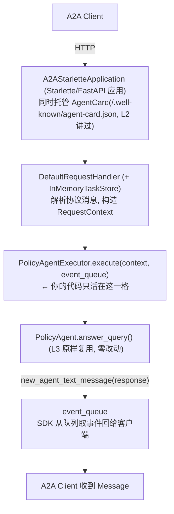

# L4 · 用 A2A SDK 把 Agent 包成 A2A Server（AgentExecutor + AgentCard）

> 课程：A2A: The Agent2Agent Protocol（DeepLearning.AI × Google）
> 本课任务：给 L3 的 `PolicyAgent` 套上 A2A Python SDK，让它成为一个**可被其他 Agent 发现和调用的 A2A Server**。SDK 把协议低层细节全接管了，你只需回答一个问题：**收到请求时该干什么**。

## 0. 本课目标与整体结构

整课就是一个文件 `a2a_policy_agent.py`（notebook 里用 `%%writefile` 落盘），四段结构：

```
① Imports          —— a2a.server.* 各模块 + L3 的 PolicyAgent
② PolicyAgentExecutor —— 协议管道 ↔ 业务逻辑的桥(唯一要写逻辑的地方)
③ main(): 元数据    —— AgentSkill(能做什么) + AgentCard(我是谁)
④ main(): 组装运行  —— RequestHandler + A2AStarletteApplication + uvicorn
```

请求进来后在 server 内部的流转：



## 1. AgentExecutor：协议管道与业务逻辑的桥

继承 SDK 的 `AgentExecutor` 抽象类，讲师原话：它连接的是"**A2A SDK 处理的通用协议管道**"和"**你的 Agent 的特定逻辑**"。必须实现两个方法：

```python
class PolicyAgentExecutor(AgentExecutor):
    def __init__(self) -> None:
        self.agent = PolicyAgent()          # 持有 L3 的业务 Agent

    async def execute(
        self,
        context: RequestContext,            # 入口:含用户输入、context_id 等
        event_queue: EventQueue,            # 出口:输出写这里,由 A2A 客户端读走
    ) -> None:
        prompt = context.get_user_input()   # 从协议消息中取用户文本
        response = self.agent.answer_query(prompt)      # 调业务逻辑(同步、快)
        message = new_agent_text_message(response)      # 文本 → A2A Message 对象
        await event_queue.enqueue_event(message)        # 异步入队,SDK 负责回传

    async def cancel(self, context, event_queue) -> None:
        pass    # 接口要求必须实现;纯同步短请求没有可取消的长任务,置空即可
```

三个机制点：

| 机制 | 说明 |
|---|---|
| `RequestContext` | 请求的一切输入。本课只用 `get_user_input()`；讲师提醒**生产环境应读 `context_id` 来管理多轮状态**，这里为简化跳过 |
| `EventQueue` | 输出不是 `return`，而是**往事件队列 enqueue**——这个设计天然支持后面课程的流式/长任务/多事件场景，短回答只是"恰好只 enqueue 一个 Message" |
| `cancel()` | 面向 L2 讲的 Task 生命周期（可取消长任务）；同步一问一答用不上，但接口强制实现 |

> **架构师视角**：注意 L3 的 `PolicyAgent` 在本课**一行未改**——Executor 是唯一的胶水层，总共约 10 行逻辑。这验证了 L3 埋的分层伏笔：**业务 Agent（协议中立）+ 薄适配器（每协议一个）**。团队里任何存量 Agent 要 A2A 化，工作量就是"实现 execute/cancel 两个方法"；反过来，A2A SDK 也因此不关心你的 Agent 内部是 Claude、Gemini 还是规则引擎。另外注意 `execute` 是 `async` 而 `answer_query` 是同步阻塞调用——demo 无妨，生产上这会卡住事件循环，应改异步 SDK 或丢线程池。

## 2. AgentSkill 与 AgentCard：机器可读的"名片"

`main()` 里先定义元数据。**AgentSkill 描述"能做什么"**：

```python
skill = AgentSkill(
    id="insurance_coverage",
    name="Insurance coverage",
    description="Provides information about insurance coverage options and details.",
    tags=["insurance", "coverage"],                     # 便于检索/分类
    examples=["What does my policy cover?",             # 示例查询:给调用方
              "Are mental health services included?"],  # (或路由 LLM)看的
)
```

**AgentCard 描述"我是谁、在哪、怎么跟我说话"**——L2 说过的 digital business card，server 会把它挂在 well-known URL 上供发现：

```python
agent_card = AgentCard(
    name="InsurancePolicyCoverageAgent",
    description="Provides information about insurance policy coverage ...",
    url=f"http://{HOST}:{PORT}/",            # 我被托管在哪(本课 localhost:9999)
    version="1.0.0",                          # Agent 自身的版本号
    default_input_modes=["text"],             # 只收文本
    default_output_modes=["text"],            # 只回文本
    capabilities=AgentCapabilities(streaming=False),   # 不支持流式,客户端别用 SSE
    skills=[skill],                           # 挂上技能清单
)
```

HOST/PORT 从环境变量取（`POLICY_AGENT_PORT=9999`）。本课程所有 Agent 都跑 localhost，但讲师强调**它们完全可以分布在多台远程服务器上**——URL 写在 Card 里，客户端不关心物理位置。

> **对比课程 10-MCP L4 的 server**：同样是"把能力包成 server"，两者的**暴露粒度**差一个层级。MCP server（FastMCP）暴露的是**函数**——`@mcp.tool` 装饰器从签名和 docstring 自动生成 schema，调用方拿到的是确定性的工具调用接口；A2A server 暴露的是**整个 Agent**——AgentCard 描述的是能力域（skill + 自然语言 examples），调用方发的是自然语言消息，对端**自己推理后**给答案。套 06-protocols.md 的锚层：MCP 锚 L1（Agent ↔ 工具），A2A 锚 L4（Agent ↔ Agent）；一个是"给 Agent 装手"，一个是"给 Agent 发名片"。结构上倒是同构：MCP 有 tools/list 做发现，A2A 有 well-known AgentCard 做发现；MCP 有 Inspector 调试，A2A 靠 client 拉 Card 验证。

## 3. 组装并运行 Server

```python
request_handler = DefaultRequestHandler(
    agent_executor=PolicyAgentExecutor(),   # 请求最终路由到你的 Executor
    task_store=InMemoryTaskStore(),         # Task 状态存内存(L2 的任务生命周期落点)
)

server = A2AStarletteApplication(           # Starlette/FastAPI 应用:
    agent_card=agent_card,                  #   托管 AgentCard 供发现
    http_handler=request_handler,           #   把协议请求转给 handler
)

uvicorn.run(server.build(), host=HOST, port=PORT)   # 标准 ASGI 部署
```

`InMemoryTaskStore` 是 L2 讲的 Task 生命周期（submitted → working → completed/failed）的存储实现——本课 Agent 直接回 Message 用不到它，但 handler 需要它来支撑 task 型交互；生产上换成持久化实现即可支撑重启恢复与多副本。

运行方式：notebook 里嵌一个终端（Terminal 1），执行

```bash
uv run a2a_policy_agent.py
# → Running A2A Health Insurance Policy Agent
# → Uvicorn running on http://localhost:9999
```

启动后**什么都不会发生**——server 静默等待，因为还没有任何请求进来。每个 Agent 用一个独立终端（policy agent 占 Terminal 1），保持运行，下节课的 client 要连它。

> **架构师视角**：`A2AStarletteApplication` 落到 ASGI/uvicorn，意味着 A2A server 的**部署故事就是普通 Python Web 服务的故事**——容器化、反向代理、水平扩容、健康检查全部沿用现成基建，没有私有运行时。协议 SDK 选择"寄生"在主流 Web 栈上而不是自造运行时，是它能被快速采纳的工程原因之一（MCP 的 streamable HTTP server 同理）。真正的增量运维成本在别处：AgentCard 的版本治理、TaskStore 外置、以及 06-protocols.md 第八节列的跨信任域鉴权——demo 里这台 server 是"裸奔"的，任何人可调。

## 4. 本课总结

| 要点 | 一句话 |
|---|---|
| AgentExecutor | 协议管道 ↔ 业务逻辑的唯一桥；实现 `execute`（取输入→调 Agent→事件入队）与 `cancel` |
| EventQueue | 输出走事件队列而非 return，为流式/长任务预留同一通道 |
| AgentSkill / AgentCard | skill=能做什么（含示例查询），card=我是谁/在哪/怎么交互（模态、streaming 能力、版本） |
| 组装链 | Executor → DefaultRequestHandler(+InMemoryTaskStore) → A2AStarletteApplication → uvicorn |
| 复用 | L3 的 PolicyAgent 零改动接入 |

> **记忆点（引出 L5）**：server 已在 9999 端口挂出名片、竖起耳朵，但终端里一片安静——**协议的另一半还不存在**。L5 写 A2A Client：用 `ClientFactory.connect` 连上它、`get_card()` 拉名片完成发现、`send_message` 发出第一条跨 Agent 消息，并处理 Message / Task 两种响应形态。

## 与我的资产映射

- 协议层判据：`agent/skills/agent-selection/2-framework/06-protocols.md`（A2A 回本点=跨进程/跨团队/跨组织；本课虽是 localhost 演示，形态上已是独立进程 + 运行时发现——正好踩在"该用"信号的最小样例上；攻击面清单见其第八节）
- MCP 对照：`agent/courses/10-MCP: Build Rich-Context AI Apps with Anthropic/notes/L4-构建第一个MCP服务器.md`（server 侧黄金对比：工具级 vs Agent 级暴露）
- 框架层：`agent/skills/agent-selection/2-framework/`（本课用裸 A2A SDK，无编排框架——L6 会展示 ADK 内置 A2A 集成的对照做法）
- [[project_selection_matrix]]
