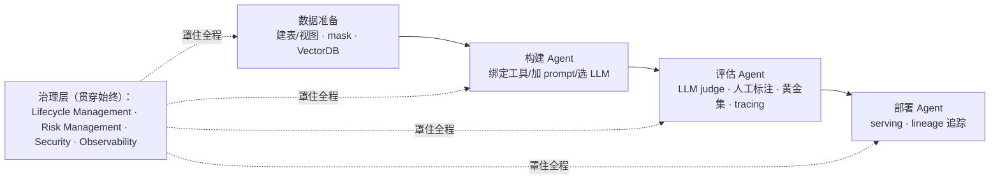

# L1 · Agent 治理四大支柱（Lifecycle / Risk / Security / Observability）

> 课程：Governing AI Agents（DeepLearning.AI × Databricks）
> 本课任务：认识 Agent 治理的四大支柱及各自的最佳实践，并拿到一份"能不能上生产"的自检 checklist。

## 1. 现实：prototype-first 开发的代价

今天构建 Agent 的普遍现状：

- **原型优先（prototype-first）**：绝大多数系统从 POC/demo 起步，**可行性压倒可扩展性与治理**。从 demo 起步本身不是坏事——直到**性能开始压倒治理**：团队盯着模型准确率和各种 metrics，把 access control、auditing 挤到后座；
- **权限过宽**：开发者起步时通常拿到**跨所有环境的宽泛权限**，而不是 role-based access controls。带着高权限进生产是非常危险的；
- **没有审计轨迹（audit trails）**：团队无法追溯 Agent 到底做了什么、访问了什么、在哪失败——调试极其困难，而生产上出了问题，**唯一真正能排障的手段就是治理**。

后果是**部署周期拉长 3 倍**：一个两三周搭好的漂亮 POC，交给团队推生产要花约 **8 个月**——因为安全与治理的每个环节都得回头重做。结论：**治理要从 day one 开始实践**，别把它当上线前的补作业。

> **架构师视角**："POC 两三周、生产八个月"是向管理层解释"为什么要在 demo 阶段就引入治理"的最佳数字。治理不是拖慢交付的税，而是把"上线前重做一遍安全"的隐性成本前置摊销——这正是架构决策里典型的"现在付小钱 vs 将来付大钱"取舍。

## 2. 什么是数据治理 / Agent 治理

**Data governance**：一套策略（policies）、流程（processes）与标准（standards）构成的框架，保证数据**准确、安全（safe & secure）、且全生命周期被妥善管理**。

**Agent Governance = 控制（control）+ 可见性（visibility）**，覆盖四个方面：

| 支柱 | 管什么 |
|---|---|
| Lifecycle Management | 你如何构建与维护 Agent |
| Risk Management | 你如何保护 Agent 免于常见失败模式 |
| Security | 你如何控制对 Agent 的访问 |
| Observability | 你能否看到 Agent 采取的全部行动 |

## 3. 治理在 Agent 构建流程中的位置：贯穿始终的一层

构建 Agent 系统的流水线，治理不是其中一站，而是**罩在从头到尾之上的一层**：

本课程用 **Unity Catalog + MLflow** 来落地这层治理。

## 4. 四大支柱与各自的最佳实践

治理覆盖从数据创建到模型监控的一切，四大支柱是给开发者的概念化/分类框架，每根柱子对应一条最佳实践：

| 支柱 | 最佳实践 | 含义 |
|---|---|---|
| **Lifecycle Management** | **Separation of Duties（职责分离）** | 多团队通过 dev / staging / prod 环境管理数据与模型变更，配版本控制，保证每阶段有恰当的 review |
| **Risk Management** | **Defense in Depth（纵深防御）** | 多层重叠的防御：PII 检测、guardrails、合规控制、监控——从数据摄入到模型表现全程兜底 |
| **Security** | **Least Privilege Access（最小权限）** | Agent 和用户只拿到角色所需的最小权限，靠加密、认证、细粒度访问控制实现 |
| **Observability** | **Audit Everything（审计一切）** | 全面记录所有系统交互：数据访问、模型动作、预测——支撑完整可追溯与合规报告 |

## 5. 每根支柱的落地技术清单

实现各支柱最佳实践的常见技术与工具：

| 支柱 | 技术清单 |
|---|---|
| Lifecycle（职责分离） | 版本控制、CI/CD pipelines、Environment Management（dev/staging/prod 隔离）、Deployment Orchestration、Change Management（可回滚能力） |
| Risk（纵深防御） | 数据质量监控、PII detection、guardrails、合规能力、model validation |
| Security（最小权限） | SSO 登录、API keys、多因素认证（MFA）、service principals、secret management、access controls、数据保护、网络安全 |
| Observability（审计一切） | 不止 GenAI 常谈的 **OTel（OpenTelemetry）**模型 trace 标准——还包括 audit logs、application logs、inference logging、access logs、监控能力、lineage tracking、告警（alerting） |

> **对比 agent/skills/agent-selection/7-safety-guardrails.md**：我的护栏选型笔记覆盖的是**运行时拦截链**（输入护栏→输出护栏→工具权限边界→沙箱→红队），大致对应本课 Risk Management 一根柱子（Defense in Depth）+ Security 的一部分；而本课把版图扩成四根柱——护栏之外还有**环境隔离/回滚（Lifecycle）**和**审计/lineage（Observability）**这两块运行时拦截管不到的地盘。护栏是治理的子集，不是全部。

## 6. 上线前自检 checklist

下次想把 Agent 能力推上生产、自问"这 ready 了吗"时，按四柱过一遍：

1. **Lifecycle**：能否安全地在环境间晋级变更（promote changes），带恰当的 review 与回滚能力？
2. **Risk**：是否有多层防护，在问题影响生产**之前**把它拦下？
3. **Security**：所有数据源是否**只有**获授权的 Agent 和用户能访问？
4. **Observability**：能否追溯 Agent 用过的每个工具——何时运行、访问了什么数据、返回了什么？

这四问就是四大支柱的关键能力，整门课会反复看到它们的实战形态。

## 7. 本课总结

| 要点 | 一句话 |
|---|---|
| prototype-first 的债 | 性能压倒治理 + 宽权限 + 无审计 → 部署周期 3 倍、POC 到生产 8 个月 |
| Agent 治理定义 | 控制 + 可见性，覆盖生命周期、风险、安全、可观测四面 |
| 治理的位置 | 不是流水线一站，而是罩住"数据准备→构建→评估→部署"全程的一层 |
| 四柱四实践 | 职责分离 / 纵深防御 / 最小权限 / 审计一切 |
| 落地工具 | Unity Catalog + MLflow（本课程主线） |

> **记忆点（引出 L2）**：四大支柱是"要管什么"的总纲，但纲要落地需要一个抓手。L2 引入 **Unity Catalog**——把四根柱子变成可操作（actionable）的治理基座：一个集中式数据目录，管访问控制、审计、lineage、数据质量，Agent 的表、视图、工具（function）、乃至 Agent 本身（model）都注册在里面统一治理。

## 与我的资产映射

- 护栏层：`agent/skills/agent-selection/7-safety-guardrails.md`（运行时拦截链 ≈ Risk 支柱；本课补全 Lifecycle 与 Observability 两块盲区）
- 观测·eval 层：`agent/skills/agent-selection/5-observability-eval.md`（OTel/tracing/lineage 的选型对照）
- 面试包：`agent/interview/jd-senior-agent-engineer/07-safety-guardrails.md`（最小权限、越权拦截、人审闸口——四支柱是很好的答题框架）
- [[project_selection_matrix]]
