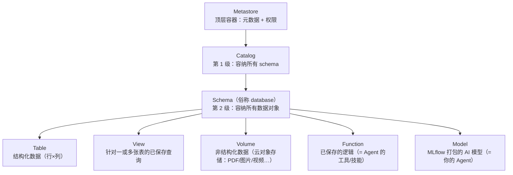
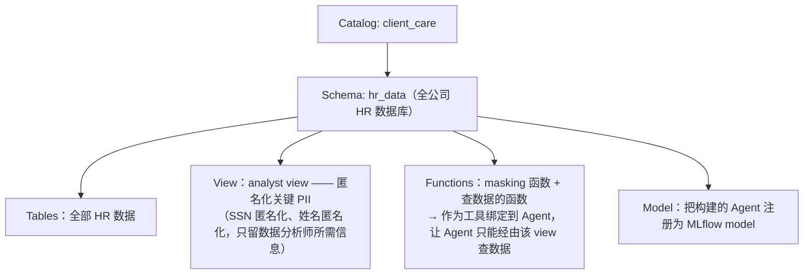

# L2 · Unity Catalog：治理基座与三级命名空间

> 课程：Governing AI Agents（DeepLearning.AI × Databricks）
> 本课任务：认识 Unity Catalog 是什么、它的对象层级怎么组织，以及 Lab 1 里将用它搭出的 Client Care 治理结构与自定义最小权限。

## 1. Unity Catalog：让四大支柱可操作的治理基座

上一课的四大支柱要落地，抓手就是 **Unity Catalog**——你的 **governance foundation**：

- 一个**集中式数据目录（centralized data catalog）**，提供 access control、auditing、lineage tracking、数据质量监控等能力，**横跨所有 Databricks workspaces**；
- **Databricks workspace**：团队写代码、跑 notebook、访问数据的协作环境。Unity Catalog 在所有 workspace 之上提供**统一治理**——治理不随环境割裂。

回看 L1 的流水线（数据准备 → 构建 → 评估 → 部署 + 全程治理层），本课程就是在 Databricks 上用 Unity Catalog 把那层治理"焊"上去。

## 2. Metastore 与三级命名空间

用 Unity Catalog 先要理解它的结构。**Metastore 是顶层容器**，注册数据与 AI 资产的元数据、以及治理其访问的权限。每个 metastore 暴露一个**三级命名空间**：

即寻址方式是 `catalog.schema.对象`。

## 3. 两大可保护对象：Table vs Volume（以及 VectorDB）

Databricks 主要用两类 **securable objects** 存取数据：

| 对象 | 装什么 | 例子 |
|---|---|---|
| **Table** | 结构化、表格数据 | 行×列组织的数据集合 |
| **Volume** | 非结构化、非表格数据 | PDF、图片、视频等，存于云对象存储 |

两者都能派生**向量数据库**：表的 vector 列或 volume 配 vector index（用 Databricks Vector Search）。关键点：**这些向量库仍然继承 Unity Catalog 的全部安全与审计能力**——AI 检索应用不会成为治理飞地。

> **架构师视角**：Unity Catalog 最值得抄的设计是把 **Function（工具）和 Model（Agent 本身）与数据放进同一套命名空间、同一套 ACL（ ACL = Access Control List，访问控制列表）**。多数团队的现状是：数据权限归数仓管、工具权限散在代码里、Agent 权限没人管。三者同目录治理后，"谁能调这个工具""谁能调用这个 Agent"与"谁能读这张表"用同一套 grant/revoke 语义回答——权限模型只剩一种，审计面也只剩一个。

## 4. Schema 内的数据对象全家福（Agent 视角）

对 Agent 开发者，五类对象各自的角色：

- **Table**：Agent 要分析的底层数据；
- **View**：一段行为像表的已保存查询——**最小权限的主要载体**，只暴露任务所需的行列；
- **Volume**：给 RAG/多模态用的非结构化原料；
- **Function**：已保存、返回值的逻辑——**这就是你的 tools/skills**，可以挂到 Agent 上去查数据；
- **Model**：MLflow 打包的 AI 模型——**Agent 本身注册为 model**（自定义微调 LLM 同理），Lab 2 会实操。

> **对比 A2A 课 L12 的安全/OAuth**：A2A 解决的是**跨组织、跨 Agent 边界**的身份问题——OAuth 流程回答"对面这个 Agent 是谁、代表谁"；Unity Catalog 解决的是**数据平面内部**的授权问题——身份确认之后，"这个身份能碰哪张表哪一列哪个函数"。前者是门口的护照检查，后者是楼内的门禁分区，企业级 Agent 两道都得过。

## 5. Lab 1 预告：Client Care 公司的治理结构

Lab 1 将以公司 **Client Care** 为背景创建并使用 Unity Catalog 对象：

这个结构就是 L0 承诺的"特定、有意图的访问"：Agent 不直接碰表，只经过脱敏视图 + 注册过的函数。

## 6. 权限 presets 与自定义最小权限

授权时有多档 privilege presets：**ALL PRIVILEGES**（一键全给）、manage、editor / reader 等 custom presets（选中即切换权限组合）、以及 **Custom**（完全手工，hands-on）。本 lab 为将要创建的 developer group 选 **Custom 最小特定权限**：

| 权限 | 允许开发者做什么 |
|---|---|
| USE SCHEMA | 使用该 schema |
| CREATE MODEL | 创建模型 |
| CREATE MODEL VERSION | 创建模型版本 |
| SELECT | 从表和视图**读**数据 |
| EXECUTE | 运行函数、调用已部署模型做推理 |
| CREATE TABLE | 在 schema 内建新表 |

要点：给宽权限确实"一键就行"，但治理要求的是**按角色裁剪**；且 **revoke 和 grant 一样容易**——权限不是一次性决定，而是可持续调整的旋钮。

## 7. 本课总结

| 要点 | 一句话 |
|---|---|
| Unity Catalog | 集中式数据目录：访问控制/审计/lineage/数据质量，横跨所有 workspace |
| 三级命名空间 | Metastore → Catalog → Schema → Table/View/Volume/Function/Model |
| 两类 securable | Table（结构化）+ Volume（非结构化），派生的 VectorDB 继承全部治理能力 |
| 工具与 Agent 入目录 | Function = 工具，Model = Agent（MLflow 打包），与数据同一套 ACL |
| 最小权限实操 | developer group 用 Custom 权限：USE SCHEMA / CREATE MODEL / SELECT / EXECUTE / CREATE TABLE |

> **记忆点（引出 L3）**：本课解决了"**人**（developer group）对数据对象的权限"；但部署后真正去查数据的是 **Agent 自己**——它需要一个属于自己的身份，才能做到"只访问所需数据"。L3 讲给 Agent 分配什么样的 **Databricks identity**（service principal），让它带着恰当的权限上岗。

## 与我的资产映射

- 护栏层：`agent/skills/agent-selection/7-safety-guardrails.md`（③ 工具权限边界一节——UC 的 EXECUTE/SELECT 授权就是"最小权限工具网关"的平台化实现）
- 工具层：`agent/skills/agent-selection/4-tools.md`（工具注册与发现——UC Function 是"工具即受治理资产"路线）
- 面试包：`agent/interview/jd-senior-agent-engineer/07-safety-guardrails.md`（越权拦截：视图脱敏 + 函数收口 + 目录 ACL 的三重收敛是现成案例）、`02-tool-gateway-auth-and-contract.md`（工具网关的认证与契约）
- [[project_selection_matrix]]
