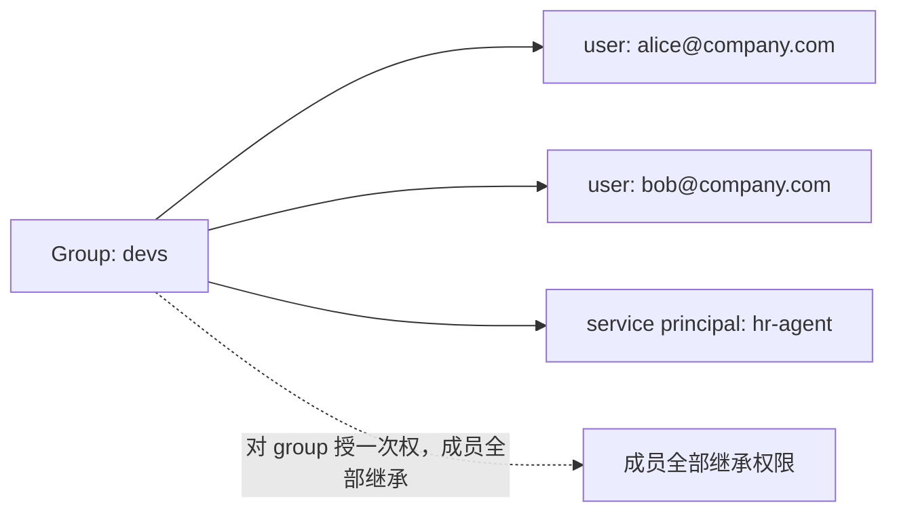

# L3 · Agent 身份与三种部署认证（Service Principal）

> 课程：Governing AI Agents（DeepLearning.AI × Databricks）
> 本课任务：部署 agent 前，先解决"agent 以谁的身份运行"——弄清 Databricks 三类身份与四种管理角色，理解为什么 agent 需要专属 Service Principal，并对比三种部署认证方式（本课程 lab 选 Manual Authentication）。

## 0. 本课目标与衔接

L2 讲了 Unity Catalog 的组件——治理四支柱（four pillars）如何用 Unity Catalog 落地。本课往前推一步：**部署 agent 时，必须确保它只有访问所需数据的权限**。而权限挂在身份上，所以第一个问题是：该给 agent 分配什么 Databricks 身份？

## 1. Databricks 三类身份

| 身份类型 | 是什么 | 用在哪 |
|---|---|---|
| **User** | Databricks 识别的人类用户身份，用 email 地址表示 | 人的日常操作 |
| **Service Principal** | 非人类身份 | jobs、自动化工具与系统：脚本、app、CI/CD 平台 |
| **Group** | 身份的集合（可同时装 users 和 service principals） | 简化身份管理：对 workspace、数据及其他 securable objects 批量授权 |

Group 的价值：授权时不必一个个给。给数据、模型等任何可授权对象开权限时，直接授给整个 group，组内的 users 和 service principals 全部继承。例如建一个 developers group，开发者需要较宽的访问面，一次授权即可，不用逐人操作。



## 2. 四种管理角色（Admin Roles）

管理这些身份的角色分四级：

| 角色 | 能做什么 |
|---|---|
| **Account Admin**（最高层） | 向 account 添加 users / service principals / groups，分配 admin 角色 |
| **Workspace Admin** | 向 account 添加 users 和 service principals，授予 workspace 访问权 |
| **Group Manager** | 管理某个 group 内的权限，分配 group manager 角色 |
| **Service Principal Manager** | 管理 service principal 上的角色 |

## 3. Agent 的身份难题：为什么需要专属 Service Principal

上面是"人"的身份，agent 的身份管理是个新挑战：

- **agent 需要自己的身份**——它要跑自动化任务、访问数据；
- **用人类 admin 凭证跑 agent = 安全与审计双重风险**；
- agent 需要**一致的身份，不随触发它的人变化**（consistent identity regardless of who triggers the agent）。

解法：**用 service principal 的凭证运行 agent**。三步：

1. 为**每个 agent** 创建专属（dedicated）service principal；
2. 给这个 service principal 授予**最小所需的 Unity Catalog 权限**（若它在某个 group 里，确保 group 权限也对得上）;
3. 带着明确的身份上下文（specific identity context）部署 agent。

> **架构师视角**：这就是 IAM 领域的 non-human identity（机器身份）问题在 agent 上的重演。关键设计约束是"身份与触发者解耦"——审计日志里必须能回答"是**哪个 agent** 干的"，而不是"是替谁跑的那次 admin 会话干的"。每 agent 一个 service principal 的粒度选择，换来的是 per-agent 的最小权限边界和 per-agent 的审计链，代价是身份数量随 agent 数量线性增长——这正是后面 Manual Authentication / 集中式身份管理要治理的对象。

## 4. 三种部署认证方式（Authentication Options）

agent 部署时的认证选项有三种：

| # | 方式 | 机制 | 身份归属 | 适用场景 |
|---|---|---|---|---|
| 1 | **Automatic Authentication Passthrough**（system authentication） | agent 的 service principal 自动获得对**声明资源**（declared resources）的访问权，凭证自动托管 | 无论谁调用，都是同一身份 | POC / demo 阶段最常见 |
| 2 | **On-Behalf-of-User Authentication** | agent 使用**最终用户的凭证** | 调用者（caller）的身份 | 用户特定的敏感数据访问；需要特定 API scopes；需要"必须是真人"的身份校验场景 |
| 3 | **Manual Authentication** | 使用**预先创建好**、带特定权限的 service principal——即所谓 CENTRALIZED identity management | 预建的 service principal | 大量系统进生产的公司最常见：**不允许 on-the-fly 创建 service principal** |

选择判断：
- 身份是否要跟人走？跟人走 → On-Behalf-of-User（比如"只有真人用户才能通过的身份校验"）；
- 不跟人走，且组织要求集中管控身份的创建 → Manual；
- 快速验证 → Automatic passthrough。

> **对比 7-safety-guardrails.md（工具权限边界）**：选型矩阵第 ③ 段讲的是"最小权限 + 危险操作审批"这类**运行时拦截**；本课在它下面又垫了一层——**身份层**。护栏拦的是"这个请求该不该放行"，身份层决定的是"即使护栏被绕过（prompt injection 打穿了），agent 的凭证本身能摸到的资源上限是多少"。两层是纵深防御关系：护栏可能失效，service principal 的权限边界是数据库引擎强制的硬底线。

## 5. 本课程 Lab 的路线：Manual Authentication

因为 Manual Authentication 是生产环境里模型（以及正在进入生产的 agent）最常见的方式，三个 lab 按它展开：

```
Lab 1（L4）：创建 service principal ＋ 创建 devs group ＋ 把 SP 加入 group
             ＋ 给 group 授予非常具体的权限
Lab 2（L6）：开发 agent
Lab 3（L6/L7）：用 service principal 的凭证部署 agent
```

跟练提示：可注册 **Databricks Free Edition** 账号。Free Edition 下你同时拥有 account admin 和 workspace admin 权限，但 **account admin console 是锁定的**（免费版限制），实际可用的是 workspace admin。

## 6. 本课总结

| 要点 | 一句话 |
|---|---|
| 三类身份 | User（email）、Service Principal（自动化系统）、Group（批量授权容器） |
| 四种管理角色 | Account Admin > Workspace Admin > Group Manager / SP Manager |
| Agent 身份原则 | 每 agent 一个专属 SP + 最小 UC 权限 + 身份与触发者解耦 |
| 三种认证 | Automatic（POC）/ On-Behalf-of-User（跟人走）/ Manual（生产集中管控） |
| Lab 路线 | Lab1 建身份与权限 → Lab2 开发 → Lab3 以 SP 凭证部署 |

> **记忆点（引出 L4）**：本课定了"agent 以谁的身份跑"——预建的 hr_data_analyst service principal，装进 devs group。L4 进 Lab 1 实操：把 HR 数据装进 Unity Catalog，打分类标签、建匿名化视图、配 group 权限、上列掩码，最后把查询封装成 UC 函数——给这个身份铺好它唯一能走的数据通道。

## 与我的资产映射

- 安全层：`agent/skills/agent-selection/7-safety-guardrails.md`（③ 工具权限边界——本课补的是它下面的身份层地基）
- 面试包：`07-safety-guardrails`（最小权限 / 纵深防御话术：护栏层之下还有 IAM 层）
- 部署层：`agent/skills/agent-selection/9-serving-deployment.md`（agent 部署时的身份上下文是部署配置的一部分）
- [[project_selection_matrix]]
