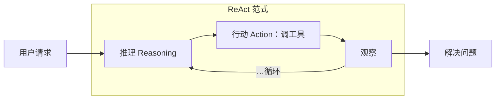
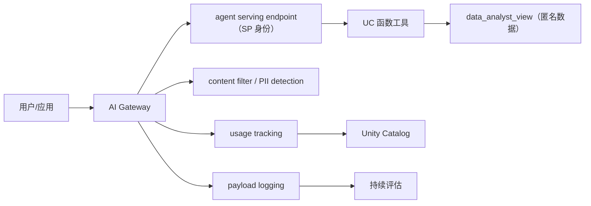

# L5 · 让 Agent Production-Ready：评估方法、MLflow 与 AI Gateway

> 课程：Governing AI Agents（DeepLearning.AI × Databricks）
> 本课任务：治理地基之上开始建 agent 本体——过一遍 production-ready 的完整链路：评估维度与三种 eval 方法、eval 如何转成监控、OTel tracing、MLflow logging 与 ResponsesAgent 接口、以 service principal 部署的六个理由，以及部署后的 AI Gateway。

## 0. 本课目标与衔接

L4（Lab 1）把数据层治理搭完了。本课是 Lab 2 / Lab 3 的理论铺垫：**构建 agent → 评估 → 部署**，工具是 MLflow 和自定义评估指标。

## 1. Agent 快速回顾：LLM 是大脑，工具是手脚

Agent 用 **LLM 作为大脑做推理**，配一组工具和（通常）一个 system prompt 来做决策。以客服为例——用户问"能帮我退掉上一单吗？"，人类客服的流程是：查账户 → 找订单信息 → 查退货政策 → 确认商品在政策范围内 → 生成退货面单。**agent 应走同样的推理步骤**：

工具可以是：文档、向量数据库、函数、API、表。只要 agent 能理解它所用的数据（通过 prompt 或工具的显式动作），就能生成正确回复、检索到数据。

## 2. 评估什么：三类指标

agent 建好后、进生产前，必须评估系统表现。三个维度：

| 维度 | 看什么 |
|---|---|
| **Retrieval metrics**（RAG 指标） | 检索/回答是否 relevant |
| **Response metrics** | 是否 hallucinate、是否说错、是否 unsafe |
| **Speed / Latency / Cost** | 构建与维护成本；响应是否快到用户可接受 |

## 3. 怎么评：三种 Eval 方法

| 方法 | 是什么 | 适用 |
|---|---|---|
| **Code-based evals** | JSON / regex 表达式校验 | 有确定格式可断言时 |
| **LLM-as-a-judge** | LLM 按 prompt 模板给数据打标；hallucination 等指标 | **最流行**——大多数 agent 没有 ground truth 可对；且很容易做一个"二号 agent"来评 tone 或任意自定义指标 |
| **Human-in-the-loop** | golden dataset：领域专家（SME）标注数据，或提供 input/output 对 | 用于训练/微调，以及最高置信度的验收 |

## 4. Eval → Monitoring：上线后评估变监控

关键转换：**模型变成生产部署系统之后，这些 eval 会转成监控能力**——给最初的评估指标设 **thresholds（阈值）**，开始持续监控；除关键性能指标外，还要监控 **cost 和 token count**。

> **对比 5-observability-eval.md**：选型矩阵里"两种 eval 类型 + 两种节奏"（离线回归 vs 在线监控）在本课被压缩成一句"evals turn into monitoring"——同一套指标，发布前是门控（gate），发布后加阈值就是监控（monitor）。这验证了矩阵里的核心判断：**eval 资产要一次定义、两个阶段复用**，而不是离线在线各写一套。

## 5. Tracing：OTel 标准与 MLflow Tracing

准备生产化时，跑 eval 依赖 tracing 能力：

- tracing 的事实标准是 **OpenTelemetry（OTel）格式**；
- **MLflow tracing 也用 OTel 格式**记录全部 trace；
- trace 内每一步叫 **span**：可看每步耗时、输入输出、LLM 的 attributes、中间步骤、RAG agent 检索到的全部文档——据此在生产中排障。

## 6. MLflow Logging：把 Agent 存成可部署的版本化制品

本课程会把 agent **log 进 MLflow**——即把 agent 存为 MLflow model registry 里的**版本化模型制品**（可理解为"存成 Databricks 能部署和托管的格式"）。它带来：

- 存储 agent 代码、依赖、完整配置；
- 创建带 metadata 的可部署 model version；
- 启用 model serving endpoints 和 API 访问；
- 跟踪实验、性能指标和 **lineage（血缘）**；
- 支持**回滚**到历史版本。

背景：Databricks 新发布 **MLflow 3.0**——GenAI 开发生命周期的 OSS 平台，含 tracking、packaging、model registry、observability 及部署/serving endpoint 的关键组件（DeepLearning.AI 另有 DSPy + MLflow 课程）。

## 7. ResponsesAgent：企业级 Agent 的统一接口

用代码编写 agent 时，MLflow 推荐用 **ResponsesAgent 接口**包装：

| 特性 | 说明 |
|---|---|
| 框架无关 | OpenAI / LangChain / Anthropic，任何 Python 框架写的 agent 都能 wrap |
| 统一接口 | 一致的输入输出格式 |
| 零侵入 | **不改核心 agent 逻辑或代码** |
| 生态兼容 | 与 Databricks 各特性和 MLflow 兼容 |
| 多 agent | 为 multi-agent 系统提供公共接口 |

> **架构师视角**：ResponsesAgent 是"防腐层（anti-corruption layer）"打法——平台不押注任何 agent 框架，只规定 IO 契约。框架层的选型（我的 `2-framework` 矩阵）因此与部署层解耦：换框架不换部署管线，multi-agent 之间也以同一契约互通。评估平台侧的取舍时，"是否用薄接口把框架和 serving 解耦"比"支持哪些框架"更本质。

## 8. 为什么以 Service Principal 部署：六个理由

已经有 UC views、masks、system prompts 了，还不够安全吗？——不够。Lab 3 最终以 service principal 部署，理由：

| # | 理由 | 对比 |
|---|---|---|
| 1 | **控制爆炸半径（blast radius）** | 最小所需权限 vs admin 账号摸到一切 |
| 2 | **清晰审计轨迹** | "哪个 agent 做了什么"精确留痕 vs admin 活动难以追溯 |
| 3 | **边缘情况防御** | 对 prompt injection 等恶意行为的防护 |
| 4 | 监管合规 | regulatory compliance |
| 5 | 凭证隔离 | credential isolation |
| 6 | 完整治理保护 | full governance protection |

> **对比 7-safety-guardrails.md（① 输入护栏）**：矩阵里 prompt injection 的第一道防线是输入侧检测——但检测是概率性的。本课给出兜底答案：**假设注入总会有打穿的一天，被打穿时 agent 能造成的破坏上限 = 它的 service principal 权限**。护栏层负责降低事件概率，身份层负责封顶事件损失——风险 = 概率 × 损失，两层各压一个因子。

## 9. AI Gateway：部署后的集中治理面

agent 以 SP 凭证部署、拿到 serving endpoint 之后呢？——接 **AI Gateway**（Databricks 的 Mosaic AI Gateway）：把该 endpoint、或任何外部模型 / Databricks 托管模型 / agent 都路由进来，集中治理：

| 能力 | 内容 |
|---|---|
| **Unified Access** | 单一接口接入所有模型——OpenAI、开源模型、自研 agent |
| **Advanced Security** | 集中治理、content filtering、**PII detection** |
| **Usage Tracking** | 所有活动记入 Unity Catalog，权限强制执行；可按单个或全部 endpoint 跟踪 |
| **Cost attribution** | 成本归因，防 endpoint 被过度使用 |
| **Monitoring + Payload logging** | 监控模型准确性；LLM/agent 的全部输入输出落日志，可再跑评估 |
| **Spending insights** | 尤其针对三方/专有 LLM 的花费洞察，辅助资源优化 |

> **对比 memory 课 12a 的数据层治理视角**：12a 的结论是"治理落在数据层，agent 换了规则还在"；本课把同一思想推到**流量层**——Gateway 让治理（过滤、审计、成本）落在 endpoint 之上的公共通道，agent 内部实现随便换，治理面不动。数据层（L4）+ 身份层（L3）+ 流量层（L5），三层治理面正好都不在 agent 代码里。

## 10. 本课总结

| 要点 | 一句话 |
|---|---|
| 评估三维度 | Retrieval（相关性）/ Response（幻觉·错误·不安全）/ 速度·延迟·成本 |
| 三种 eval 方法 | code-based（JSON/regex）、LLM-as-judge（无 ground truth 时最流行）、human-in-the-loop（golden dataset） |
| Eval → 监控 | 上线后同一批指标加阈值即监控，另盯 cost 与 token count |
| Tracing | OTel 是标准格式，MLflow tracing 兼容；trace 由 span 组成，每步可查 |
| MLflow logging | agent = 版本化模型制品：代码+依赖+配置，支持 serving、lineage、回滚 |
| ResponsesAgent | 框架无关的统一 IO 接口，不改核心逻辑，multi-agent 通用 |
| SP 部署六理由 | 爆炸半径、审计、注入防御、合规、凭证隔离、完整治理 |
| AI Gateway | endpoint 之上的集中治理面：统一接入、过滤、用量/成本、payload 日志 |

> **记忆点（引出 L6）**：理论链路已通：建 agent → eval → log 进 MLflow → 以 SP 部署 → 套 Gateway。L6 开始动手写 Lab 2 的 `agent.py`：**用 OpenAI SDK 构建 tool-calling agent，再 wrap 进 MLflow ResponsesAgent 接口**——上一课注册的两个 UC 函数将作为它的工具被真正调起来。

## 与我的资产映射

- 观测/评估层：`agent/skills/agent-selection/5-observability-eval.md`（三种 eval 方法、eval→monitoring 的两阶段复用、OTel/span 数据模型全部对上）
- 安全层：`agent/skills/agent-selection/7-safety-guardrails.md`（护栏降概率 × 身份层封损失的风险分解；Gateway 的 content filtering/PII detection 属 ①② 段）
- 框架层：`agent/skills/agent-selection/2-framework/`（ResponsesAgent 证明框架选型可与 serving 解耦）
- 部署层：`agent/skills/agent-selection/9-serving-deployment.md`（serving endpoint + Gateway 路由模式）
- 面试包：`06-full-link-trace-and-observability.md`（OTel trace/span）、`09-eval-driven-development.md`（LLM-as-judge、golden dataset）、`07-safety-guardrails`（blast radius 话术）
- [[project_selection_matrix]]
