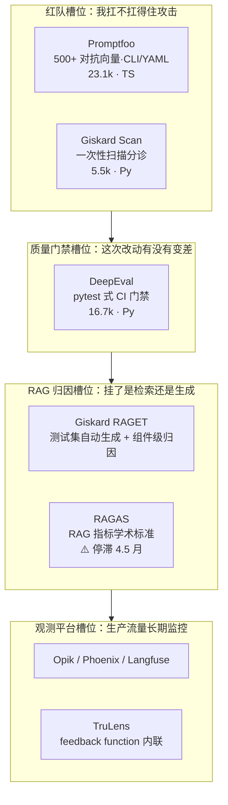

# 附录 A · Giskard 的同类工具选型，与"离线测试框架能否挂进 LiteLLM"

> 课程：Red Teaming LLM Applications（DeepLearning.AI × Giskard）
> **本篇非课程内容**：课程通篇用 Giskard 演示，但没说 Giskard 在 2026 年的生态位。本附录回答三个问题——**同类工具还有谁、Giskard 现在该不该选、这类工具能不能挂进 LiteLLM 的 guardrails 配置**。
> 数据核实日期：**2026-07-10**（GitHub API + PyPI + 官方公告）。star 数与维护状态易变，引用前重新核实。

## 0. 先订正一批广泛流传的错数据

网上（以及各类 AI 生成的选型对比）关于这几个工具的 star 数普遍严重偏低，多数是 2025 年上半年的快照。实测：

| 工具 | 常见说法 | **实测（2026-07-10）** | 语言 | 最近提交 |
|---|---|---|---|---|
| **Promptfoo** | ~10.8k | **23,109** | TypeScript | 2026-07-10 |
| **Opik**（Comet） | "增长最快" | **20,509** | Python | 2026-07-10 |
| **DeepEval** | ~9k | **16,747** | Python | 2026-07-10 |
| **RAGAS** | ~10k | **14,774** | Python | ⚠️ **2026-02-24** |
| **Giskard** | ~5.2k | **5,502** | Python | 2026-07-10 |
| **TruLens** | ~3k+ | **3,434** | Python | 2026-06-30 |

**两处仓库改名**（老链接会 302）：
- `explodinggradients/ragas` → **`vibrantlabsai/ragas`**
- `Giskard-AI/giskard` → **`Giskard-AI/giskard-oss`**（`-oss` 后缀通常是 open-core 拆分的信号，值得留意）

## 1. 三处会改变选型结论的事实错误

### 1.1 ❌ "Giskard v2 已停止积极维护，v3 里 Scan 还没有"

**不成立。** PyPI 与 GitHub release 都显示：

- `giskard` **v2.19.2 发布于 2026-07-06**（写本篇的 4 天前），v2 线仍在出版本
- 新包线已拆分为 `giskard-core` / `giskard-llm` / `giskard-scan` / `giskard-checks`，均为 beta（1.0.0b2 / b4，2026-06-09）
- **`giskard-scan` 1.0.0b2 是存在的**——Scan 并没有在新包线里缺位，只是还在 beta

准确的说法是：**Giskard 正在做 v2 → 拆包重构的过渡，v2 仍在维护，新包线 beta 中**。这是"过渡期"，不是"旗舰功能缺位 + 旧版停维"。风险等级完全不同。

（RAGET 是否已进新包线未核实：PyPI 上无 `giskard-rag` 包，v2 里 RAGET 是 `giskard.rag` 子模块，新包线里的归属需现查。）

### 1.2 ⚠️ RAGAS 才是这批里真正停滞的那个

- **最后一次提交 2026-02-24**，距今约 4.5 个月
- 484 个 open issues
- 组织从 `explodinggradients` 迁到 `vibrantlabsai`

对照组：Promptfoo / Opik / DeepEval / Giskard 全部在 **2026-07-10 当天**有提交。

所以"鉴于 Giskard v3 过渡期风险，现在起步我会选 RAGAS 的测试集生成"这个建议**在维护风险这条轴上是反的**——它避开了一个仍在活跃出版本的项目，转向了唯一一个停滞四个多月的项目。

### 1.3 ➕ Promptfoo 已被 OpenAI 收购（2026-03-09）

这是选型时绕不开的背景，但流传的对比文里几乎都没提：

- 2026-03-09 宣布被 OpenAI 收购，将并入 **OpenAI Frontier**
- **官方承诺按现有 license 保持开源**，继续维护为"best-in-class red teaming / static scanning / evals 工具，支持任意模型与应用"
- 官方口径的采用量：**35 万开发者用过、13 万月活、超过 25% 的 Fortune 500 在用**（流传的"5.1 万开发者"是旧数据）

选型含义：短期无碍（开源承诺 + 提交活跃），但**它从中立第三方工具变成了模型厂商的资产**。如果你的红队门禁要评测 OpenAI 的竞品模型，这个归属值得在 ADR 里记一笔。

## 2. 六个工具的槽位分布

这些工具不是同一个东西，混在一张表里比 star 数会得出错误结论。按**它们回答什么问题**来分：

几个容易混淆的关系：

- **Promptfoo 的红队 ≠ Giskard 的 Scan**。Promptfoo 是持续 CI 门禁（PR 时跑），Giskard Scan 是一次性分诊扫描（L3/L5 课程里的用法）。深度不是一个量级：Promptfoo 有庞大的对抗探针库，Giskard 的注入/有害性检测器是"有价值的信号"，不是探针库。
- **DeepEval 与 RAGAS 有包含关系**：DeepEval 内置 `RagasMetric`，底层直接调 ragas 库——把竞品包进了自己生态。（此条未独立核实，见 §7）
- **Opik / TruLens 其实是 Phoenix / Langfuse 的竞品**，不是 Giskard 的竞品。它们跨"评估 + 观测"两个槽位。TruLens 被 Snowflake 收购（2024 年收购母公司 TruEra）后仍开源，但开发重心转向企业数据平台集成。
- **Giskard RAGET 是这批里唯一的独门功能**：从知识库自动合成 question / reference_answer / reference_context，然后**把 Retriever 和 Generator 分开打分**。Promptfoo 没有对等物。Promptfoo 回答"我的 prompt 扛不扛得住攻击"，RAGET 回答"我的 RAG 挂了，是检索拉错还是生成器无视了上下文"。**这是两个不同的问题，不构成替代关系。**

## 3. 核心问题：这些工具能挂进 LiteLLM 的 guardrails 吗

**不能——但不是因为技术障碍，是因为类别不匹配。**

LiteLLM 的 guardrails 配置挂载的是**运行时检测引擎**（毫秒级、逐请求、在用户请求的关键路径上）。Giskard / Promptfoo / DeepEval 是**离线测试框架**（分钟级、批量跑测试集）。硬塞进去等于**把 CI 测试跑在每个用户请求的热路径上**。

这正是护栏笔记里那条分层的边界：`7-safety-guardrails.md` §四把候选分成 **A 组运行时拦截** 和 **B 组发布前红队/门控**，并且明确写了"B 组不是运行时拦截"。Promptfoo 就在 B 组。

但有**三种真实可用的集成模式**：

### 模式 1：评估目标指向 LiteLLM proxy（最常用）

这些工具测的都是 OpenAI 兼容端点，把 `base_url` 指到 `http://localhost:4000` 即可。Giskard 的 `giskard.Model` 包装器只要求一个"输入进、输出出"的函数，函数里调 proxy 就行。

真正的价值不在于省事，而在于：**测试环境和生产环境走同一条网关路径**，于是 LiteLLM 上挂的运行时 guardrails 会一起被测到。你可以用 Promptfoo 的注入攻击去验证挂在 LiteLLM 上的 Lakera guardrail 真的挡住了——

> **这是"用 B 组验证 A 组"的正确姿势：离线红队不是绕过护栏去测裸模型，而是把护栏包在被测系统里一起测。**

否则你测的是一个生产中根本不存在的系统。

### 模式 2：judge model 走 LiteLLM

DeepEval / RAGAS 的 LLM-as-judge 调用配置成走 LiteLLM（SDK 或 proxy）。好处是 **judge 的成本进入统一预算治理**——评估成本不便宜，高频 CI 很容易失控，挂上 virtual key 的 spend cap 正好管住。（具体金额见 §7，未核实。）

### 模式 3：检测逻辑反向下沉

如果离线评估中发现某个检查值得变成运行时防线（比如 Giskard Scan 发现的某类注入模式），用 LiteLLM 的 custom guardrail 机制把该检测逻辑包成一个轻量服务挂上去。

**注意下沉的是"检测器"不是"框架"。** 这回到 L5「架构师的裁决」那个闭环：**红队（攻）发现 → 护栏（守）消化 → eval（度量）回归**，三者共享同一套 requirement 语言。离线工具负责发现，运行时层负责消化。

## 4. Promptfoo vs Giskard：分场景，不是二选一

**Promptfoo 明显赢的地方**：红队深度（探针库 vs 检测器）、工程成熟度（23.1k vs 5.5k，且 Giskard 在拆包过渡期）、CI 集成与多模型对比（YAML 定义一次，跨 30+ provider 并排出结果矩阵）。

**Giskard 仍然赢的地方**：只有一个，但可能对你重要——**RAGET 的测试集自动生成 + 组件级归因**（见 §2）。

**隐藏成本：语言栈。** Promptfoo 是 TypeScript / CLI 工具，其余都是 Python 库。对 LangGraph 栈来说，Promptfoo 只能作为外部 CLI 在 CI 里调用（红队场景本来就该这么用，不是问题），但**没法像 Python 库那样嵌进你的评估代码**、复用 `giskard.Model` 式包装器或 pytest 套件。

## 5. 架构师视角：修正后的槽位建议

> 不是二选一，是按槽位组合。但**在维护风险这条轴上，我的结论和流传版本相反**：
>
> - **红队槽位 → Promptfoo**。无争议，Giskard 这个场景直接放弃。留意 OpenAI 归属（§1.3），若需评测 OpenAI 竞品模型，在 ADR 里记一笔。
> - **质量 CI 槽位 → DeepEval**。Python-native，16.7k，每日提交，你已经熟。
> - **RAG 测试集生成 / 归因槽位 → Giskard RAGET，不是 RAGAS**。流传的建议是"因 Giskard 过渡期风险改用 RAGAS"，但数据是反的：Giskard 4 天前还在发版，RAGAS 停滞 4.5 个月。若担心 beta 包线不稳，**钉住 `giskard` v2.19.x 即可**——v2 仍在维护，RAGET 就在 v2 里。
> - **观测槽位 → 已有 Phoenix / Langfuse 就不必引入 Opik / TruLens**。它们跨评估 + 观测两槽，和你现有栈重叠。
>
> **更普适的一条**：这类"XX 停止维护了所以换 YY"的选型建议，成本极低（一句话）而验证成本也极低（一次 GitHub API 调用）。**凡是以项目存续状态为前提的结论，落进笔记前一定要打一次 API。** 本篇订正的三处错误全部来自这一步——包括一个把活跃项目判死、把停滞项目推荐上位的反向结论。

## 6. 面试话术

**被问"Giskard 能不能做 guardrails"**：先做类别区分（离线测试框架 vs 运行时检测引擎，分钟级批量 vs 毫秒级逐请求），再讲模式 1 和模式 3。**能区分"测试框架"和"运行时防线"、并说出两者如何互相喂数据，比背出十个工具名更能证明你搭过生产系统。**

**被问"Promptfoo 和 Giskard 怎么选"**：先答场景拆分（红队 vs RAG 归因，两个不同问题），再补一句——"Promptfoo 的红队和 DeepEval 的红队模块有重叠，小团队可以只用 DeepEval 一站式，安全要求高再上 Promptfoo 专职红队"。把三个工具的关系一次说清，比捧一踩一显判断力。

**加分项**：主动提 Promptfoo 已归 OpenAI（2026-03）且承诺保持开源。这个信息 2025 年的资料里没有，能证明你在跟踪生态而不是背旧文章。

## 7. 本篇总结

| 要点 | 一句话 |
|---|---|
| 数据订正 | 流传的 star 数普遍偏低约一倍；Promptfoo 23.1k、DeepEval 16.7k、RAGAS 14.8k、Giskard 5.5k |
| Giskard 现状 | v2.19.2 仍在发版（2026-07-06），新包线拆分为 core/llm/scan/checks 且 beta——是过渡期，不是停维 |
| RAGAS 现状 | ⚠️ 停滞 4.5 个月（末次提交 2026-02-24），org 迁至 vibrantlabsai——真正的维护风险在这里 |
| Promptfoo 现状 | 2026-03-09 被 OpenAI 收购，并入 Frontier，承诺保持开源；35 万开发者用过 |
| 能否挂进 LiteLLM | **不能**——离线测试框架（分钟级批量）≠ 运行时检测引擎（毫秒级逐请求），硬挂等于把 CI 跑在热路径 |
| 三种正确集成 | ① 评估目标指向 proxy（顺带验证运行时护栏）② judge model 走 proxy 纳入成本治理 ③ 检测器（非框架）反向下沉为 custom guardrail |
| 槽位组合 | 红队 Promptfoo + 质量 CI DeepEval + RAG 归因 Giskard RAGET（钉 v2.19.x） |

## 8. 未核实清单（引用前现查）

- Promptfoo「500+ 对抗攻击向量」——量级可信，精确数字未核
- DeepEval「内置 RagasMetric，底层直接调 ragas 库」——包含关系的说法合理，未验证当前版本是否仍然如此
- DeepEval「每月处理 1000 万+ G-Eval 指标计算」——厂商口径
- TruLens 被 Snowflake 收购（2024，经母公司 TruEra）——广泛报道，未一手核实
- Opik「端到端评估比 Langfuse 快一个数量级」——厂商基准，慎引
- 评估成本「1000 条测试集单次 $10–30，高频 CI 月耗 $400–1200」——量级示意，与模型/指标强相关
- Giskard RAGET 是否已进新包线（PyPI 无 `giskard-rag`；v2 中为 `giskard.rag` 子模块）
- LiteLLM custom guardrail 的确切接口名（`generic_guardrail_api` 等）——以当前版本文档为准

已核实：六个仓库的 star / 语言 / 最近提交（GitHub API）、两处组织改名、Giskard v2.19.2 与 giskard-scan 1.0.0b2 的发布日期（GitHub Releases + PyPI）、Promptfoo 收购公告与开源承诺（OpenAI / Promptfoo 官方）。

## 与我的资产映射

- 护栏层：`agent/skills/agent-selection/7-safety-guardrails.md`（§四已把 Promptfoo 归入 **B 组发布前红队**、与运行时 A 组分离——本篇 §3 是这条边界的展开论证；该文档"Promptfoo 2026-03 归 OpenAI(现查)"的标注**已由本篇核实为真**，可去掉现查标记）
- 观测·eval 层：`agent/skills/agent-selection/5-observability-eval.md`（DeepEval / RAGAS / Opik / TruLens 的槽位划分；**RAGAS 停滞需在候选表中标注**）
- 课程正文：`L3-自动化Prompt注入攻击.md`（Giskard LLM Scan 的定位 = 分诊，不是探针库）、`L5-完整红队实战评估.md`（「架构师的裁决」的红队/护栏/eval 闭环 = 本篇模式 3 的理论基础）
- 护栏生态：`agent/courses/safety/Safe and reliable AI via guardrails/notes/附录A-护栏生态全景.md`（运行时那一侧的对应篇；两篇合起来是"离线发现 → 运行时消化"的完整闭环）
- 面试包：`agent/interview/jd-senior-agent-engineer/07-safety-guardrails.md`（§6 两段话术）
- [[project_selection_matrix]]
