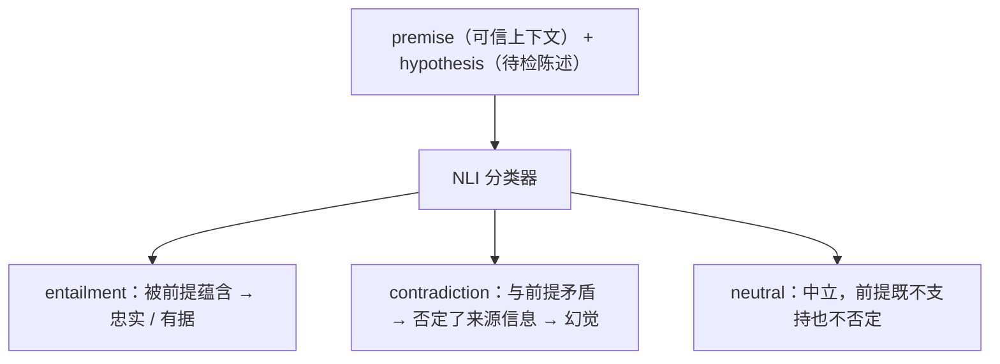
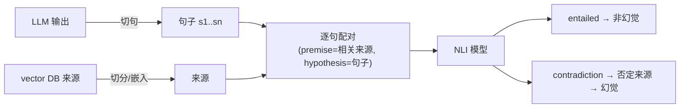

# L4 · 用 NLI 模型构建幻觉检测 Validator（groundedness 校验）

> 课程：Safe and reliable AI via guardrails（DeepLearning.AI × GuardrailsAI）
> 本课任务：从 L3 的"禁词检查"升级到对付现代生成式 AI 最大的问题之一——**幻觉**。用 **NLI（Natural Language Inference）模型**做核心判断器，逐步搭出一个检测 RAG chatbot 回答是否忠于可信来源的 validator。

## 0. 本课目标与衔接

L3 造的护栏解决的是"提到禁词"这种最简单的问题。本课处理的失败模式来自 L1 的复现：问 chatbot 如何复刻某个披萨配方，它**编造了一个 shared data drive 里根本不存在的配方**。幻觉的现实危害已有大量头条案例：著名的 ChatGPT lawyer 事件、来自政客的诉讼、对大型企业的罚款等。

本课先把幻觉问题**定义清楚**，再把 NLI 模型跑通，最后一步步组装成完整 validator（guard 的封装留到 L5）。

## 1. 界定问题：幻觉 = 不 grounded（不忠于可信来源）

本课谈"缓解幻觉"，特指 **groundedness** 语境下的幻觉：

- 你作为组织/开发者手里有一批**可信的来源**（sources），可以据实回答问题；
- 问题变成：**RAG chatbot 里的 LLM 对这些来源有多 faithful（忠实）？**

这个定义把"幻觉检测"从不可判定的"真假判断"收窄成可计算的"**输出是否被给定来源支持**"。

> **对比课程 24（Automated Testing for LLMOps）的幻觉检测**：24 课在 CI 里用 **LLM-as-judge**——把 ground truth（quiz_bank）和输出一起交给 GPT 打 Y/N，属于**离线、事后、判质量**的 eval；本课用 **NLI 分类器**在**运行时同步拦截**每一次响应。两者正是 `7-safety-guardrails.md` 强调的"拦截 ≠ 判好坏"两面：离线 eval 挡不住线上那一次事故，运行时护栏也替代不了质量度量——生产系统两个都要。另一差异：LLM judge 灵活但又贵又是概率的；NLI 是小分类器，便宜、可本地跑、输出可校准的分数。

## 2. NLI 速成：premise / hypothesis / 三分类

NLI 模型本质上是检查"**给定更高层的 context，某段文本有多 faithful**"：

| 概念 | 含义 |
|---|---|
| **Premise**（前提） | 你真正信任的 context（本课＝vector database 里的来源） |
| **Hypothesis**（假设） | 可能与 premise 相关的陈述（本课＝LLM 输出的句子） |
| 模型输出 | 给定 premise 为真，hypothesis 三种可能的概率 |

三个类别：



## 3. 搭建 NLI pipeline 并试跑

额外导入几个 ML 库：`nltk`（NLP 工具，后面用它切句）、`sentence-transformers`（embedding 模型）、HuggingFace `transformers` 的 `pipeline`；再加上 L3 见过的那套 guardrails 类与函数。

```python
from transformers import pipeline

NLI_MODEL = "GuardrailsAI/finetuned_nli_provenance"  # GuardrailsAI 在 HF 上的微调 NLI 模型
nli_pipeline = pipeline("text-classification", model=NLI_MODEL)
# pipeline 只是帮你把模型的使用样板代码封装好；首次运行需下载权重，等几秒
```

用太阳的 toy 例子试跑，找一找手感：

| Premise | Hypothesis | NLI 输出 |
|---|---|---|
| The sun rises in the east and sets in the west. | The sun rises in the east. | **entailment**，score 0.869 |
| The sun rises in the east and sets in the west.（同一前提） | The sun rises in the west. | **contradiction**，score 0.864 |

两个方向都拿到了很高的置信分——这个分类器可以作为幻觉检测 validator 的 building block。

## 4. 系统设计：NLI 之外还缺什么

单靠 NLI 模型不够，得把它**安置在一个更大的系统里**，保证 LLM 输出和 vector database 来源都被整理成 NLI 模型能消费的格式。高层流程：



这是个"很多活动部件"的复杂 validator，课程按四步逐块搭建。

## 5. 逐步构建 HallucinationValidator

### 5.1 第一步：句子切分（sentence chunking）

LLM 输出可能是多句甚至多段，而 groundedness 校验是**逐句**做的：

```python
def sentence_splitter(self, text: str) -> list[str]:
    return nltk.sent_tokenize(text)   # NLTK 句子分词器：文本 → 句子字符串列表

def validate(self, value: str, metadata: dict) -> ValidationResult:
    sentences = self.sentence_splitter(value)   # 先把 LLM 输出切成单句
    ...
```

### 5.2 第二步：为每个句子找相关来源（find_relevant_sources）

判断一个句子有没有依据，先要找到**跟它相关的那几条来源**：

```python
def find_relevant_sources(self, sentences, sources) -> ...:
    # 关键：用同一个 embedding 模型嵌入"来源句子"和"LLM 生成句子"
    source_embs   = self.embedding_model.encode(sources)
    sentence_embs = self.embedding_model.encode(sentences)
    for emb in sentence_embs:            # 逐句：
        sims = cosine_similarity(emb, source_embs)  # 与所有来源算余弦相似度
        top5 = sorted(sims)[-5:]                    # 排序取 top-5
        # 记录每个句子的 5 条最相关来源
```

讲师特别强调：**必须用完全相同的 embedding 模型**嵌入文档来源和 LLM 句子，否则相似度不可比。然后回到 `validate`，把切好的句子传入这个函数拿到"每句 → 相关来源"。

### 5.3 第三步：蕴含判断（check_entailment）

最后一步是判定"每句最相关的 5 条来源是否真的蕴含/证明句子的陈述"——**相关来源当 premise，句子当 hypothesis**，交给已经建好的 pipeline：

```python
def check_entailment(self, sentence: str, sources: list[str]) -> bool:
    result = self.nli_pipeline({"text": " ".join(sources),      # premise：相关来源
                                "text_pair": sentence})          # hypothesis：LLM 句子
    return result["label"] == "entailment"
    # True  = 预测 entailment（有据）
    # False = 预测 contradiction 或 neutral（无据）
```

注意 **neutral 也按 False 处理**——"来源既不支持也不否定"同样视为不 grounded。

### 5.4 第四步：汇总成 validate 主逻辑

```python
def validate(self, value: str, metadata: dict) -> ValidationResult:
    sentences = self.sentence_splitter(value)                    # ① 切句
    relevant  = self.find_relevant_sources(sentences, self.sources)  # ② 找相关来源
    hallucinated, entailed = [], []
    for sent in sentences:                                       # ③ 逐句判蕴含
        if not self.check_entailment(sent, relevant[sent]):
            hallucinated.append(sent)    # 无据句 → 幻觉列表
        else:
            entailed.append(sent)
    if hallucinated:                                             # ④ 最终裁决
        return FailResult(error_message=f"Hallucinated: {hallucinated}")
    return PassResult()
```

### 5.5 收尾：把依赖装进 `__init__`

来源、embedding 模型、entailment 模型要对类内所有函数可见——更新 `__init__` 参数并存成实例变量：

```python
def __init__(self, embedding_model=None, sources=None, entailment_model=None, **kwargs):
    self.embedding_model = SentenceTransformer("all-MiniLM-L6-v2")
    # all-MiniLM-L6-v2：很小但很能打的 embedding 模型，多个 leaderboard 表现好
    self.sources = sources
    self.nli_pipeline = pipeline(model=entailment_model)  # 用传入的 entailment 模型初始化
```

> **架构师视角**：这个 validator 其实是一条**微型 RAG 管线的镜像**——切句、嵌入、top-k 检索、配对推理，只不过方向反过来：RAG 用检索去"生成"，它用检索去"审计生成"。工程上真正的取舍点有三个：**切句粒度**（句级校验漏得少但 NLI 调用次数 = 句子数，延迟线性增长）、**top-5 截断**（真依据若没进 top-5 会误杀）、**neutral 判负**（宁可误杀不可漏放的保守策略，会把"正确但超出来源"的回答也拦掉——L5 的"太阳是恒星"例子正是这一刀）。这些参数就是幻觉护栏的精度/召回/延迟三角。

## 6. 直接实例化测试 validator

不用 guard，直接把 validator 当普通对象测：实例化 `HallucinationValidator` 并传入 source 文本，再喂一段要校验的文本，捕获并打印结果——**返回 failure，因为文本不被来源蕴含**。validator 工作正常。

## 7. 本课总结

| 要点 | 一句话 |
|---|---|
| 幻觉的可操作定义 | groundedness：LLM 输出是否忠实于你信任的来源，而非泛泛的"真假" |
| NLI 三分类 | premise + hypothesis → entailment / contradiction / neutral |
| 模型 | GuardrailsAI 微调的 NLI provenance 模型（HF）+ all-MiniLM-L6-v2 embedding |
| 四步管线 | 切句（nltk）→ 同模型嵌入找 top-5 相关来源 → 逐句 check_entailment → 有幻觉句即 FailResult |
| 关键细节 | 来源与生成句必须用同一 embedding 模型；neutral 与 contradiction 同判不通过 |

> **记忆点（引出 L5）**：validator 已经能单独跑通并抓出无据文本，但它还只是个裸类。L5 把它**包进 Guard、挂上 Guardrails Server**，接回披萨店 chatbot，让 L1 那个编造配方的 prompt 在真实应用链路里被当场拦截——并回答"什么时候裸用 validator、什么时候必须上 guard"。

